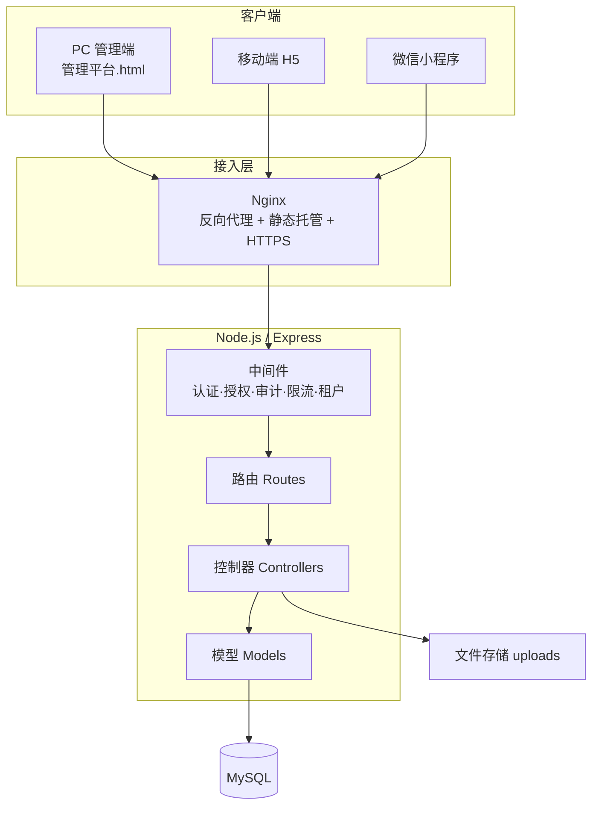
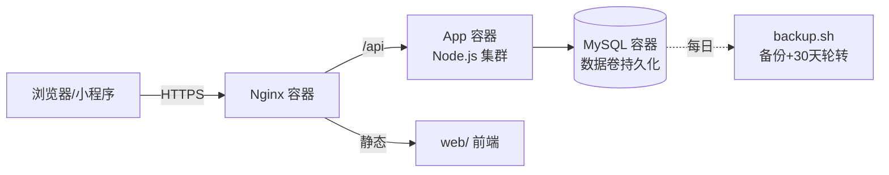
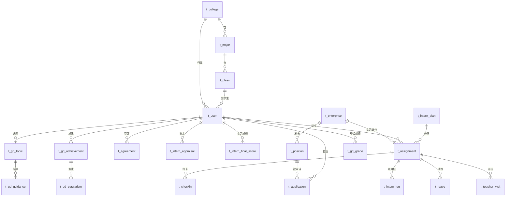
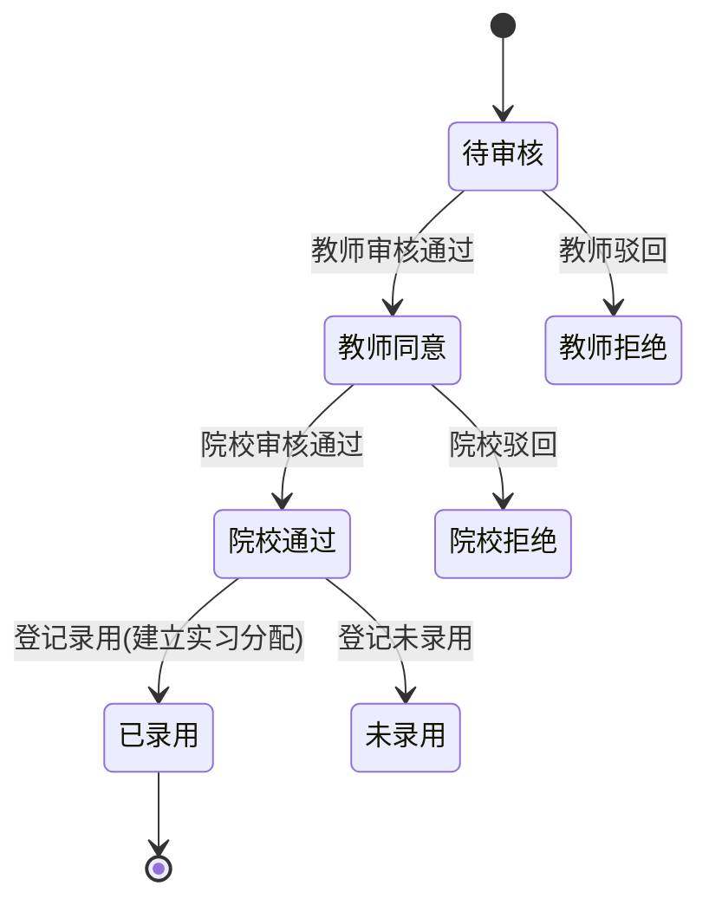
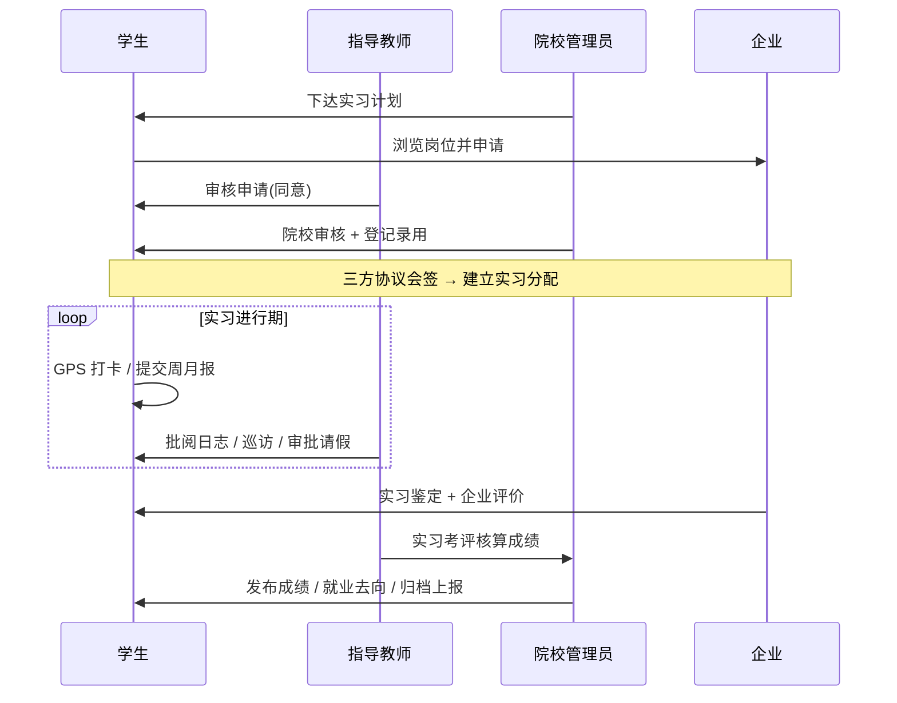

# 系统设计

> 毕业设计及岗位实习管理平台 · 系统设计说明书

## 1. 技术架构

### 1.1 技术选型

| 层 | 技术 |
| --- | --- |
| 前端（PC 管理端） | 原生 HTML/CSS/JS 单页应用，同源调用 REST API |
| 前端（移动端） | H5（骨架屏加载、自适应）+ 微信小程序 |
| 后端 | Node.js + Express 5 |
| 数据库 | MySQL（mysql2 连接池，参数化查询） |
| 认证 | JWT（jsonwebtoken）+ bcryptjs 加密 |
| 文件 | multer 上传，本地/对象存储 |
| 报表 | xlsx 导出（学信网格式等） |
| 部署 | Docker Compose（db+app+nginx）/ PM2 集群 + Nginx |

### 1.2 分层架构

请求自上而下经过：**Nginx → 中间件链（JWT 认证 → 强制改密 → 操作审计）→ 路由 → 控制器（业务校验）→ 模型（数据访问）→ MySQL**，响应统一为 `{ success, message, data, code }` 格式。

### 1.3 部署架构（私有化）

## 2. 模块设计

后端按业务域划分为 48 个功能模块（控制器/模型/路由三层对应），核心分组：

| 业务域 | 模块 |
| --- | --- |
| 组织与权限 | 用户、学院、专业、班级、管理员、认证授权 |
| 企业岗位 | 企业、岗位、企业入驻、企业端门户 |
| 实习准备 | 实习计划、申请录用、三方协议、家长知情、免实习 |
| 实习进行 | 分配、打卡、周月报、请假、换岗终止、巡访 |
| 实习监控 | 风险预警、催办、保险、缺报监测 |
| 实习收尾 | 报告、鉴定、考评、就业去向 |
| 毕业设计 | 任务节点、选题、任务书、指导、互查、成果查重、答辩、成绩 |
| 数据服务 | 统计分析、数据大屏、省平台对接、归档、学信网导出 |
| 合规安全 | 操作审计、投诉安全、企业评价、满意度、通知公告 |
| 系统 | 系统配置、工作流配置、对接配置、多租户（SaaS 可选） |

## 3. 数据库设计

### 3.1 核心实体关系（ER）

> 完整库约 70 张表，下图为核心业务实体及关系（省略审计/配置等支撑表）。

### 3.2 关键表说明（节选）

| 表 | 说明 | 关键字段 |
| --- | --- | --- |
| t_user | 用户（5 角色统一表） | role, college_id, major_id, class_id, must_change_password |
| t_intern_plan | 实习计划 | checkin_count, weekly_count, monthly_count, status |
| t_assignment | 实习分配（学生-企业-教师-计划） | student_id, enterprise_id, teacher_id, plan_id, status |
| t_checkin | 打卡 | latitude, longitude, distance, within_range, slot |
| t_application | 岗位申请 | status(0待审→1教师同意→3院校通过→5录用) |
| t_agreement | 三方协议 | student_signed, teacher_signed, school_signed, status |
| t_intern_log | 周报/月报 | type(weekly/monthly), status(0草稿1提交2通过3驳回) |
| t_gd_topic / t_gd_grade | 毕设选题 / 成绩 | review_score, defense_score, total_score |
| t_audit_log | 操作审计 | user_id, action, target_type, ip |

### 3.3 状态机示例：岗位申请

## 4. 核心业务流程

## 5. 安全设计

- **认证**：JWT Bearer Token，7 天有效期；首次登录强制改密（`requirePasswordChanged` 中间件）。
- **授权**：`requireRole(...)` 路由级 RBAC；数据按学院/个人作用域过滤。
- **防护**：参数化查询防 SQL 注入；安全响应头（nosniff/XFO/Referrer-Policy）；请求体限流 1MB；登录失败限流。
- **审计**：`auditMiddleware` 对所有写操作异步落库（谁/何时/何 IP/操作什么）。
- **数据合规**：敏感数据脱敏导出；电子协议留痕；支持数据封存与移交。
- **多租户（可选）**：single（私有化单库，默认）/ multi（SaaS 多库）双模式。

## 6. 接口设计规范

- RESTful 风格，`/api/<资源>` 统一前缀。
- 统一响应：`{ success: bool, message: string, data: any, code: number }`。
- 分页：`page` / `page_size`，返回 `{ list, total, page, pageSize }`。
- 鉴权：除登录/注册/公开接口外，均需 `Authorization: Bearer <token>`。
- 健康检查：`GET /api/health`。

详见《[功能测试报告](03-功能测试报告.md)》中的接口验证结果。
