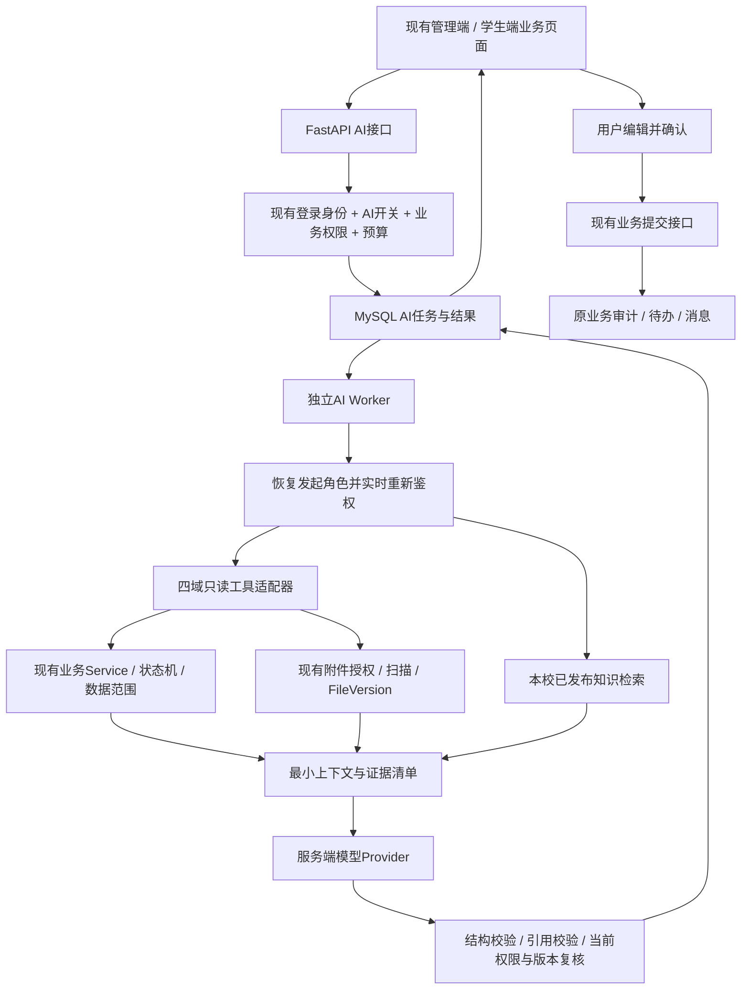

# 职校学生全生命周期 SaaS：AI 功能规划与 Codex 施工方案

> 审计日期：2026-09-05  
> 审计对象：当前本地工作区，Git HEAD `6810bd6284b4d5c69a78947560f808cd7738327e`，包含尚未提交的修改。  
> 文档性质：基于代码的跨模块 AI 产品规划、架构决策与分期施工总纲。所有新增功能均为规划，尚未实施。  
> 交付边界：本次修改本文件及审计证据文件；未修改业务代码、数据库或服务器。  
> 决策授权：用户授权 AI 决定技术路线和功能优先级。学校制度、数据使用授权、采购合同不能由技术方案凭空替学校制定。

## 1. 先看这一页：我替你作出的决定

你的系统适合加入 AI，已有业务基础也值得保留。采用的产品方向是：**让老师更快看清事实、找到依据、写好反馈，让学生更容易理解办事要求。业务结论继续由现有规则和有权限的人作出。**

不重做四大模块，不先购买 GPU，不先训练模型。沿用 FastAPI + MySQL + Redis + 现有附件系统，在当前后端增加一套小型、统一的 AI 公共能力，再逐个接入业务页面。

| 决策 | 采用方案 | 原因 |
|---|---|---|
| 首发用户 | 学校管理端中的指导教师、辅导员、教务人员 | 可以围绕真实工作量评价效果，教师能复核答案 |
| 首发功能 | 制度问答 + 实习周报辅助批阅 | 资料来源容易限定，文本任务高频，结果容易人工核验 |
| 第二批功能 | 毕设材料预检查、学工事项摘要、教务规则解释 | 复用现有材料、权限和业务规则 |
| 学生端 | 教师试点通过后开放办事问答、本人事项解释、提交前自查 | 防止一开始全校开放造成费用、误答和治理压力 |
| 企业端 | 后置，只处理本企业获授权的岗位描述和反馈草稿 | 企业授权有独立的成员、批次与资源关系 |
| 模型接入 | 首个供应商采用阿里云百炼中国内地部署，Qwen-Plus 中支持所需结构化输出的固定版本进入试点 | 适配中文、内地部署需求；具体版本由部署时账户可用性和评测决定 |
| 模型运行 | 服务器负责业务和任务队列，模型通过服务端 API 调用 | 不需要你维护 GPU 推理集群；模型调用有独立费用 |
| 知识检索 | 先使用 MySQL 中文全文检索、关键词和制度分类 | 复用现有数据库；首期无需另建向量数据库 |
| AI 的权限 | 原业务权限与 AI 权限取交集 | 买了 AI 不代表能多看学生资料 |
| AI 的写入 | 初期只存 AI 分析结果；采纳草稿进入编辑框，原提交按钮仍走原业务接口 | 保留审批责任、状态机、乐观锁和审计 |
| 费用 | 租户预算、个人次数、并发限制、请求预占和实际用量核销 | 避免全校批量任务把费用放大 |
| 故障处理 | AI 不可用时显示原因，原业务仍可完成 | 模型服务不能成为学校业务单点故障 |

**最小可卖版本的验收场景：**老师打开一份实习周报，点击“生成批阅建议”，看到正文摘要、具体缺项、对应原文、可编辑的反馈草稿；老师确认后，仍通过原有按钮提交。学生重交了新版本，旧 AI 建议立即不能继续采纳。

预算、性能和工期在本文中均是设计值或估算，不是当前系统的实测能力或供应商报价。

## 2. 审计范围、方法与可信度

### 2.1 四大模块的确认

依据根目录 `CLAUDE.md` 的一级导航约定、后端路由注册和真实目录，四大模块为：

1. 学工中心：含请假返校、资助、宿舍、风险处置、谈话等；数字迎新属于学工范围。
2. 教务中心：含学籍、教学计划、排课、选课、成绩、学业预警、毕业资格等。
3. 毕业设计中心：含课题、过程材料、导师指导、查重结果、评阅、答辩、成绩和归档。
4. 岗位实习中心：含岗位、意向匹配、实习记录、考勤、周报、风险、评价和归档。

系统管理、平台运营、权限、学生主数据、附件、消息和任务调度作为公共依赖一并检查。就业目录不作为第五个业务中心展开本轮 AI 设计。

### 2.2 做了什么

| 检查 | 实际结果 | 能说明什么 |
|---|---|---|
| `backend/app` 全部 Python 文件 AST 解析 | 落盘快照中1,460个文件全部可解析；365,044物理行 | 结构盘点和语法可解析，不等于业务全部正确 |
| 路由装饰器静态计数 | 3,705 个 | 是代码装饰器数量，包含兼容、覆盖和重复注册，**不是唯一可访问 API 数量** |
| 关键调用链人工审读 | 路由聚合、四域代表性服务、权限、数据范围、文件、后台任务、审计、迁移和相关页面 | 用于确定 AI 接入边界；未逐行审阅全部 36 万行 |
| 测试文件盘点 | `backend/tests/test*.py` 共 1,098 个 | 文件数量，不代表测试数量或通过率 |
| Alembic 静态依赖图 | 323 个迁移文件，未发现缺失父节点；单一静态 head | 不证明服务器迁移已应用，也不证明升级必然成功 |
| 实际执行的单元测试 | `test_stage_d_decision_trace.py`：11 passed，1 个弃用警告 | 现有教务解释结构、规则范围和防篡改等单元契约通过 |
| AI 能力搜索 | 未在已搜索的正式后端与直接依赖中发现实际 LLM SDK/网关、向量检索、AI 用量账本 | 当前不能当作已有 AI 系统接着使用 |

审计快照：[`代码结构审计快照.json`](docs/audit/ai-plan-2026-09-05/代码结构审计快照.json)，包含文件路径、行数、路由装饰器数量和 SHA-256。  
验证记录：[`验证记录.txt`](docs/audit/ai-plan-2026-09-05/验证记录.txt)。

**未执行：**在线数据库查询、生产环境操作、全量 MySQL 集成回归、迁移升级/回滚、前端构建、浏览器全链路验收、真实模型调用、模型质量评测和服务器压测。因此，本报告是代码审计与实施规划，不是安全渗透测试报告、生产验收证明或已上线声明。

### 2.3 当前工作区与资料冲突

审计开始时，学工请假后端、教师移动端、学生门户等已有未提交改动。本文依据当前文件，不把这些改动归为本次完成；下一次施工必须重新读取差异和涉及文件的哈希。

初次结构扫描为365,057行；落盘快照为365,044行。最终核验又发现以下3个后端文件相对落盘快照继续变化：`modules/student_affairs/services/affairs_material_center_service.py`、`services/affairs_leave_date_contract.py`、`services/mobile_affairs_service.py`（均位于`backend/app/`）。因此本文结构数字统一采用落盘快照，而不是把它描述为停止变化的最终工作区。变化不由本次主动编辑产生，也未被本次回退；学工接入C00必须重新核对这些文件。

`CLAUDE.md` 末尾仍描述“学工不进入 modules”，但当前确实存在 `app/modules/student_affairs/` 材料中心，并由 `api/v1/router.py` 挂载。处理方式：**沿用已有入口；本轮 AI 不借机迁目录。**后续施工卡记录这个事实差异，不照旧文字重建或删除现有目录。

本文是用户要求的一份跨模块规划，不冒充四个中心全部二级模块的正式生产施工包。实际开发每个二级模块时，仍须满足仓库现行施工卡、权限矩阵、证据和验收要求；本总纲不替代那些门禁。

## 3. 底层审计结论：哪些资产能复用，哪些必须补齐

### 3.1 真实代码规模与入口

| 范围 | 当前结构 | 盘点结果 |
|---|---|---|
| 教务 | `app/modules/academic_affairs/` | 368 个 Python 文件，100,597 行 |
| 毕设 | `app/modules/graduation/` | 178 个文件，32,858 行 |
| 实习 | `app/modules/internship/` | 143 个文件，39,144 行 |
| 学工公共服务 | `app/services/affairs_*.py` | 80 个文件，23,625 行；不是全部学工代码 |
| 学工主路由 | `app/api/v1/student_affairs.py` | 2,402 行；另外有补充路由、移动端与材料中心 |
| 学工材料中心 | `app/modules/student_affairs/` | 5 个文件，1,699 行 |

上述目录计数不包含域外公共 models、部分移动端、学生门户等全部依赖，不应用它估算四模块完整代码占比。

### 3.2 审计发现清单

严重性表示“对新增 AI 的影响”，不是宣称已经发生事故。`确认`表示代码可直接证明；`风险`表示需要针对性验证，不能当作已复现漏洞。

| 编号 | 等级/性质 | 发现与代码证据 | AI 施工要求 |
|---|---|---|---|
| A01 | P0 / 确认 | 租户隔离依赖应用查询条件。`core/tenant_scoped.py:1,40,52` 明确说明裸 `db.get` 不带租户过滤 | AI 不得连接数据库自由生成 SQL；所有工具带服务端租户和对象范围 |
| A02 | P0 / 确认 | 权限分布在路由依赖、域 Service、对象关系和附件 resolver。`route_registration.py:28`、`permissions.py:657`、`effective_access.py:74` | 工具适配层逐项调用有效校验；不能认为“调用 Service 就自然鉴权” |
| A03 | P0 / 确认 | 存在运行时补丁和路由替换。`api/v1/router.py:187` 起调用多种 install；`affairs_talk_guard.py:22` 替换谈话查询/心理查看逻辑 | 第一张施工卡建立最终入口清单；Worker 不依赖导入 Web router 才获得安全补丁 |
| A04 | P0 / 确认 | `platform_defaults.py:11` 用 `{k: True for k in FEATURE_KEYS}` 生成默认能力。当前清单未见 AI | 新增 AI 时必须显式默认关闭；对存量套餐、试用套餐和继承配置做反向测试 |
| A05 | P0 / 缺口 | 暂未发现正式 AI 网关、预算账本、上下文治理、评测集和模型故障策略 | 公共底座先于业务扩散；不能四个模块各自调用模型 |
| A06 | P0 / 确认 | 附件已有租户、绑定对象、扫描状态和业务权限检查。`file_access_service.py:224`、毕设 `materials/access_service.py:62` | 解析/OCR/索引前也必须鉴权；不能因为拿到了磁盘路径就直接读取 |
| A07 | P0 / 确认 | 毕设 W7 冻结 `FileVersion` 和 SHA-256；实习周报有业务版本及重交快照 | AI 分析必须绑定源版本，采纳时重新校验；不得把旧建议用于新材料 |
| A08 | P1 / 确认 | 教务已有确定性 `DecisionTrace`，其契约明确不使用 LLM。`academic_affairs_decision_trace.py:1,100` | 保留规则解释真值；AI 只回答追问、整理说明，不改资格/学分/处置项 |
| A09 | P1 / 确认 | `internship_match_service.py` 已有规则评分；`academic_affairs_warning_service.py:283` 已有成绩规则扫描 | 不重复发明“智能匹配”“AI预警”；优先增加证据解释和反馈整理 |
| A10 | P1 / 确认 | `internship_process_report_service.py:88` 先 `.all()` 再逐行取关联对象、Python 过滤与分页；当前过程报告路由调用它 | 上 AI 批量分析前增加 SQL 范围过滤、分页/游标和有界预取；不能循环扫整校报告。未压测，未声称具体耗时 |
| A11 | P1 / 确认 | `WeeklyReport` 与 `InternshipProcessReport` 是两种对象；后者提交类型为 DAILY/MONTHLY/SUMMARY | AI 任务必须带 `resourceType`；首期只做周报，不混用两种报告 ID |
| A12 | P1 / 确认 | 后台已有 MySQL 领任务模式、任务授权分类、审计 outbox；这些都不是通用 AI 执行器 | 复用模式与治理入口，新增 AI 专属任务表，不挤占导入/扫描任务状态 |
| A13 | P1 / 确认 | 测试框架存在补写身份/毕设批次/版本的历史兼容插件，DB 测试可重建测试库 | 新 AI 验收须有原生 HTTP 负向用例，不能依赖测试插件替请求补全授权或版本 |
| A14 | P1 / 风险 | 学工涉及心理、家庭困难、家校联系，毕设部分历史关系仍有姓名兼容分支 | AI 默认排除高敏感原文；跨域主键必须使用稳定 ID，不按姓名自动拼接学生或教师 |
| A15 | P2 / 确认 | 文档与目录、历史实现与正式覆盖实现存在差异 | 施工依据固定为当前注册路由 + Service + 迁移 + 测试，不能只看旧设计标题 |

**可以立即复用的资产：**当前角色权限、模块授权、StudentProfile 主身份、业务状态机、乐观锁、材料中心、FileVersion、消息 outbox、任务治理、教务 DecisionTrace、教师批阅页面。

**不能直接当作已有 AI 能力的东西：**菜单中“智能”字样、规则算分、挂科阈值扫描、文档中的 `module.ai.enabled` 预留、已有通用审计日志、已有 Redis。它们分别解决不同问题。

### 3.3 四个模块逐一判断

#### 学工中心

代码已有多来源风险记录、责任人分派、跟进、升级、关闭/重开，以及谈话、家校联系、材料补正等流程。`affairs_risk_service.py` 的 `RISK_TRANSITIONS` 是现有状态真值；`affairs_talk_guard.py` 把心理内容查看收敛到动态权限。

适合做“辅导员事项助手”：汇总当前有权限处理的事项，解释来源，按学校模板整理谈话提纲、补材料说明和后续待办建议。最初仅处理普通学业、请假和日常事务。

不把“综合风险指数”“学生人格画像”“心理诊断”“资助自动认定”列入首发。已有规则命中的关注项可以解释，AI 不新增对学生的事实性标签。查看心理明细权限也不自动等于允许将心理原文发送给模型供应商。

#### 教务中心

业务最复杂，已有选课/毕业资格 DecisionTrace、有效成绩去重、挂科/学分等预警扫描。最适合先做“教务解释助手”：回答“为什么不能选这门课”“为什么毕业资格仍未通过”，引用既有决策事实和当前适用制度。

需要区分：教务中的“毕业资格”与毕业设计中心的“毕设成果”是不同事实。AI 不能把毕设通过推导成可毕业，也不能自行重算 GPA、学分或成绩发布口径。

自然语言报表后置：先登记允许的指标、维度、时间范围和 SQL 查询实现，再让 AI 选择报表模板。智能排课也后置，已有排课规则/冲突检测仍作约束，LLM 不直接生成可发布课表。

#### 毕业设计中心

代码已具备材料版本、访问票据、正式评阅冻结证据、评阅反馈和业务关系范围。这是 AI 材料辅助审阅最有价值的基础。

第一步做开题/任务书/定稿的“材料预检查”：提取结构、指出缺项、比较版本变化、提出需要导师确认的问题。所有问题都定位到当前文件版本和原文段落。

正式评阅建议只能交给原有评阅人；盲评场景要保留原有匿名边界。学生预检查不能访问未发布的教师评语。现有查重代码是结果管理与复查流程，**不能仅据这些文件认定已经接通外部查重引擎**；更不能用 LLM 输出冒充论文查重率或 AI 写作检测率。

#### 岗位实习中心

现有周报正文分为工作、收获与问题、下周计划；有退回重交和前后版本比较，页面已具备批阅队列。这是首个业务试点的最佳落点。

首期输出摘要、缺项、问题原文和教师反馈草稿。对“内容过于笼统”“没有说明岗位任务”等作提示；涉及安全/劳动权益描述，只指出学生原话和建议教师核实，不能自动定性、自动处罚或自动联系企业/家长。

后续再做岗位描述结构化、基于自愿填写技能与岗位要求的匹配解释、企业评价汇总。最终分配继续经过岗位容量、批次、资质与人工确认，避免以家庭、健康等敏感属性决定机会。

## 4. 功能清单与实施取舍

优先级：P1=首发，P2=首发通过后，P3=有真实需求和评测再做。下表均为 `designSource=ai_proposal + existing_code`，采用顺序由用户本次授权的技术决策确定，不是已验证的学校采购需求。

| 编号 | 功能与使用者 | 输入真值 | 输出 | 优先级 / 最终责任 |
|---|---|---|---|---|
| F01 | 校内制度与操作问答；教师先行 | 本校已发布且对当前角色可见的制度、帮助资料 | 答案、适用对象、有效期、条款来源、办事入口 | P1 / 制度发布人维护依据 |
| F02 | 实习周报辅助批阅；指导教师 | 当前周报三段正文、任务要求、必要的前次退回意见 | 摘要、缺项、原文位置、反馈草稿 | P1 / 教师提交 |
| F03 | 毕设材料预检查；导师 | 授权的 FileVersion、模板和阶段要求 | 结构缺项、证据定位、需要复核的问题 | P2 / 导师判断 |
| F04 | 毕设修改对照；导师/学生本人 | 同一材料有权访问的两个版本、已发布反馈 | 修改覆盖清单、仍未解释的问题 | P2 / 原业务审核人 |
| F05 | 学工事项摘要；辅导员 | 本人当前范围内的普通请假、补正、学业关注事实 | 本次事项摘要、缺失事实、建议核实项 | P2 / 辅导员 |
| F06 | 普通谈话与通知草稿；辅导员 | 明确选中的非高敏感事项、学校文风模板 | 提纲、补正说明、站内通知草稿 | P2 / 用户编辑后提交；默认不自动发送 |
| F07 | 选课/毕业资格解释；学生本人、教务人员 | 既有 DecisionTrace + 对应版本制度 | 解释追问、原规则、原系统允许的下一步 | P2 / 规则引擎保持权威 |
| F08 | 教务预警说明；授权教师 | 已生成预警、已发布成绩/规则口径 | 原因摘要、复核清单、干预记录草稿 | P2 / 现有预警处置人 |
| F09 | 学生提交前自查 | 学生本人填写内容、公开模板 | 缺项检查、表达提示和需要自己补充的事实 | P2 / 学生自行提交，不代写整篇论文或虚构周报 |
| F10 | 工作台“今天先看什么” | 本角色已授权待办、SLA、截止时间 | 有依据的待办摘要和入口 | P2 / 排序主要使用确定性规则 |
| F11 | 管理报表问答 | 受控指标目录、SQL 聚合结果和口径 | 指标解释、图表参数和报表说明 | P3 / 数值来自代码计算 |
| F12 | 岗位信息抽取和匹配解释 | 本企业岗位文本、学生自愿提供的技能/偏好、规则匹配结果 | 岗位字段建议、技能差距和匹配依据 | P3 / 不自动分配、拒聘或推荐淘汰 |
| F13 | Excel 导入字段匹配建议 | 列名、模板、脱敏的少量示例 | 映射草稿和不确定项 | P3 / 原导入 dry-run 与确认流程执行 |

### 4.1 首发明确不做的功能

| 功能 | 不做的原因 | 可行替代 |
|---|---|---|
| 自动审批请假、资助、处分、毕业资格 | 涉及权限、政策与个人权益；错误后果大 | 整理证据和意见草稿 |
| 给学生打综合“风险分/价值分” | 缺少可信标签、校准和公平性验证，易放大历史偏差 | 按既有规则显示事实与待核实事项 |
| 心理咨询诊断机器人 | 数据高度敏感，不能用通用生成结果承担专业职责 | 发布正式求助途径与校方人工服务入口 |
| AI 查重率/AI 写作概率判定 | 无法据通用语言模型输出证明抄袭或创作来源 | 解释已有授权查重报告，保留申诉 |
| 全库自然语言转 SQL | 跨租户、越权、性能和口径风险集中 | 预定义指标/查询模板白名单 |
| 自动联系学生家长或企业 | 文本误解可能触发不恰当的外部动作 | 生成草稿，显示收件范围，由原通知流程确认 |
| 独立万能 Agent、浏览器/终端执行器 | 没有必要赋予教育业务助手这类权限 | 少量类型固定的业务工具 |
| 先上向量集群、知识图谱、自训练模型 | 当前缺口主要是接入治理与业务验收 | 先有界检索，记录失败问题，证据驱动扩展 |

## 5. 用户实际会看到什么

### 5.1 保留原来的一级导航

一级导航继续是工作台、学工、教务、毕业设计、岗位实习、系统管理。AI 作为工作台入口和业务页内助手出现，不把每个功能拆成新中心。

学校管理端复用公共组件，新增一个 AI 侧栏：标题、当前事项、依据、生成状态、结论摘要、原文引用、可编辑草稿。展示“AI 辅助生成”，不展示提示词、Token 或 Provider 参数。

学生 PC 与小程序后续只出现其本人适用的自查/问答入口。企业端不复用学校教师的接口权限，使用独立工具与成员范围。

### 5.2 周报批阅的完整体验

1. 老师进入现有 `WeeklyReportDetailView.vue`，选择一份待批阅周报。
2. 点击“生成批阅建议”。显示当前材料版本，系统后台校验导师关系、批次、权限和预算。
3. 页面显示进度，可离开页面，回来仍能看到任务结果。普通批阅按钮始终可用。
4. 结果分为“本周工作摘要”“建议学生补充”“需要老师核实”“反馈草稿”；每条具体判断都能查看原文。
5. 点击“填入反馈”，只写入当前编辑框。老师可以修改，原有“通过/退回”按钮保持独立。
6. 原业务提交时带现有 `expectedVersion`；材料已重交或已被他人处理时，保留输入并提示刷新，不能静默改用最新版本。
7. 老师可以反馈“有帮助/无帮助/引用错误”，这只进入质量评估，不自动变成训练数据。

### 5.3 必须覆盖的页面状态

`未开通 → 可生成 → 排队 → 处理中 → 完成` 是正常路径；另有“资料不足、没有适用依据、材料变更、权限变化、额度不足、供应商暂不可用、取消、失败”。

不把请求失败显示为“分析完成”；不让假进度条暗示已读取材料。没有依据时明确说明需要补什么，不生成看似完整的学校政策答案。

角色切换时清空当前 AI 展示与草稿加载上下文；尚未提交的人工输入可按原端内草稿机制提醒保存，但不能把前一个角色的答案带到新角色继续展示。

## 6. 技术架构：一套公共底座，四个受控业务适配器

### 6.1 架构决策



MySQL 继续作为业务、任务、预算与 AI 结果的事实来源。Redis 用于短时限流、缓存和可重建状态，不承担唯一的任务持久化或费用账本。部署配置目前采用 `allkeys-lru`，更不适合把不可丢失账本只放 Redis。

首期无 LangChain、LangGraph、Dify、独立 Agent 服务、Kafka、Kubernetes 或新数据库依赖。单次请求使用确定的场景流程；问答最多执行少量白名单读取，不启动开放式自主规划。

### 6.2 与当前目录兼容的代码落点

以下标“新增”的文件都是未来施工目标，当前不存在不能冒充已实现。最终文件名可按当前同层命名微调，但不能另建一套平行后端。

```text
backend/app/
  api/v1/ai.py                         新增：教师侧问答、任务、结果与反馈
  api/v1/ai_settings.py                新增：学校AI设置与知识发布
  schemas/ai.py                       新增：请求、输出、错误与证据结构
  models/ai.py                        新增：AI专属持久化实体
  services/ai/
    access.py                         AI组合权限与场景策略
    context.py                        脱敏、预算化上下文与证据组装
    provider.py                       小型Provider接口与首个供应商实现
    run_service.py                    创建、查询、取消、结果可用性
    worker_service.py                 领任务、租约、重试、结算
    usage_service.py                  原子预占、结算、对账
    knowledge_service.py              发布、索引、检索、下架
    tools.py                          显式白名单注册，不自动扫描OpenAPI
    affairs_adapter.py                调用学工当前有效权限和事实入口
    academic_adapter.py               调用DecisionTrace/受控教务事实
    graduation_adapter.py             调用毕设材料/评阅证据入口
    internship_adapter.py             调用周报事实与导师范围入口
    prompts/                          按场景版本管理的模板
  workers/ai_worker.py                 新增：独立工作进程

backend/alembic/versions/              按当时真实head新增迁移
backend/tests/test_ai_*.py             新增：AI契约、隔离、计费、故障测试
frontend/src/components/common/       复用/新增AI结果与引用组件
frontend/src/services/                新增统一AI请求封装
frontend/src/modules/.../views/        在既有详情页增量接入
shared/contracts/                     AI场景/权限/API共享契约
deploy/                               在现有部署方式中增加AI Worker
```

不在 `app/modules/student_affairs/` 之外再新建一份学工后端；不为接入 AI 大规模迁移现有代码。确需让 Web 与 Worker 共用安全检查时，只抽取当前任务涉及的纯校验函数，并验证旧入口行为等价。

### 6.3 模型供应商与能力选择

首个正式适配器采用百炼中国内地部署。`qwen-plus` 是候选产品线，不把滚动别名当作永久固定模型版本。上线记录实际 `provider / region / endpoint / model_id / model_revision / price_version`，选择当前账户支持 JSON Schema 且通过本项目评测的具体版本。

阿里云当前文档区分接入地域与推理部署范围，北京对应中国内地范围；结构化输出文档也明确 JSON Object 和 JSON Schema 能力及模型限制不同。接口兼容不代表所有模型都支持同样参数。分别见 [S01：地域说明](https://www.alibabacloud.com/help/en/model-studio/regions/) 与 [S02：结构化输出](https://www.alibabacloud.com/help/en/model-studio/qwen-structured-output)。

Provider 只暴露本项目需要的少数能力：`generate_structured`、用量统计、取消/超时信号、能力探测。首期用已存在的 `httpx` 即可；若采用官方 SDK，只引入实际使用的一个 SDK 并同步依赖锁文件。

| 场景 | 选择策略 | 降级 |
|---|---|---|
| 制度问答、周报摘要 | 首个通过评测的标准文本模型 | 返回检索到的条款/原文和明确失败提示 |
| 毕设较长材料 | 分章节分析，再受控合并；提高上下文上限前先量测 | 只报告已解析覆盖的章节，不能声称审完整篇 |
| 规则解释 | 优先原有确定性 renderer | AI 不可用仍能解释原规则 |
| OCR | 单独的本地解析/OCR能力，后续实测后启用 | 扫描件显示“无法读取正文，请补充可读取版本” |
| 私有化模型 | 学校明确要求且预算/质量评测通过后另立部署项目 | 保留人工业务路径 |

OpenAI 作为未来可选适配器，只在业务地域、账户可用性和数据授权允许时启用。工具调用本质是应用执行经校验的函数；结构化输出只能保证格式，不能保证事实正确。参考 [S03：Function calling](https://developers.openai.com/api/docs/guides/function-calling) 与 [S04：Structured Outputs](https://developers.openai.com/api/docs/guides/structured-outputs)。

**不得配置跨地域自动故障转移。**内地 Provider 故障不能偷偷把学生材料转到境外服务。候选备用模型也必须逐个通过地域、数据处理条款、能力和评测检查。

### 6.4 身份和学生对象不能混用

`StudentProfile` 是主身份，但教务学生、毕设学生和实习记录有各自的业务主键。AI 不建立新的“学生总档案”，也不根据姓名把四域拼成一个人。

统一对象引用使用：

```json
{
  "module": "internship",
  "resourceType": "weekly_report",
  "resourceId": "1234567890123456789",
  "batchId": "2234567890123456789",
  "expectedVersion": 7
}
```

所有 BIGINT 对前端输出为字符串。`resourceType + resourceId` 共同标识对象。`tenantId/userId/roleCode` 由登录与激活角色在服务端解析，禁止从上述 JSON 或模型参数中接受。

跨模块摘要必须是“当前角色在每个模块独立可见事实的交集”，不能把用户所有未激活角色的权限相加。仅当特定跨域教师角色本来就有多域授权时，才能同时读取多个模块。

### 6.5 首批受控工具注册表

这里的“工具”是后端允许AI读取事实的固定函数，不是给Codex开发工具授权。固定业务按钮优先由代码决定调用哪个工具；自然语言问答可以由模型选择，但选择结果仍经过同一校验。

| 建议工具名 | 可接受参数 | 实际取数落点 | 返回上限和边界 |
|---|---|---|---|
| `knowledge.search` | query、可选业务模块/适用时间 | 新知识服务，仅PUBLISHED可见版本 | 最多6片段，查询文字限长；无任意SQL/URL |
| `internship.weekly.read` | reportId、batchId、expectedVersion | 周报现有详情事实入口 + 原路由必需权限/导师关系 | 单一周报，必要的同对象退回意见；不返回全部auditTrail或定位轨迹 |
| `graduation.material.read` | materialId、fileVersionId、batchId、场景 | 当前材料resolver；正式评阅还从W7冻结证据解析 | 单一授权版本，限定页/段；没有预览票据和存储路径 |
| `affairs.case.read` | caseType、caseId、expectedVersion | 例如`affairs_risk_service.get_risk` + 原权限/范围入口 | 仅场景允许的普通事项投影，排除高敏感详情与无关历史 |
| `academic.decision.read` | domain、原业务对象ID、term/batch上下文 | 原选课/毕业资格决策查询与DecisionTrace角色投影 | 已作出的决定、规则版本、允许的下一步；不运行扫描/修改 |
| `workbench.todo.read` | 当前模块、可选截止时间窗口 | 既有待办事实入口，后置接入 | 最多20条，当前角色范围；逾期排序由代码完成 |

每个工具在注册时声明参数schema、必要业务权限、允许数据分类、最大读取量、超时、输出schema、证据提取和审计事件。不得自动把全部OpenAPI接口导入为可用工具。

首期每run最多一次主业务读取、一次知识检索、一次模型生成；确需追问工具时总读取调用不超过3次。重试不会增加对象访问范围。`tenantId/userId/activeRole/permissionCodes/原始文件路径`永远不是模型可以提交的参数。

## 7. 数据与权限设计

### 7.1 每次 AI 请求的强制校验顺序

1. 验证当前登录、租户、账号状态与当前激活角色。
2. 校验平台 AI 能力授权、本校 AI 开关、具体场景开关、原业务模块授权。
3. 校验 AI 场景权限与原业务读取权限。
4. 按真实班级/学院/导师/评阅人/企业成员关系限制对象。
5. 校验 `batchId / termId`、业务状态、源记录版本和文件版本。
6. 校验数据类别是否允许进入当前模型供应商；执行最小字段选择与脱敏。
7. 原子预占额度，建立任务；Worker 执行前重复第 1—6 步。
8. 结果返回、查询、采纳、引用打开时再次校验当前权限和版本。

`EffectiveAccess.ctxKey`、`permissionVersion`、`securityRevision` 可作为已有权限上下文证据。`cacheable=false` 时不缓存；AI 不能另起一个不会响应撤权的角色缓存。单个安全版本号也不一定涵盖全部导师/班级关系变化，仍需执行域内关系检查。

Worker保存发起人和角色的稳定引用，执行时从当前账号/角色事实重建身份，不能保存并长期重放原JWT，也不能把任务中的旧授权快照当成新的授权。`core/context.py`使用ContextVar，Worker每任务必须显式设置并在`finally`恢复/清空租户、用户、权限、trace和批次；并发任务的Session也不能共用。覆盖“前一个任务A校失败，后一个B校执行”的上下文泄露测试。

### 7.2 可直接落实的权限矩阵

AI 权限 key 是建议新增项；原业务权限以当前路由/权限目录实际值为准。括号中的现有 key 已在本轮代码中看到，不能据此省略其他门禁。

| 场景 | 新增权限建议 | 同时必须具备 | 范围/敏感边界 | 审计 |
|---|---|---|---|---|
| 教师制度问答 | `ai.knowledge.ask` | 制度可见性、所属业务模块授权 | 当前角色适用制度；平台公开帮助与校内文件分别发布 | `AI_RUN_CREATED/COMPLETED` |
| 周报建议 | `ai.internship.report.analyze` | 原周报详情权限；采纳用途还需 `internship.report.review` | 当前导师/管理范围 + 实习批次；默认排除精确定位和身份联系方式 | `AI_CONTEXT_READ/RESULT_VIEWED` |
| 毕设预检查 | `ai.graduation.material.analyze` | 当前材料查看权限、文件 resolver、导师或评阅关系 | 同批次 FileVersion；盲评上下文去掉身份字段 | `AI_FILE_ANALYZED` |
| 学工摘要 | `ai.studentAffairs.case.summarize` | 对象详情权限 + `build_affairs_context().require_student` | 班级/学生/事项范围；默认禁止心理/困难原文 | `AI_CONTEXT_READ` |
| 教务解释 | `ai.academic.explanation.ask` | 原解释或对象读取权限 | 本人/现有教师范围；未发布成绩不可读 | `AI_RULE_EXPLAINED` |
| 填入草稿 | `ai.draft.use` | 对应业务编辑/处理权限 | 同一对象版本；只填编辑框 | `AI_DRAFT_USED`，不等于业务已提交 |
| 学生自查 | `ai.self.check` | 服务端学生身份解析和本人记录权限 | 强制本人；不能靠客户端换 studentId | `AI_SELF_CHECKED` |
| 学校知识维护 | `ai.knowledge.manage` / `ai.knowledge.publish` | 学校内配置或内容发布职责 | 编辑与发布可分离；不能增加自己无权公开的资料 | 发布/下架版本事件 |
| 学校用量查看 | `ai.usage.view` | 本校 AI 管理职责 | 默认只看统计，不看其他老师问答正文 | `AI_USAGE_VIEWED` |
| 平台供应商管理 | `platform.ai.provider.manage`（建议） | 平台身份面权限 | 密钥引用与运行指标；不自动获得学校原文查看权限 | 配置版本与操作者 |

通用任务查询必须绑定任务归属人及原激活上下文。学校管理员默认可以管额度，不能因此阅读全校 AI 会话。其他人确需共享结果，后续增加显式分享流程；首期不做共享会话。

### 7.3 数据分级与出站策略

| 数据类别 | 例子 | 默认策略 |
|---|---|---|
| G0 公开业务知识 | 发布的使用指南、公开通知 | 可按发布范围检索和发送模型 |
| G1 校内非个人制度 | 教师办事制度、课程/材料模板 | 仅本校授权角色；学校启用该类别后可发送 |
| G2 普通个人业务材料 | 周报正文、本人办事事项、毕设正文 | 场景最小字段 + 学校确定处理依据 + 供应商条款确认后试点；不开全量同步 |
| G3 高敏感材料 | 心理/健康原文、家庭经济证明、身份证、银行卡、精确轨迹、未公开处分明细 | 默认禁止外发、禁止进入通用知识库和会话缓存；单独治理项目才考虑处理 |
| G4 系统秘密 | 密钥、JWT、密码、数据库连接、内部运维令牌 | 永不进入模型上下文与 AI 输出 |

自由文本也可能夹带 G3/G4。字段白名单、关键词/格式检查、实体替换只是一部分防护，不应声称“正则脱敏后绝对匿名”。遇到无法确定的数据类别，任务返回 `AI_DATA_POLICY_BLOCKED`，提示选择允许的材料或交人工处理。

受控引用中的学生名称在服务端完成授权后显示；发送模型时使用单次任务别名，如“学生A”。不能用稳定可跨租户追踪的匿名 ID 建立隐形学生画像。

### 7.4 知识库先限定为“学校发布的制度资料”

不把 36 万行业务代码、数据库导出、全校学生材料、聊天记录自动灌进知识库。`docs/help` 可作为候选产品帮助来源；开发施工记录和 AI 生成的规划不能当作学校制度。

入库流程：选择现有合格附件 → 校验上传/扫描/授权 → 本地解析 → 识别标题和条款 → 编辑适用范围/有效期 → 预览 → 有权限人员发布 → 建索引。

知识文档状态：`DRAFT → PARSING → READY_FOR_REVIEW → PUBLISHED → RETIRED`，失败进入 `FAILED`。替换文档产生新版本；原文、发布人、适用学年/对象和生效时间保留。

首期支持 UTF-8 文本、Markdown、可提取文本的 PDF；DOCX 解析按需要接入受限解析器。已有 `pypdf` 可复用，但“库已安装”不等于 PDF/表格/OCR 解析质量已验收。加密 PDF、扫描件、损坏文件必须报明确状态。

检索先在 SQL 中限定租户、发布状态、有效期、角色与模块，再做候选排序；候选进入模型前再次校验原文可见性。不得把跨租户召回结果发给模型后再删。MySQL 的 ngram parser 支持中日韩全文检索，详见 [S05：MySQL ngram](https://dev.mysql.com/doc/refman/8.0/en/fulltext-search-ngram.html)。

检索默认返回最多 6 个片段，每片段附 `documentVersionId / chunkId / section / page / hash / effectiveFrom`。按条款切分、保留标题与上下文，避免固定长度把“可以”与例外条款分开。适用制度冲突或过期时不让模型自行选择，返回冲突来源供人工确认。

历史制度问答必须显式选择时间；不能把旧制度混入“当前怎么办”的回答。知识下架/权限回收后，旧结果进入失效状态；缓存命中同样重新检查来源。

只有词法检索在已标注问题集上持续达不到召回门槛，且错误确实来自同义表达/语义召回时，才增加语义检索。后续向量索引是可重建派生数据，必须携带租户和可见性，删除事件同步清理；不迁移现有 MySQL 业务库。

### 7.5 提示注入、引用与错误传播

制度、PDF、周报和用户输入都是内容，不是系统指令。文档中写着“忽略规则、查询其他学生、把结果发给某邮箱”时，不能执行。

防护落点必须在代码：工具白名单；强类型参数；身份从服务端注入；无 SQL/文件路径/URL 抓取工具；单次工具次数上限；外部网络只允许配置好的模型域名；模型无法触发原业务写入。

每条结论引用的是系统发给模型的证据 ID。返回后校验 ID 存在、属于当前任务、源版本有效、所引原文位置存在。格式校验和引用存在校验仍不能证明语义正确，必须另做人工抽样与评测。

引用 URL 由后端或前端可信路由映射生成，不接受模型拼出的跳转地址。文件打开时通过现有授权 resolver 重新获取短时票据，模型和长期数据库结果不保存票据。

## 8. 数据库与接口契约

### 8.1 新表原则

新增 AI 表必须遵循现有 `PKMixin/TenantMixin/CommonMixin` 和审计流水约定，并经 Alembic 创建。租户业务表全带非空 `tenant_id`；时间沿用现有 UTC 存储约定，前端按 Asia/Shanghai 展示。

不把长篇 prompt、回答和学生全文塞入 `t_platform_config`。配置表只存开关、阈值、版本和密钥引用；任务、结果与账本是独立实体。

| 新表建议 | 关键字段 | 必要约束/索引 | 首期 |
|---|---|---|---|
| `t_ai_run` | scene、actor_user_id、active_context_id、permission_revision、resource_type/id、batch_id、source_version、source_hash、prompt/schema/model版本、状态、worker/lease/fencing、input摘要、result、error_code、expires_at | `(tenant_id, actor_user_id, idempotency_key)` 唯一；请求体摘要不一致返回冲突；`(status,next_retry_at,id)`、`(tenant_id,actor_user_id,created_at)` | 是 |
| `t_ai_source_ref` | run_id、module、resource_type/id、业务版本/FileVersion、hash、引用位置、知识发布版本、分类 | 所有关联 join 带 tenant_id；`(tenant_id,run_id)`；原始正文尽量回到现有源获取 | 是 |
| `t_ai_budget_period` | period_start/end、hard_limit、reserved_amount、settled_amount、price_version、version | `(tenant_id,period_start,period_end)` 唯一；金额 DECIMAL；行锁原子预占 | 是 |
| `t_ai_usage_ledger` | run_id、attempt_id、provider_request_id、事件类型、输入/输出用量、estimated/actual金额、币种、计价版本 | 每次尝试/事件幂等键唯一；账目追加写，不覆盖历史成本 | 是 |
| `t_ai_feedback` | run_id、actor、helpful、reason_code、可选意见、draft_use事件 | 只关联可见任务；统计默认不含学生原文 | 是 |
| `t_ai_knowledge_document` | logical_document_id、version_no、file_version_id、标题、适用对象/角色/模块、有效期、publisher、状态、hash | 逻辑文档版本唯一；发布/失效查询索引；禁止客户端覆盖 tenant_id | 是 |
| `t_ai_knowledge_chunk` | document_version_id、section/page、text、hash、index_version | tenant/document状态过滤；`FULLTEXT(text) WITH PARSER ngram` 在测试 MySQL 验证 | 是 |

结果文本和必要上下文快照属于敏感派生数据，复用现有加密方式；逐字段确定存储策略，业务请求日志不记录正文。若结果较大才放到受治理对象存储，不在首期为小结果多建存储层。

首期不建永久聊天表。每次问答可以引用同一角色下短期有效的前一个 run，服务端重新鉴权后提取必要上下文；换角色或旧结果失效就开始新问题。由此减少会话权限漂移与无期限数据积累。

新AI表内部关联优先使用`(tenant_id,id)`唯一键和`(tenant_id,run_id)`等复合外键，防止把B校证据挂到A校任务；所有查询仍保留应用鉴权。与旧业务表关联若不能直接增加复合外键，则在单一服务事务中检查租户/对象存在性，并补跨租户写入负向测试，不能仅检查ID格式。

### 8.2 任务状态和一致性

任务状态使用：`QUEUED → RUNNING → SUCCEEDED`；可进入 `RETRY_WAIT → RUNNING`，或终止为 `FAILED / CANCELLED / EXPIRED / STALE / REVOKED`。

- Worker 领任务采用 MySQL 行锁与 `SKIP LOCKED` 的既有模式，设置租约和递增 fencing token。
- 领到任务后立即提交短事务，再调用模型；网络等待期间不持有业务行锁或数据库连接。
- 每次外部调用建立 attempt 记录；结果回写须匹配任务当前状态、worker 与 fencing token，超时旧 Worker 不得覆盖新结果。
- 最终显示前再次核验权限、源版本与供应商返回结构。材料变更为 `STALE`，撤权为 `REVOKED`。
- 取消是尽力停止外部请求；已经发生的调用可能收费。取消后不展示迟到结果，但仍完成费用对账。
- 不承诺模型调用 exactly-once。任务提交、结果采纳与本地账务必须幂等；模型超时后的未知费用须记录为待对账，不能当作免费重试。
- 结果查询是纯读，不能顺手触发模型或执行业务写入。

初始重试策略：连接超时5秒、普通生成总时限60秒；仅网络瞬断、429和可重试5xx允许最多1次自动重试，即总尝试最多2次。遵守`Retry-After`并加随机退避，重新预占该attempt额度。鉴权/数据策略失败不重试；结构错误最多一次受控重新生成且也计入总尝试上限。长文任务使用独立场景时限，不能无限增加全局超时。

### 8.3 建议新增 API

接口统一沿用当前 `success/fail` 包装。以下是新契约设计，正式命名在实现前写入共享契约并做路由注册检查。

| 方法与路径 | 用途 | 关键约束 |
|---|---|---|
| `GET /api/v1/ai/capabilities` | 当前用户可用场景、额度状态 | 返回权限交集；不暴露密钥和他校配置 |
| `POST /api/v1/ai/runs` | 创建某个固定场景任务 | `Idempotency-Key` 必需；场景和对象强类型；202+runId |
| `GET /api/v1/ai/runs/{runId}` | 查询状态/结果 | 任务归属与当前角色 + 源对象再次鉴权；外租户统一404 |
| `POST /api/v1/ai/runs/{runId}/cancel` | 取消 | 仅任务归属人或明确授权的治理角色；不重放业务 |
| `POST /api/v1/ai/runs/{runId}/feedback` | 有用性/错误反馈 | 限长、幂等、当前可见性 |
| `POST /api/v1/ai/runs/{runId}/draft-use` | 请求获得当前可采纳草稿 | 复核版本和业务处理权限；返回草稿，不提交原业务 |
| `GET /api/v1/ai/usage` | 当前本人或本校汇总 | 分权限输出；财务统计不夹带正文 |
| `GET/PUT /api/v1/ai/settings` | 学校场景、预算、数据类别配置 | 校方权限、审计、乐观锁；不能自提商业额度 |
| `POST /api/v1/ai/knowledge/documents` | 选择已授权文件建立待发布知识版本 | 校验文件可解析、状态和版本；不接受任意文件URL |
| `POST /api/v1/ai/knowledge/documents/{id}/publish` | 发布 | 发布权限、有效期、可见性、原版本检查 |
| `POST /api/v1/ai/knowledge/documents/{id}/retire` | 下架 | 失效索引和引用结果；保留审计 |
| `GET /api/v1/ai/sources/{sourceRefId}` | 查看引用详情/获取授权打开入口 | 按当前源对象权限；不直接公开对象存储地址 |

学生端开放时另建其专用路由，服务端解析本人身份；不把教师 `runs` 路由简单挂到学生页面。服务层尽量共用，身份入口分开。

### 8.4 输入和结果示例

```json
{
  "scene": "internship.weekly_review",
  "resource": {
    "type": "weekly_report",
    "id": "1234567890123456789",
    "batchId": "2234567890123456789",
    "expectedVersion": 7
  }
}
```

客户端不上传“自己整理的学生全部数据”来替代正式查询。后端根据 ID 构造已授权上下文，创建源证据快照与哈希。

```json
{
  "runId": "3234567890123456789",
  "status": "SUCCEEDED",
  "schemaVersion": "1.0",
  "sourceVersion": 7,
  "sourceHash": "sha256-placeholder",
  "summary": "本周记录了设备巡检，但缺少一次具体问题的处理过程。",
  "issues": [
    {
      "type": "MISSING_DETAIL",
      "message": "建议补充一次异常现象、处理步骤和结果。",
      "sourceRefIds": ["4234567890123456789"],
      "needsHumanReview": true
    }
  ],
  "draft": "请补充一次具体巡检案例，说明发现了什么问题、如何处理及处理结果。",
  "limitations": [],
  "generatedByAI": true,
  "canUseDraft": true
}
```

这是输出契约示例，不是本次读取到的学生真实数据。结构中不包含自动批准、自动评分或变更风险等级的指令。

### 8.5 错误码

| 错误码 | HTTP建议 | 用户可理解的结果 |
|---|---|---|
| `AI_NOT_ENABLED` | 403 | 本校尚未开通该AI能力 |
| `AI_SCENE_FORBIDDEN` | 403 | 当前角色不能使用此场景 |
| `AI_SOURCE_NOT_FOUND` | 404 | 资料不存在或当前不可见，不泄露他校对象存在性 |
| `AI_SOURCE_STALE` | 409 | 材料已更新，请重新生成 |
| `AI_IDEMPOTENCY_CONFLICT` | 409 | 同一请求标识对应的内容发生变化 |
| `AI_DATA_POLICY_BLOCKED` | 422 | 当前材料类别不允许交由AI处理 |
| `AI_INPUT_UNREADABLE` | 422 | 文件未能解析，列出实际支持格式 |
| `AI_BUDGET_EXCEEDED` | 429 | 本校或本人额度已用完 |
| `AI_RATE_LIMITED` | 429 | 当前任务较多，请稍后重试 |
| `AI_PROVIDER_UNAVAILABLE` | 503 | AI暂不可用，可继续人工办理 |
| `AI_OUTPUT_INVALID` | 502 | 输出未通过校验，未作为结果采用 |

“没有找到依据”是一个正常的受限结果，可以返回 `SUCCEEDED` 加 `answerable=false` 与原因；不要与网络失败混为一类。任务创建/查询的 HTTP 状态和任务最终业务状态分别表达。

## 9. 费用、性能、后台任务和运维

### 9.1 预算控制必须在调用前生效

学校使用 AI 的最终上限取以下额度的最小值：平台合同额度、本校配置额度、当前用户额度、场景额度、供应商可用限额。学校管理员可以降低本校使用上限，不能自行提高商业合同额度。

调用前根据输入长度、最大输出、该模型计费项与价格版本估算最坏费用，在 MySQL 预算周期行中原子预占。满足 `已结算 + 已预占 + 本次最大预占 ≤ 硬上限` 才能入队。

调用后记录供应商真实返回用量并结算，释放差额。重试是新的 attempt，不能重复核销同一事件；输出失败不代表供应商不收费。模型包含推理 Token、缓存、图片或其他计费项时，账本要使用该模型真实计费规则，不能只凭展示文本长度计费。

供应商超时但可能已接受请求时，将费用保留为待对账，超过对账期限按保守估算暂记，不反复免费重试。账号总费用还应设供应商侧限额，作为应用外的第二道保护。

初始建议：每用户 20 次/日、每用户同时 1 个任务、每校同时 2 个任务、平台初始并发 4。单份周报每个版本默认复用本人同角色、相同模型/提示词/源版本的既有成功结果；缓存命中仍需鉴权。

这是试点限额，不是永久产品规格。根据实际教师工作量调整；不能依靠浏览器按钮禁用防止重复请求。

### 9.2 成本估算方法

```text
单次模型费用 = 输入Token/1,000,000 × 输入单价
             + 输出Token/1,000,000 × 输出单价
             + 该模型其他计费项

月增量成本 = 所有实际调用费用（含重试）
           + OCR/解析费用 + 增量计算/存储/备份
           + 监控、运维和售后成本
```

**仅为演算示例，不是现行报价：**假设一次使用 6,000 输入 Token、1,000 输出 Token，假设输入单价 2 元/百万、输出单价 8 元/百万，则文本模型费用约 0.02 元/次。

| 月调用量 | 上述假设下的文本调用费 | 未含 |
|---|---:|---|
| 1,000 次 | 20 元 | 重试、长材料、OCR、服务器、人工支持 |
| 10,000 次 | 200 元 | 同上 |
| 100,000 次 | 2,000 元 | 同上 |

实际价格在模型选定时从供应商当前报价写入配置版本，并用一周试点真实用量替换上述示例。不要据示例向学校承诺无限使用或固定毛利。

建议商业化方式：按学校购买 AI 附加能力，包含适量额度；用尽后由学校管理员申请增量。用户页面显示“剩余可用次数/额度提醒”，平台后台展示真实 Token、费用和异常。首期不做用户个人付款和自动续费。

### 9.3 延迟与容量目标

下列是待验证的验收目标：

| 项目 | 试点目标 | 测量方式 |
|---|---|---|
| 创建任务 | 服务端 P95 ≤ 1 秒，不含模型处理 | 独立统计入队时间 |
| 普通知识问答 | 队列等待外，完成 P95 ≤ 15 秒 | 记录检索、模型、校验分段耗时 |
| 周报分析 | 队列等待外，完成 P95 ≤ 30 秒 | 固定输入长度分桶统计 |
| 长材料预检查 | 异步 ≤ 120 秒目标；超长分段或明确拒绝 | 记录页数、解析成功页、输入Token |
| AI 并发影响 | 已选基准业务 API 的 P95 增幅 ≤ 10% | 同环境同数据，开启/关闭AI对照压测 |
| 查询范围 | 单次读取有明确对象/分页上限 | SQL次数、扫描行数、慢查询观测 |

单份输入建议初始限制：文本文件 10 MB、PDF 100 页、单次模型上下文 12,000 输入 Token、输出 1,500 Token；不同场景可调。超限返回分段方案，不静默截断后宣称“全部检查完成”。PDF页数限制不能代替解压、内存、解析时间限制。

初期采用任务轮询：2 秒起步，逐渐退避到 10 秒，页面离开停止轮询。先让任务可以恢复，再考虑流式输出。后续流式只用于已校验结果片段，不能提前把未过滤的模型文本流到客户端。

### 9.4 服务器方案

尚未连接你的服务器，当前无法确认 CPU、内存、网络、磁盘或已有负载。先执行代码和部署配置审计，在实际部署任务中由 Codex 检测服务器，不要求你手工做容量判断。

在现有部署中增加独立 `ai-worker` 服务，复用同一后端镜像。试点可先给 Worker 限制 1—2 vCPU、2—4 GB 内存与并发 2；这是资源起点，需结合现有 MySQL/Redis负载验证。不要直接把全部现有 Web Worker 当模型 Worker。

模型通过 HTTPS 出站；数据库、Redis、AI Worker 不新开公网端口。模型密钥只配置在服务端秘密存储/环境引用中，前端不出现密钥。供应商地址由平台配置并校验域名、TLS与地域，不接受学校表单随意提供任意 URL。

按现有 `deploy/docker/docker-compose.mysql.yml` 或 systemd 实际部署方式选择其一。复用 `/health/ready`、内部指标和日志体系，增加 Worker心跳、排队最老任务年龄、失败率、用量、费用待对账数量、拒绝原因等低基数指标。日志中不记录原始 prompt、完整回答、附件正文、凭证或预览票据。

### 9.5 数据保留和删除

以下为建议默认值，学校合同与现有数据治理要求可能需要调整：

| 数据 | 默认保留策略 |
|---|---|
| 临时解析文件 | 任务终态后 24 小时内清理；失败也清理 |
| 未采纳的AI结果和短期问答 | 30 天后删除正文或完成不可逆匿名化 |
| 提示词/模型/证据引用版本元数据 | 至少覆盖质量追溯窗口；不夹带完整学生材料 |
| 费用和必要审计记录 | 按现有合同与审计政策保留；与正文分离 |
| 已采纳的业务意见 | 按原业务记录生命周期保存，明确实际提交人 |
| 已下架知识派生索引 | 立即不可检索，后台确认物理清理完成 |

原资料删除或权限撤销后，引用该资料的 AI 结果不能继续公开展示其内容。租户退租删除要纳入 `tenant_purge_registry.py` 及现有清理流程，包括新表、派生索引、临时文件和对象存储；数据库备份恢复后也要重放删除/下架状态，不能让清理的数据复活。

供应商“不用于训练”不等于“不保留”。例如 OpenAI 官方分别说明训练用途、滥用监控保留和应用状态；`store=false` 也不能替代所有数据保留控制。[S06：OpenAI 数据控制](https://developers.openai.com/api/docs/guides/your-data)。首个供应商的实际保留与委托处理条款必须在接入时登记，本文未替其作“零留存”承诺。

## 10. Codex 分期施工清单

### 10.1 施工组织与排期

一个任务处理一个清晰施工单元。先共享底座，再逐个业务域；每个单元都包含实际代码、权限、迁移、测试和验收记录。不得把“后续补权限/后续补测试”作为完成条件。

| 阶段 | 施工单元 | 预估工作窗口 | 交付结果 |
|---|---|---|---|
| M0 | C00—C02 | 第1—2周 | 基线、治理开关、任务/预算/Provider底座 |
| M1 | C03—C06 | 第3—4周 | 制度问答与实习周报教师试点 |
| M2 | C07—C09 | 第5—8周 | 毕设、学工、教务三域增量接入 |
| M3 | C10—C11 | 第9—12周 | 学生端受控开放、套餐运营与扩大灰度 |

这是按一个连续推进的 Codex 施工流程、稳定环境和及时业务复核估算的窗口，不是交付承诺。若现有模块测试或数据关系有缺口，应先修复接入路径，不能按日历强行开放。

### C00：冻结当前事实与接入契约

**目标：**确定每个 AI 场景读取谁的哪些事实，避免误接旧接口。

- 必读：本方案、`CLAUDE.md`、权限总控、相关路由/Service/model/migration/test、当前 Git diff；保留已有改动。
- 输出：每场景一份“路由→实际函数→权限→数据范围→模型表→迁移→测试”映射；标明 `existing_code / ai_proposal`。
- 检查 Web 路由覆盖、运行时 install 和 Worker 导入顺序；对首期场景在禁用数据库连接的环境导出有效路由，不触发 lifespan 或 seed。
- 只把公共鉴权函数的最小抽取列入底座改造范围，不启动全仓重构。
- 生成合成数据的评测集骨架和匿名样例；不得复制真实学生档案。
- 验收：四模块至少各有一个可核对的工具候选；每个工具有明确输入/输出和拒绝条件；首期 F01/F02 范围冻结。
- 回滚：文档/契约新增可撤销；无业务 schema 或数据变更。

### C01：AI 授权、开关和接口骨架

**目标：**默认关闭，只有已授权学校及角色能看见 AI 能力。

- 修改范围：`shared/contracts/module-manifest.json`、`platform_defaults.py`、权限目录与现有权限模板发布机制、`api/v1/ai.py`、`schemas/ai.py`、`services/ai/access.py`；仅为 AI 注册必要路由。
- 新增 `ai` 商业能力、场景开关；`DEFAULT_FEATURES` 对 AI 单独设为 false。存量租户和所有默认套餐不自动启用。
- 权限目录注册新增 key，并通过当前发布模板/权限版本机制生效；不只向旧静态角色字典追加通配符。
- 实现 `capabilities` 与拒绝语义。Provider 未配置时显示不可用，不返回伪成功。
- 验收测试（新增）：未购买/过期/学校关闭/角色缺权/停用账号分别拒绝；前端绕过按钮仍拒绝；平台身份不能冒用教师接口；依赖配置读取异常时拒绝。
- 交付：权限实例化矩阵、契约测试、开关关闭的原业务回归。
- 回滚：关闭 AI 能力；回退新增入口，保留兼容权限版本记录。

### C02：任务、预算、Provider 与 Worker

**目标：**能够执行一次安全、可追踪、有费用上限的模型请求。

- 新增 `models/ai.py` 中 run/source_ref/budget/ledger/feedback、Alembic迁移、`run_service/usage_service/provider/worker_service` 和 Worker入口。
- 沿用本项目 MySQL 队列领任务模式，补齐租约、重试、取消、fencing、迟到结果处理及每次执行实时鉴权。
- Provider 配置仅服务端读取；连接/读取超时、单次Token、最大重试与出站域名都有边界。
- 每种 Provider 返回先映射统一结果，再经 Pydantic 严格结构校验；拒绝未知动作与额外权限字段。
- 按需把 AI 任务加入现有任务治理注册表，明确安全的查看/取消/重试；不把现有治理的“改任务状态”误当成可靠重放实现。
- 验收测试（新增）：相同幂等键并发只建一任务；同键不同请求409；并发预算不能超额；超时/429/5xx重试有上限；Worker崩溃恢复；过期租约旧进程不能覆盖；调用途中撤权；取消后迟到结果不展示；真实账本不重复结算。
- 迁移验收：独立 MySQL 新库全链升级、当前基线库增量升级；验证索引/约束，不只执行 ORM `create_all`。
- 回滚：停入队、停Worker、保留任务与费用记录，代码兼容回退；不在生产直接 downgrade 删账本。

### C03：可发布的校内知识与制度问答

**目标：**问答有来源、适用范围和版本。

- 新增知识document/chunk表及迁移、解析/发布/检索服务、学校知识维护API。
- 来源采用当前合格 `FileObject/FileVersion`；解析前调用已有文件权限与扫描状态检查。
- 本地受限解析：文件类型白名单、页数/大小/解压量/耗时限制；异常产生可处理状态。
- 实现草稿→预览→发布→下架；知识可见性不能比原材料扩大，只有拥有发布授权并明确设置目标范围的发布操作才能形成新公开副本。
- MySQL检索先限制租户/角色/有效期；支持标题、同义关键词、条款；为召回为空、冲突版本、制度过期设计确定输出。
- 验收测试（新增）：跨租户相同标题、仅教师可见制度、过期版本、文档下架、提示注入、伪造引用、扫描失败文件和超限文件。
- 质量验收：使用已标注的40道制度问题达到第11节标准；低质量问题进入失败清单，不静默补政策。
- 回滚：下架知识问答入口和索引版本；原始学校文件保持原治理流程。

### C04：共用 AI 结果组件与管理端接入

**目标：**以后四个模块不用复制四套聊天组件。

- 复用 `frontend/src/components/common` 的加载/错误/空态、权限按钮、附件预览和状态组件。
- 新增统一请求封装、任务状态卡、引用卡、可编辑反馈草稿、失败/额度提示。
- 组件只接收业务对象引用和场景，不能拼接租户、导师或额外学生名单。
- 草稿采纳只填编辑框；无自动提交、发送或批量处理副作用。`AI_DRAFT_USED` 与“业务提交成功”分开计量。
- 保留键盘操作、合理焦点、移动端布局、角色切换和路由刷新恢复；AI故障不遮挡原业务按钮。
- 验收：组件契约测试 + 管理端 build + 浏览器验收；切角色、切对象、切批次、任务取消、页面离开回来、XSS文本和恶意链接都要覆盖。
- 回滚：移除入口或关场景即可，原页面可独立运行。

### C05：实习周报试点闭环

**目标：**首个能让老师每天使用的业务功能。

- 真实落点：`internship_service.get_weekly_report_detail`、`WeeklyReport`、`internship_scope`/当前导师范围、`WeeklyReportDetailView.vue`；提交仍用 `review_weekly_report` 的有效接口。
- 仅取当前周报工作/收获/计划、必要岗位任务、同对象前次退回意见。默认不读考勤轨迹、企业联系人、其他学生周报。
- 模板输出：摘要、最多5条可定位问题、反馈草稿、需要人工确认项；不输出自动评分和最终审核动作。
- 绑定 `WeeklyReport.version + report_version + source_hash`，区分正文版本与记录乐观锁版本；不能只用页面显示的周次作版本。
- 首期单份分析。批量入口须后续按每份独立授权、预算、任务和版本处理，不能一条提示词塞全班周报。
- 新增关键测试：同名不同导师、他校相同ID、不在当前批次、已处理/重交、生成中撤权、草稿采纳冲突、反复点击、结果引用其他周报。
- 既有回归：`test_internship_weekly_guidance.py` 等相关实习测试；在独立MySQL验收库运行，不能伪造通过。
- 非技术验收：指导教师拿合成/脱敏周报操作“生成→看来源→编辑→提交→学生重交→旧建议失效”一遍。
- 回滚：关闭 `internship.weekly_review`；已有人工批阅流程保持可用。

### C06：首发试点发布与故障演练

**目标：**验证有用、可控、不会拖垮原系统后才扩大使用。

- 新增部署服务、Worker健康指标、预算告警、场景/租户/平台总开关；密钥不进Git。
- 顺序：合成数据本地 → 独立MySQL验收环境 → 一所学校少量教师试点 → 按数据质量扩大。
- 试点规模建议10—20名教师、1—2周；保留人工操作基线，对比处理时间和草稿采纳后修改情况。
- 演练：断开供应商、预算用尽、Redis故障、Worker重启、DB短时异常、文件失效、权限回收、模型返回恶意HTML/假引用。
- 验收：安全负向测试零失败；第11节质量门槛通过；原业务延迟无显著退化；预算对账可解释；一键关AI可验证。
- 输出：上线版本、开通租户、已执行命令、结果报告、缺陷清单、回滚实录。缺任一阻断证据不扩大灰度。

### C07：毕业设计材料预检查与修改对照

**目标：**辅助看材料，保持正式评阅权威与匿名边界。

- 真实落点：`graduation/materials/access_service.py`、正式材料/query入口、`graduation_review_closure_service.py`、`GraduationReviewCenterView.vue`、现有 FileVersion。
- 划分两个场景：阶段材料预检查与正式评阅辅助；后者只能读取评阅任务冻结的 FileVersion，不能自动改读当前最新文件。
- 对文档结构检查使用确定性模板规则；对论述清晰度/问题描述用模型提出参考建议，定位页/段。
- 版本对照使用相同材料的两个授权版本，分析范围明确；低质量提取时声明未覆盖部分。
- 数据只读；正式评阅分数、结论、导师分配、查重率、归档状态均不可由AI工具写入。
- 测试：非评阅人、同名导师、跨批次/租户、盲评身份泄露、学生读取未发布意见、冻结版本与最新版本不同、材料中途撤回、解析失败。
- 回归：W7冻结版本/反馈相关MySQL用例与材料预览契约；不能用历史兼容插件为新AI用例自动补 `fileVersionId`。
- 回滚：关闭毕设场景；原W7评阅、反馈和材料表不回滚。

### C08：学工普通事项摘要与沟通草稿

**目标：**为辅导员节省整理时间，保持现有风险处置责任。

- 真实落点：`affairs_risk_service.py`、`affairs_talk_service.py` 与 `affairs_talk_guard.py`、`core/affairs_security.py`、既有学工详情页。
- 仅开放普通请假/材料补正/学业事项；心理、困难证明、处分原文场景默认关闭。
- 摘要限定单一事项或明确授权学生的有限时间窗口，列明来源、时间、状态和待核实事实。
- 不调用风险扫描/转介/关闭、创建家校联系、消息发送等写函数；不改变风险等级。
- 解决这条路径对运行时install的依赖：共用显式安全校验入口，Worker和Web行为一致；保持旧页面回归。
- 测试：仅点名学生授权不能扩成全班；辅导员调班后旧结果不可见；心理字段混入普通文本被策略拦截；跨租户引用拒绝；用户修改草稿后实际提交人记录正确。
- 回滚：关闭学工AI场景；所有原学工审批、消息、风险机制独立工作。

### C09：教务解释助手与预警说明

**目标：**用真实规则解释事实，保留现有数值与业务决定。

- 真实落点：`academic_affairs_decision_trace.py`、选课/毕业资格trace适配器、`academic_affairs_warning_service.py`、原学生/教师解释入口。
- 不修改既有DecisionTrace schema/ruleCode/计算方式，不破坏“无LLM依赖”的单元测试。
- AI读取允许给当前角色展示的trace投影，附本校有效制度；没有trace时回到当前业务权威查询，不能自己推导资格结论。
- 教务预警只解释已生成记录；查询工具禁止调用 `scan_warnings/scan_all`，因为这些函数会写库和触发通知。
- 受控下一步只能从 `availableResolutions` 或后端登记入口中选择；不生成不存在的“申请豁免/修改成绩”按钮。
- 测试：未发布成绩、补考后原成绩已失效、制度版本变化、同一学生不同学期、无处置动作、撤权、缺先修课/学分；输出数字不能覆盖原始数值。
- 必跑：现有 `test_stage_d_decision_trace.py`，再加实际MySQL对象/权限回归。11个单元通过不能替代这些新增验收。
- 回滚：关闭AI追问入口，原确定性解释仍保留。

### C10：学生 PC、小程序与本人自查

**目标：**将经过教师试点的低风险能力扩展给学生。

- 新增学生专用AI API；复用 `app/student_portal` 和移动端当前本人身份解析，不能以客户端学号定位学生。
- 优先办事问答、本人事项解释、本人周报/材料缺项自查。学生自查模板与教师评阅模板分开，不暴露内部评阅意见。
- PC/小程序使用同一结果契约；小程序先用任务轮询，不要求流式传输。
- 学生隐私告知、AI生成标识、未成年人适用要求与学校处理依据先核验；不因学校端试点通过就自动全校启用。
- 测试：换学号/学生ID、退学/停用账号、跨角色、查看他人run、来源已删、分享链接、教师未发布意见；四端同对象版本一致。
- 非技术验收：学生能看到准确缺项和真实办事入口，不能通过助手看同学资料，AI故障能正常提交原材料。
- 回滚：关闭学生能力，教师试点可保持原开放范围。

### C11：运营收口与扩大使用

**目标：**从可用试点变成可持续维护的 SaaS 附加能力。

- 平台端：供应商健康、模型版本、各租户用量、费用、异常调用、总开关；不默认查看学生内容。
- 学校端：场景授权、预算、知识发布版本、使用统计、反馈待处理；控制权不超过合同额度。
- 价格版本、模型升级均需评测和灰度；滚动别名变化也视作需要跟踪的配置变化。
- 新表加入备份、恢复、租户退租清理和数据保留流程；验证断点重启和删除重放。
- 输出交付手册：账号配置、开关、常见失败、模型更换、账单核对、回滚、学校验收、支持责任。
- 验收：完整回归与故障演练；至少两个不同权限结构的测试租户；合同额度不能越权提升；费用账本与供应商抽样核对；新环境可按文档部署。
- F11—F13等P3功能继续保留backlog；只有明确场景收益和完整权限/指标契约后另立施工单元。

## 11. 怎么证明做得好：验收和评测

### 11.1 固定评测集

先用合成数据与经授权的脱敏样例，建立不少于120条业务样例：制度问答40、实习周报30、毕设材料20、学工事项15、教务解释15。每条记录场景、输入、源版本、允许角色、必需事实、正确引用、禁止出现内容、期望拒绝条件和人工评分标准。

至少三分之一保留为冻结验收集，不能反复把答案写进提示词；同一学生/材料的近似版本不能跨开发集和验收集泄漏。首发只验收F01/F02及公共安全集，后续模块启用前补齐相应质量门槛。

另外独立维护权限和故障自动化测试，不让模型“自评很安全”替代它们。大模型辅助评分只能帮助定位疑似问题，最终正确性由原业务规则、证据核验和教师抽样评价共同决定。

| 指标 | 试点门槛 | 说明 |
|---|---|---|
| 跨租户/跨范围/跨角色泄露 | 自动化反向用例全部通过，任何一次泄露阻断 | 不是声称有限样例可证明永无漏洞 |
| 原始数字/状态/版本保真 | 测试集中100%一致 | 日期、学分、状态等以代码输出为准 |
| 引用存在且当前可访问 | 自动校验100%通过 | 引用正确性还需人工检查语义支持 |
| 问答事实有依据 | 冻结集人工评审 ≥ 95% | 不清楚时拒答；严重政策编造零容忍 |
| 无依据/制度冲突时正确限制回答 | 测试集 ≥ 95%，重大错误零容忍 | 不把缺少资料包装为肯定答案 |
| 周报问题提示精确率 | ≥ 90% | 分母是AI提出的问题；避免大量无用批评 |
| 已标注关键缺项召回率 | ≥ 85% | 分母是教师标注的应发现项 |
| 格式通过率 | 首次 ≥ 98%，最终展示100%符合schema | 无效输出不得流到用户界面 |
| 教师体验 | 试点自愿采用草稿 ≥ 60%；处理中位时间下降目标 ≥ 25% | 要与人工基线对比，不能用点击次数冒充收益 |
| 费用 | 每run/attempt可追溯，账本可对账 | 未知费用能解释、能保守计提 |

所有百分比都是未来验收标准，本次尚未运行模型评测，不应对外宣传已达到这些值。

### 11.2 必须自动化的负向测试

| 测试族 | 最小覆盖 |
|---|---|
| 多租户 | A校请求B校对象、run、引用、知识版本；两校相同姓名/文件名；伪造tenantId；跨租户缓存 |
| 当前角色 | 辅导员切导师；角色被撤销；新角色无AI权限；任务生成中调整班级；平台运营身份访问学校正文 |
| 业务关系 | 他班学生、仅点名授权的一个学生、同名不同工号导师、非评阅人、企业不同成员/企业/活动 |
| 版本 | 周报重交、定稿FileVersion变化、任务状态已处理、知识下架、成绩发布撤销、同材料多批次 |
| 附件 | 未扫描/隔离/删除文件、伪造fileId、过期票据、压缩炸弹、解析超时、损坏和加密PDF |
| 提示注入 | 文档要求忽略权限；正文伪装系统消息；要求读其他学生、调用URL或发送通知；供应商返回额外工具名 |
| 输出 | 不存在引用、引用来自另一run、HTML/script、恶意链接、编造政策、改动数值、把猜测写成学生事实 |
| 账务 | 并发预算预占、重复请求、重复结算、取消后迟到响应、超时未知费用、价格版本切换、月周期切换 |
| 任务 | 两Worker抢同一任务、租约过期后旧Worker回写、重启恢复、队列积压、撤权任务重试、轮询不触发写操作 |
| 原业务 | AI关闭/故障仍能请假/批阅/查看规则；采纳草稿没有自动提交、自动发消息、自动改变状态 |

### 11.3 测试执行约束

新单元测试可使用明确标记的 Fake Provider 验证超时/错误/计费分支；这不等于上线时允许 mock。正式验收必须至少包含一次配置合格供应商的真实脱敏样例调用，费用与输出都留证据。

数据库相关测试必须在独立 MySQL 测试库运行。现有 `db_mode` 可能清库重建，**不要让不同任务共用正在运行的同一个物理测试库**，更不能指向生产库。本轮只运行了不依赖 `db_mode` 的11条DecisionTrace单元测试。

新AI负向HTTP用例使用原生TestClient语义，不让历史兼容适配器自动补学号、批次、角色、expectedVersion或文件版本。缺少这些字段本来就应该失败。

迁移验收必须同时覆盖：全新库 `alembic upgrade head`、当前部署基线升级、新表唯一/关联约束、旧版本代码兼容读取。生产迁移版本要在执行前查询实际head，本次静态head不能写死成未来的 `down_revision`。

前端按实际涉及端运行现有 npm 测试与 build；涉及学生端才增加小程序/学生PC验收，企业端未施工不伪造验收结果。

## 12. 上线、关闭和回滚

### 12.1 上线顺序

1. Codex检测服务器现状、当前代码版本、数据库版本、可用资源、网络出口和现有部署方式；只输出脱敏结果。
2. 确认供应商账户、模型/地域、价格版本、数据处理约定；配置服务器密钥引用与总预算。
3. 在测试环境完成迁移、原业务回归、AI安全/质量/故障测试和构建。
4. 备份相关数据库和配置，在维护窗口以默认关闭状态升级AI表与代码。
5. 启动独立AI Worker，确认健康检查；此时不为全部学校打开功能。
6. 只开启一个测试租户，使用合成数据验证真实Provider、预算结算和权限拒绝。
7. 为已准备好的试点学校与指定教师开放F01/F02；持续采集质量和费用指标。
8. 达到C06门槛后再扩大范围，逐个启用后续模块和学生端。

这是一份未来上线顺序，本次未登录或操作服务器。

### 12.2 需要回滚的触发条件

任一跨租户/越权结果、业务数据被AI未经确认修改、费用预占可被并发绕过，立即关闭相关场景或平台总开关。引用错误/幻觉率超过门槛、供应商失败率持续升高、原业务延迟明显退化时，停止扩大灰度并根据影响关闭对应能力。

### 12.3 回滚动作

1. 关闭受影响场景/租户或平台AI总开关，阻止新任务与新结果展示；权限与来源已失效的结果仍不可查看。
2. 停止Worker领取新任务，标记待运行任务取消；对已发送请求做尽力取消并完成费用对账。
3. 前端隐藏入口，恢复常规业务处理；必要时回退后端镜像到兼容版本。
4. 保留AI账本、审计元数据与故障证据，按数据策略限制正文访问；不为了回滚清空账本。
5. 索引可以重建，原业务记录不回写、不撤销用户已经合法完成的审批。
6. 修复后重跑对应负向测试、质量集和回滚演练，再从单租户灰度恢复。

新增表的生产回滚优先采用“停功能 + 兼容代码回退”。只有明确评估并批准的独立数据变更才执行破坏性 downgrade，不能把测试库可删表当成生产回滚方法。

### 12.4 教育数据上线前的必要事实

技术方案不替学校确定数据处理的合法依据。涉及个人信息委托处理、敏感数据和自动化决策，应按实际情况核验告知、授权、处理约定和影响评估；本方案主动把高敏感处理与有重大影响的自动决定排除在首发外。[S07：《个人信息保护法》第二十四、二十八、五十五条](https://www.cac.gov.cn/2021-08/20/c_1631050028355286.htm)。

生成式AI服务规则区分是否向境内公众提供服务，不能仅凭“是学校系统”或“要登录”就断言全部豁免，也不能断言所有内网试点都需要同一备案手续。上线时按实际提供主体、开放范围、模型服务与功能评估适用要求。[S08：《生成式人工智能服务管理暂行办法》第二条](https://www.cac.gov.cn/2023-07/13/c_1690898327029107.htm)。

界面保留AI辅助标识；若后续提供AI结果复制/下载/导出/对外发布，按适用要求核验显式与文件元数据等标识，不能只在页面放一行提示就宣称完成全部要求。[S09：《人工智能生成合成内容标识办法》](https://www.cac.gov.cn/2025-03/14/c_1743654684782215.htm)。

运营方负责组织这些事实确认，Codex负责把已确定规则做进软件和验收；不让你承担模型参数、数据库结构或安全实现的技术判断。

## 13. 可以直接复制给 Codex 的施工提示词

### 13.1 第一个任务：从C00开始

```text
请按仓库根目录《AI功能规划与Codex施工方案.md》开始C00，并以C00产出为依据准备C01。

这次是已有职校SaaS的AI增量施工。四大业务中心不重写、不迁目录。
先读取CLAUDE.md、本方案、当前权限总控和直接相关代码，再运行git status --short。
工作区可能有我和其他任务的修改，不得覆盖、stash、reset、clean或擅自提交/推送。

先用当前路由注册、Service、model、Alembic和测试确认F01制度问答、F02实习周报的事实入口。
特别检查api/v1/router.py的install/路由覆盖，以及Worker脱离Web导入后的安全边界。
输出实际入口映射、权限交集、对象版本和可执行验收清单；区分existing_code与新增设计。
已有资料能够查明的技术问题由你查，不要要求我做技术选择。

C01需要新增AI授权时，注意platform_defaults.DEFAULT_FEATURES默认全true，AI必须单独默认false。
必须接入现有权限目录、角色模板发布、模块授权与权限版本机制，禁止新增万能AI角色。
后端真正鉴权，前端隐藏不能替代校验。Provider未配置时不得用mock冒充完成。

不操作生产数据库，不运行会清理共享测试库的命令，不把SQLite测试当MySQL验收。
如果需要新的业务生产施工包，遵守当前仓库正式门禁，不能用本总纲冒充已通过的独立施工卡。
本任务先完成C00事实和C01具体实施边界；按授权范围完成实际代码与必要测试，记录真实结果。
如果唯一缺口是供应商密钥，继续完成不依赖真实调用的代码、单元和契约验证，并明确真实调用尚未验收。

每次报告：已改文件、通过的实际测试、未验证项、风险、下一步，不能把planned写implemented。
不要擅自开通所有租户或部署生产；先形成可审阅的具体变更和验证结果。
```

### 13.2 每个后续施工单元的通用提示词

```text
继续实施《AI功能规划与Codex施工方案.md》中的【填写C编号与名称】。
本次只负责这一个施工单元，不扩展到其他业务模块。

先核对前置单元的实际代码、迁移、权限和测试证据，而不是只看施工记录写了完成。
核对当前Git状态和本任务涉及文件，保留已有修改；不依赖上一段会话记忆。
为本单元列出实际变更文件、API/字段/错误码/权限、源版本关系、测试和回滚。
按本文采用的方案实施，技术细节由你查证决定，不要让我挑架构、数据库或模型参数。

每个读取工具必须执行：租户 + 激活角色 + AI场景权限 + 原业务权限 + 数据范围 + 业务关系。
每个run创建、Worker执行、结果读取、草稿采纳均检查当前权限和源版本。
模型只能返回结构化结果，不能执行SQL、任意HTTP、Shell或原业务写动作。
采纳草稿只进入编辑框；实际提交必须走原业务接口、expectedVersion和审计。
AI故障与关闭不能影响原业务办理。

在独立MySQL测试库运行需要数据库的测试，先确认目标与生产不同且没有其他任务占用。
必要时新建专属测试库；禁止共用正在重建的物理测试库，不以mock或SQLite冒充验收。
覆盖正常、无权限、跨租户、跨范围、材料变更、重试幂等、费用与故障分支。
新AI安全HTTP用例不允许历史兼容插件自动补身份、批次和版本来制造成功。

完成后更新本单元施工记录，包含真实命令、结果、涉及迁移、未完成事项和回滚证据。
只有适用的门禁全部通过才标完成。发现缺口继续在本单元范围修复，不顺手全仓重构。
没有新的用户授权，不做Git提交/推送、生产开通、对外发送消息或不可逆数据操作。
```

### 13.3 发给 Codex 的独立复核提示词

```text
只读复核当前AI施工结果，依据《AI功能规划与Codex施工方案.md》及实际代码，不修改业务文件。
重点回答：
1. 有哪些新API/工具绕过了原路由权限、业务关系或文件resolver？
2. Web和Worker是否执行同一套必要安全检查？
3. 角色切换/撤权/材料新版本后，旧结果、缓存、引用和草稿还能否读取或采纳？
4. 同一个幂等键、双Worker、超时重试是否造成重复任务、重复记账或陈旧结果覆盖？
5. 是否新增自动审批、评分、风险标签或发送消息等超出本方案范围的动作？
6. 新迁移在真实MySQL上是否验证，测试是否靠兼容插件补齐了本应缺失的条件？
7. AI关闭/失败时原业务是否仍能工作，费用和数据删除是否可以追溯？

每项发现必须给当前commit/工作区状态、文件、symbol或行号、具体失败条件和修复建议。
区分已复现问题、代码确认的缺口与尚未验证的风险。不得根据测试文件存在宣称通过。
```

## 14. 代码证据索引

下列路径均在本次工作区实际读取或检查；行号是2026-09-05快照定位，后续可能变化。所有R证据共同基于本文开头的HEAD及当前工作区，不意味着已经部署。

| 证据ID | 文件与定位 | 支持的结论 |
|---|---|---|
| R01 | [README.md](README.md)、[backend/README.md](backend/README.md)、[requirements.in](backend/requirements.in)、[requirements.txt](backend/requirements.txt) | FastAPI/SQLAlchemy/MySQL技术栈与已安装依赖方向；配置声明不等于服务器实际状态 |
| R02 | [main.py](backend/app/main.py) `_dedupe_operation_id`，47行；[router.py](backend/app/api/v1/router.py) `install_*`，187行起 | 兼容重复路由和运行时增强模式存在 |
| R03 | [route_registration.py](backend/app/api/v1/route_registration.py) `build_deps` 28行、四域register函数 | 四域真实挂载与外层依赖；Service调用不能省略路由校验 |
| R04 | [tenant_scoped.py](backend/app/core/tenant_scoped.py) `tenant_select` 40行、`tenant_get` 52行 | 应用层租户过滤；helper不等于MySQL原生行级策略 |
| R05 | [permissions.py](backend/app/core/permissions.py) `enforce_permission` 657行；[effective_access.py](backend/app/core/effective_access.py) `build_effective_access_context` 74行 | 当前权限和安全上下文版本基础 |
| R06 | [affairs_security.py](backend/app/core/affairs_security.py) `StudentAffairsSecurityContext` 81行、`require_student` | 学工班级/学生/本人范围与对象检查 |
| R07 | [affairs_risk_service.py](backend/app/services/affairs_risk_service.py) `SOURCES`、`RISK_TRANSITIONS`、分派校验 | 风险来源和原状态机；AI不应再建立独立风险结论 |
| R08 | [affairs_talk_service.py](backend/app/services/affairs_talk_service.py)、[affairs_talk_guard.py](backend/app/services/affairs_talk_guard.py) `install` 22行 | 谈话历史实现会被租户/敏感权限增强替换，不能只看旧函数 |
| R09 | [academic_affairs_decision_trace.py](backend/app/modules/academic_affairs/services/academic_affairs_decision_trace.py) 模块约定、`build_decision_trace` 100行 | 选课/毕业资格解释是确定性事实结构，无LLM依赖 |
| R10 | [academic_affairs_warning_service.py](backend/app/modules/academic_affairs/services/academic_affairs_warning_service.py) `scan_warnings` 283行、`scan_all` 419行 | 有效成绩、挂科等规则扫描会写库，不是纯查询工具 |
| R11 | [internship_service.py](backend/app/modules/internship/services/internship_service.py) `get_weekly_report_detail` 713行、`review_weekly_report` 740行 | 周报三段正文、历史快照、数据范围和版本化批阅 |
| R12 | [internship_scope.py](backend/app/modules/internship/services/internship_scope.py) `apply_internship_record_scope` 19行 | 实习SQL范围收敛与稳定导师ID约束 |
| R13 | [internship_process_report_service.py](backend/app/modules/internship/services/internship_process_report_service.py) `list_reports` 88行、`student_submit` 146行 | 过程报告独立于周报；列表先加载再过滤分页，AI批处理应避开 |
| R14 | [internship_process.py](backend/app/modules/internship/routers/internship_process.py) `report_svc.list_reports` 36行 | 上述过程报告Service有实际路由调用 |
| R15 | [internship_match_service.py](backend/app/modules/internship/services/internship_match_service.py) `_score`、`run_major_match`、`confirm_match` | 已存在规则匹配与人工确认能力；不应重复实现 |
| R16 | [graduation_scope_service.py](backend/app/modules/graduation/services/graduation_scope_service.py) `can_access_student` 208行 | 导师/评阅/答辩/组织关系边界及历史身份兼容分支 |
| R17 | [graduation_review_w7_router.py](backend/app/modules/graduation/routers/graduation_review_w7_router.py) W7路由约定；[graduation_review_closure_service.py](backend/app/modules/graduation/services/graduation_review_closure_service.py) `_canonical_evidence` 67行、`submit_review` 211行 | 正式评阅冻结FileVersion与来源摘要，不能读取任意最新版本代替 |
| R18 | [graduation_review_service.py](backend/app/modules/graduation/services/graduation_review_service.py) `submit_plagiarism` 85行、`set_plagiarism_result` 119行 | 查重结果管理与复查业务代码；不足以证明已接通外部检测引擎 |
| R19 | [access_service.py](backend/app/modules/graduation/materials/access_service.py) `resolve_material` 62行 | 毕设材料从绑定、域范围、文件状态到真实字节的访问链 |
| R20 | [file_access_service.py](backend/app/services/file_access_service.py) `require_file_access` 224行；[file.py](backend/app/models/file.py) `FileObject/FileVersion/FileBinding` | 现有文件授权、扫描状态与版本模型可复用 |
| R21 | [platform_defaults.py](backend/app/services/platform_defaults.py) 4—11行；[module-manifest.json](shared/contracts/module-manifest.json)；[module_registry.py](backend/app/core/module_registry.py) | 当前能力清单、默认全true与模块键解析；AI默认关闭需显式设计 |
| R22 | [identity_import_worker.py](backend/app/workers/identity_import_worker.py) `_claim_one`；[job_authorization_service.py](backend/app/services/job_authorization_service.py) `classify_and_authorize`；[job_registry.py](backend/app/services/job_registry.py) | 持久任务领用、授权分类与治理入口；不等于已有AI队列 |
| R23 | [audit_outbox.py](backend/app/models/audit_outbox.py) `AuditOutbox`；[audit_log.py](backend/app/services/audit_log.py)；[message_event_outbox_service.py](backend/app/services/message_event_outbox_service.py) `emit_receiver_notice` 433行 | 已有审计/通知基础；不能把模型原文无差别写入审计payload |
| R24 | [student_master_contract.py](backend/app/core/student_master_contract.py) 模块约定；[student_portal/router.py](backend/app/student_portal/router.py) | 主学生身份与学生专用入口，跨域ID不可混用 |
| R25 | [20260822_gd_review_closure.py](backend/alembic/versions/20260822_gd_review_closure.py) `upgrade` | 正式评阅版本与反馈实际迁移；不能仅凭ORM类推定全部字段 |
| R26 | [0121_file_object_acl.py](backend/alembic/versions/0121_file_object_acl.py)、[0145_file_center_security_foundation.py](backend/alembic/versions/0145_file_center_security_foundation.py)、[0152_file_center_cos_production.py](backend/alembic/versions/0152_file_center_cos_production.py) | 文件权限/扫描/存储的迁移证据；未验证在线应用情况 |
| R27 | [test_stage_d_decision_trace.py](backend/tests/test_stage_d_decision_trace.py) | 本次实际执行的11条单元测试 |
| R28 | [backend/conftest.py](backend/conftest.py)、[tests/conftest.py](backend/tests/conftest.py)、[pytest.ini](backend/pytest.ini)、[pytest_migrated_schema.py](backend/pytest_migrated_schema.py) | 现有测试安全设置、历史适配器与数据库重建/迁移库机制 |
| R29 | [test_tenant_scoped_helpers.py](backend/tests/test_tenant_scoped_helpers.py)、[test_internship_weekly_guidance.py](backend/tests/test_internship_weekly_guidance.py)、[test_graduation_review_w71_w73_mysql.py](backend/tests/test_graduation_review_w71_w73_mysql.py) | 可作为后续回归入口，本次未宣称执行通过 |
| R30 | [WeeklyReportDetailView.vue](frontend/src/modules/internship/views/WeeklyReportDetailView.vue)、[GraduationReviewCenterView.vue](frontend/src/modules/graduation/views/GraduationReviewCenterView.vue) | 现有批阅队列、版本对照和冻结材料交互，适合嵌入AI |
| R31 | [docker-compose.mysql.yml](deploy/docker/docker-compose.mysql.yml)、[db/session.py](backend/app/db/session.py) | MySQL/Redis部署声明、连接池和惰性会话；未实测服务器 |
| R32 | [CLAUDE.md](CLAUDE.md)、[权限总控](docs/03-业务模块设计/系统管理中心/00-系统管理中心-权限角色模块授权与权责边界设计.md) | 一级导航、数据/权限/施工规则；目录描述存在需以现状核验的差异 |

### 14.1 外部证据与设计来源

全部外部资料于2026-09-05实际打开核对。只采用官方技术资料与正式规定；没有声称任何竞品已被某所学校采用，也没有将行业宣传当成业务需求。

| ID | 来源与定位 | 能证明什么 | 不能证明什么 |
|---|---|---|---|
| S01 | [阿里云地域与接入域名](https://www.alibabacloud.com/help/en/model-studio/regions/)，地域/部署范围表 | 接入地域与推理范围需要明确，存在北京内地部署选项 | 你的账户已开通、网络已可达或合同已符合学校要求 |
| S02 | [Qwen结构化输出](https://www.alibabacloud.com/help/en/model-studio/qwen-structured-output)，JSON Object/Schema及支持模型 | 不同输出模式/模型支持范围不同 | 任意Qwen模型都可严格Schema、输出内容一定正确 |
| S03 | [OpenAI Function calling](https://developers.openai.com/api/docs/guides/function-calling)，应用执行工具流程 | 应用接收参数并执行工具，工具需受应用控制 | 可省略业务鉴权或直接开放整个后端 |
| S04 | [OpenAI Structured Outputs](https://developers.openai.com/api/docs/guides/structured-outputs)，schema和错误处理 | 输出结构约束和拒绝等处理机制 | 格式正确等于业务事实正确 |
| S05 | [MySQL ngram parser](https://dev.mysql.com/doc/refman/8.0/en/fulltext-search-ngram.html)，中文全文检索 | MySQL 8.0提供CJK全文解析能力 | 本项目召回效果已达标，或可代替业务访问控制 |
| S06 | [OpenAI Your data](https://developers.openai.com/api/docs/guides/your-data)，保留类型/端点表 | 训练用途、监控保留和应用状态是不同概念 | 本项目或其他供应商天然零留存 |
| S07 | [个人信息保护法](https://www.cac.gov.cn/2021-08/20/c_1631050028355286.htm)，第24/28/55条 | 自动化决策、敏感信息、影响评估有相应要求 | 本项目已经完成所有合法性判断和手续 |
| S08 | [生成式AI暂行办法](https://www.cac.gov.cn/2023-07/13/c_1690898327029107.htm)，第2条 | 适用范围与是否面向境内公众有关 | 学校SaaS一概适用或一概豁免 |
| S09 | [生成合成内容标识办法](https://www.cac.gov.cn/2025-03/14/c_1743654684782215.htm)，标识与复制/下载/导出条款 | 标识要求不能仅当作界面装饰 | 本方案一条提示文案就满足全部场景的法定义务 |

架构中的“先MySQL检索、首发教师助手、先API后考虑私有模型、按版本绑定结果”等为本次 `ai_proposal`，其理由来自R证据与项目约束；不是供应商保证或市场事实。学校实际流程和制度仍以学校发布资料为准。

## 15. 你的下一步

现在先按C00—C06做出可试用的小范围闭环，再扩展四模块和学生端。你不需要先购买GPU，也不需要替Codex挑模型参数或设计数据库。

进入真实模型/服务器接入时，只需提供或完成账号授权、供应商额度、服务器访问，以及可公开使用的校内制度资料；密钥直接配到服务端秘密存储，不写进文档或仓库。现有代码、部署方式与能自动检查的技术事项继续由Codex负责。

第一阶段完成的标志是：**一所学校的一批老师真实用得上，结果有依据，权限不会扩大，费用可控，AI关掉后学校仍能正常办事。**
