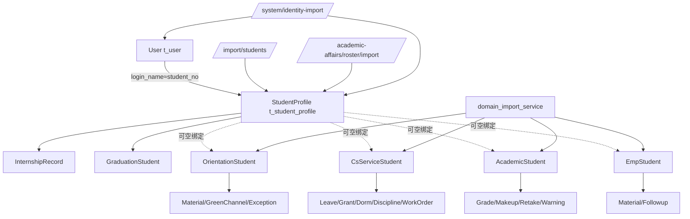
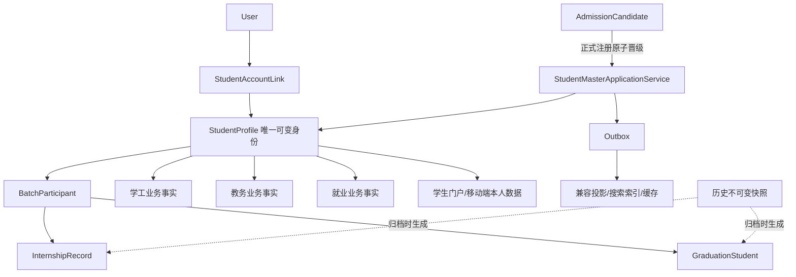

# 学生主档统一整改实施总控计划

> 文档性质：可直接交给 Cursor / Claude Code / Codex 执行的工程实施总控计划  
> 审计仓库：`penghaibin9/saas`  
> 审计基线提交：`7e883918dbfa2d12809374059bfed791b01f44bb`  
> 基线提交说明：`feat(system): establish commercial governance control plane`  
> 生成日期：2026-07-25  
> 执行原则：**一阶段一验收，一次只改一条主链；禁止一口气重构所有模块。**

---

## 目录

1. [结论与推荐路线](#1-结论与推荐路线)
2. [如何使用本计划](#2-如何使用本计划)
3. [审计方法、边界与可信度](#3-审计方法边界与可信度)
4. [纠错记录：本次审计如何逐步修正判断](#4-纠错记录本次审计如何逐步修正判断)
5. [当前学生调用总图](#5-当前学生调用总图)
6. [逐文件证据索引与整改定位](#6-逐文件证据索引与整改定位)
7. [目标架构与不可妥协的规则](#7-目标架构与不可妥协的规则)
8. [三种可落地方案及最终裁决](#8-三种可落地方案及最终裁决)
9. [数据库与服务层详细设计](#9-数据库与服务层详细设计)
10. [权限、路由、菜单统一设计](#10-权限路由菜单统一设计)
11. [分阶段施工计划](#11-分阶段施工计划)
12. [逐阶段测试计划](#12-逐阶段测试计划)
13. [历史数据迁移与回滚方案](#13-历史数据迁移与回滚方案)
14. [CI 与静态合同门禁](#14-ci-与静态合同门禁)
15. [AI 执行协议与任务输出格式](#15-ai-执行协议与任务输出格式)
16. [最终验收标准](#16-最终验收标准)
17. [遗漏复核清单](#17-遗漏复核清单)
18. [最终施工顺序](#18-最终施工顺序)

---

# 1. 结论与推荐路线

## 1.1 一句话结论

当前系统已经有正确的权威学生主档 `t_student_profile`，但尚未形成“**学生身份只有一个写入口、账号稳定绑定主档、所有业务按 `student_id` 引用、历史字段仅作快照**”的完整架构。

当前真实状态是：

```text
1 套权威学生主档
+ 4 套可独立创建学生的旧业务影子台账
+ 3 条能够创建 StudentProfile 的批量/身份导入链
+ 多套模块业务名单导入
+ 前端路由、菜单、后端权限码漂移
+ 不完整且存在确定性字段错误的投影同步
+ 学生账号与学生主档没有稳定外键
```

## 1.2 推荐路线

采用**渐进式统一方案**：

```text
只读全仓扫描
→ 建立主档写入合同和 CI 门禁
→ 修复加密、组织校验、投影错误
→ 把所有主档创建统一到 StudentMasterApplicationService
→ 收敛三套导入入口
→ 建立 User ↔ StudentProfile 稳定绑定
→ 停止影子学生新增
→ 回填 student_id
→ 岗位实习试点统一批次选人
→ 毕业设计复用
→ 迁移旧学工、旧学业、就业
→ 迎新按“录取候选人 → 正式学生”模型收口
→ 双读对账稳定后下线旧写入口
```

## 1.3 不建议的做法

以下做法均禁止：

- 一次性删除 `OrientationStudent`、`CsServiceStudent`、`AcademicStudent`、`EmpStudent`；
- 一次性把几十张子表全部换外键；
- 直接修改生产数据而不先跑 dry-run；
- 仅改前端按钮，不改后端写入口；
- 仅改数据库，不校验路由、菜单、权限和学生端身份解析；
- 用姓名自动绑定学生；
- 在业务模块导入中“找不到主档就自动建学生”；
- 把所有历史冗余字段都删除，导致历史合同、归档、证书失去当时快照；
- 为了兼容而继续允许多套新增学生入口；
- 跑与本阶段无关的全仓数据库测试，浪费时间和额度。

---

# 2. 如何使用本计划

## 2.1 行号使用规则

本文所有行号以基线提交：

```text
7e883918dbfa2d12809374059bfed791b01f44bb
```

为准。

任何 AI 开工前必须先执行：

```bash
git rev-parse HEAD
git status --short
```

如果 HEAD 不同：

1. 不得机械按照旧行号修改；
2. 使用本文提供的“搜索锚点”定位；
3. 重新输出当前文件行号；
4. 发现行为已变化时，更新审计结论后再施工。

推荐定位命令：

```bash
rg -n "class StudentProfile|def create_student|def update_student|StudentProfile\(" backend/app
rg -n "student_id|studentNo|studentNo.*name|real_name" backend/app
rg -n "phone_encrypted\s*=|id_card_encrypted\s*=" backend/app
rg -n "permissionKey.*student|student\.profile|studentAffairs\.student" frontend/src backend/app
```

## 2.2 执行纪律

每次 AI 任务只能执行本文一个阶段。

每阶段必须按以下顺序：

```text
读取阶段范围
→ 只读扫描
→ 输出拟改文件
→ 修改
→ 运行静态检查
→ 运行定向测试
→ 输出差异、风险、未完成项
→ 停止
```

没有用户的新指令，不得自动进入下一阶段。

## 2.3 Git 纪律

- 禁止 `git add -A`
- 禁止 `git add .`
- 禁止自动 commit
- 禁止自动 push
- 禁止新建分支
- 禁止改与本阶段无关的文件
- 禁止删除旧文件，除非本阶段明确进入 Contract 清理期
- 工作区有他人改动时必须精确隔离

---

# 3. 审计方法、边界与可信度

## 3.1 本次已经覆盖的调用链

已逐层核对：

1. `StudentProfile` 模型、Schema、Router、Service；
2. 学院、专业、班级组织主数据；
3. 学生主档导入、教务学籍导入、统一师生身份导入；
4. 通用域导入；
5. 数字迎新；
6. 旧在校服务；
7. 旧学业过程；
8. 就业；
9. 新学工；
10. 新教务；
11. 毕业设计；
12. 岗位实习；
13. 学生 PC 门户；
14. 移动端学生身份解析；
15. 用户账号与 RBAC；
16. 前端总路由、业务路由、权限守卫、菜单规划；
17. 当前 MySQL CI 和变更感知测试选择器；
18. 现有学生、导入导出、迎新测试。

## 3.2 审计采用的双向方法

### 正向追踪

```text
前端页面
→ 前端 API
→ 后端 Router
→ 权限依赖
→ Service
→ ORM Model
→ 数据表
```

### 反向追踪

```text
StudentProfile / student_id / student_no
→ 搜索写入点
→ 搜索影子表
→ 搜索业务子表外键
→ 搜索移动端本人解析
→ 搜索导入入口
→ 搜索菜单与路由权限
```

## 3.3 可信度边界

GitHub 私有仓库代码搜索在本次连接中没有返回完整索引，且连接器不能递归输出整棵仓库树。

因此本文不能诚实地声称：

> 仓库中绝对不存在任何尚未读取的隐藏调用。

为消除这一风险，**阶段 0 被设计为强制本地全仓扫描阶段**。在阶段 0 的清单生成器通过前，任何 AI 不得进入业务代码修改。

这不是降低计划可信度，而是把“可能遗漏”变成一个可自动验证、可阻断的工程门禁。

---

# 4. 纠错记录：本次审计如何逐步修正判断

这一节必须保留，后续 AI 不得只看最终结论而忽略判断变化。

## 4.1 纠错一：不是“两套学生导入”，而是至少三条能创建主档的链

### 初步判断

最初只识别到：

1. `/api/v1/import/students/*`
2. `/api/v1/academic-affairs/roster/import/*`

### 深入审计后修正

系统管理还有：

```text
/api/v1/system/identity-import/*
```

它会同时创建：

- `StudentProfile`
- `User`
- `STUDENT` 角色绑定
- 初始密码回执

所以当前能创建 `StudentProfile` 的主链至少有三条：

| 链路 | 创建主档 | 创建账号 | 权限 |
|---|---:|---:|---|
| `/import/students/*` | 是 | 否 | `student.import` |
| `/academic-affairs/roster/import/*` | 是 | 否 | `academicAffairs.roster.import` |
| `/system/identity-import/*` | 是 | 是 | `systemAdmin.user.import` |

### 最终裁决

- 系统管理身份导入应成为**批量创建学生身份 + 登录账号**的唯一正式入口；
- 公共学生 API 可保留单个手工建档，但必须调用统一应用服务；
- 教务学籍导入不得直接创建学生身份；
- `/import/students/*` 先兼容转发，稳定后下线或改为主档维护专用别名。

---

## 4.2 纠错二：主学生导入不是内存态，只有旧域导入是内存态

### 初步风险表述

曾笼统说“导入批次在内存中”。

### 深入审计后修正

`import_export_service.py` 的主档导入已经使用：

- `StudentImportBatch`
- `SharedImportBatch`
- claim / finish / fail
- 整批事务

它不是单纯 `_MEM`。

真正使用进程内 `_MEM` 的是：

```text
backend/app/services/domain_import_service.py
```

它会在多 Worker、服务重启和逐行提交时出问题。

### 最终裁决

- 保留主档导入的“持久化批次 + claim”思路；
- 禁止继续使用 `domain_import_service` 创建学生影子记录；
- 不应误删已经较成熟的共享批次底座。

---

## 4.3 纠错三：毕设和实习的“学生导入”不是第二套身份导入

### 初步表象

毕设和实习都有“学生导入”按钮，容易判断为重复导入学生。

### 深入审计后修正

两者主要逻辑是：

```text
用学号匹配已有 StudentProfile
→ 创建 GraduationStudent / InternshipRecord
```

没有重新创建 `StudentProfile`。

### 最终裁决

- 这两套导入不是身份重复；
- 但仍要求学校反复整理 Excel 名单，体验差、容易漏人；
- 应改造成“批次范围选人 + 冻结参与名单”；
- 迁移顺序先实习，再毕设。

---

## 4.4 纠错四：迎新表不能粗暴删除

### 初步表象

`OrientationStudent` 复制了大量身份字段，看起来是错误影子表。

### 深入业务分析

“已录取但未正式注册的人”在业务上可能还不是正式在籍学生。

### 最终裁决

迎新应明确为：

```text
AdmissionCandidate（录取候选人）
→ 核验、报到、缴费、材料、宿舍
→ 正式注册
→ 原子创建/绑定 StudentProfile
```

因此：

- 可以保留迎新候选人表；
- 但不能无限期不绑定主档；
- 绑定后身份字段必须以主档为准；
- 不能把迎新候选人主键继续叫通用 `studentId` 而不区分；
- 正式转换必须是唯一原子操作。

---

## 4.5 纠错五：“一份学生数据”不等于业务表完全不能保存姓名

成熟系统需要区分：

### 可变主数据

由 `StudentProfile` 唯一管理：

- 学号；
- 姓名；
- 性别；
- 身份证；
- 手机；
- 当前学院；
- 当前专业；
- 当前班级；
- 当前学籍状态。

### 业务事实

由业务模块管理：

- 实习单位；
- 毕设题目；
- 就业去向；
- 请假；
- 处分；
- 奖助；
- 成绩；
- 迎新进度。

### 不可变历史快照

允许在业务归档时保存：

- 当时姓名；
- 当时学院；
- 当时班级；
- 当时学号；
- 当时证书展示信息。

但快照必须：

- 标明 `snapshot` 语义；
- 禁止作为当前身份查询源；
- 禁止普通编辑；
- 不参与当前账号绑定。

---

## 4.6 纠错六：教务敏感字段问题不仅是“没加密”

进一步审计发现：

1. 学籍导入直接把明文写入 `id_card_encrypted`；
2. 学籍更正把密文列当明文进行比较；
3. 审核通过又直接写明文；
4. 敏感查看接口直接返回 `id_card_encrypted`，没有解密。

这会出现两种都不正确的情况：

```text
若库中是明文 → 敏感查看直接泄露明文
若库中是密文 → 页面拿到 Fernet 密文，而不是身份证号
```

所以整改不是只补一行 `encrypt_field()`，而是要统一：

```text
写入：normalize → encrypt_sensitive + hash_sensitive
读取：decrypt_sensitive → mask / reveal
更正比较：比较解密后的规范化值或 hash
审计：不记录明文
```

---

## 4.7 纠错七：投影同步不是“设计不足”，而是有确定性代码错误

`student_projection_sync.py` 使用：

```python
c.name
m.name
cl.name
```

但组织模型字段实际是：

```python
college_name
major_name
class_name
```

因此只要主档带组织 ID，当前同步函数就可能抛 `AttributeError`。

同时主档更新在提交后才调用同步，可能出现：

```text
主档已提交
→ 投影同步报错
→ API 返回失败
→ 用户重试
→ 实际数据已经改变
```

最终必须用事务内 Outbox 替代“提交后同步调用”。

---

## 4.8 纠错八：账号登录已优先用学号，但仍不是强绑定

真实登录链已经优先使用：

```text
User.login_name == StudentProfile.student_no
```

并且姓名回退只保留给历史演示账号。

这比“所有账号都按姓名找人”要好。

但仍存在：

- 学号修改后账号可能失联；
- 账号与主档没有数据库唯一链接；
- 手机端、门户、系统用户组织展示要重复做学号匹配；
- 无法可靠表达账号合并、换学号、恢复账号。

因此仍需建立稳定账号绑定表。

---

# 5. 当前学生调用总图

## 5.1 当前结构



## 5.2 目标结构



---

# 6. 逐文件证据索引与整改定位

> “行号”以基线提交为准；“搜索锚点”是后续 AI 的主要定位方式。

## 6.1 权威学生主档

### `backend/app/models/student.py`

| 行号 | 搜索锚点 | 当前行为 | 整改 |
|---:|---|---|---|
| 16-45 | `class StudentProfile` | 权威主档；租户内学号唯一 | 保留为唯一可变身份 |
| 31-32 | `id_card_encrypted` | 有密文列和 hash 列 | 统一用 `encrypt_sensitive/hash_sensitive` |
| 33-35 | `college_id / major_id / class_id` | 只有普通 BIGINT，没有显式父链约束 | 应用层强校验；后续评估复合租户约束 |
| 48-65 | `class StudentContact` | 联系方式独立表 | 保留；手机号不再复制到业务表 |
| 68-80 | `class StudentStageEvent` | 生命周期事件 | 所有主档关键变化必须写事件 |
| 83-94 | `class StudentImportBatch` | 主档导入批次 | 保留并与共享批次统一 |

### `backend/app/schemas/student.py`

| 行号 | 锚点 | 问题 | 整改 |
|---:|---|---|---|
| 11-20 | `class StudentCreate` | 支持组织字段 | 写入前必须验证组织链 |
| 23-31 | `class StudentUpdate` | 声明允许改学院、专业、班级 | 当前 Service 实际忽略；要么删除字段，要么转专门异动入口 |
| 34-36 | `class StudentVoid` | 只有原因 | 增加 `expectedVersion`；高风险强制作废另设专用请求 |

### `backend/app/api/v1/student.py`

| 行号 | 锚点 | 当前行为 | 整改 |
|---:|---|---|---|
| 24 | `APIRouter(prefix="/students"` | 公共主档 Router | 保留 |
| 26-33 | `_PICKER_PERMS` | 多业务权限可取学生候选项 | 统一到目录查询能力；保留数据范围 |
| 89-107 | `def list_students_endpoint` | 列表与 picker 共用 | 明确 `mode=picker`；最小 DTO |
| 126-137 | `def create_student` | 直接调用 `db_service.create_student` | 改调 `StudentMasterApplicationService` |
| 140-146 | `def update_student` | 写权限 `student.profile.manage` | 加 `expectedVersion`，区分身份更正/组织异动 |
| 149-152 | `def void_student` | 普通逻辑作废 | 改为影响预检 + 乐观锁 + 专用强制作废权限 |

### `backend/app/services/db_service.py`

| 基线行号 | 锚点 | 问题 | 整改 |
|---:|---|---|---|
| 238-245 | `def _as_optional_id` | 只做 int 转换 | 替换为组织实体校验 |
| 248-325 | `def create_student` | 直接 `StudentProfile(...)`；组织不校验 | 迁入统一应用服务 |
| 328-354 | `def update_student` | 忽略 Schema 中的组织字段 | 明确拆分基础信息修改与组织异动 |
| 355-364 附近 | `def void_student` | 不检查活动业务 | 增加 impact preview 和阻断 |
| 更新函数末尾 | `sync_student_projections` | 主事务提交后同步 | 改为同事务写 Outbox |

---

## 6.2 投影同步

### `backend/app/services/student_projection_sync.py`

| 行号 | 锚点 | 问题 | 整改 |
|---:|---|---|---|
| 3-9 | 模块说明 | 声明主档唯一真相 | 保留原则 |
| 22-27 | `def sync_student_projections` | 只覆盖 campus、graduation | 迁移期补覆盖，长期减少投影 |
| 40-48 | `c.name / m.name / cl.name` | 字段名错误 | 改为 `college_name/major_name/class_name` |
| 50-77 | 两个投影循环 | 同步式、无重试、无错误状态 | 改为 Outbox 消费器 |
| 79 | `db.commit()` | 投影独立事务 | 允许重试，但不得影响主档事务结果 |

### `backend/app/models/org.py`

| 行号 | 正确字段 |
|---:|---|
| 21 | `College.college_name` |
| 40 | `Major.major_name` |
| 61 | `SchoolClass.class_name` |

---

## 6.3 三条主档创建/导入链

### A. 公共学生主档导入

#### `backend/app/api/v1/import_export.py`

| 基线行号 | 锚点 | 当前行为 | 整改 |
|---:|---|---|---|
| 98-107 | `class ImportRowsRequest` | 只描述基础字段 | 改用统一模板契约 |
| 120-127 | `/students/validate` | `student.import` | 兼容别名，最终统一权限 |
| 130-146 | `/students/validate-file` | 支持 xlsx/csv | 按项目规则改为只支持 xlsx |
| 149-164 | `/students/confirm` | 持久化批次 + 幂等 | 保留机制，改调统一应用服务 |
| 167-199 | `/domain/*` | 业务域通用导入 | 禁止学生类域自动建档 |

#### `backend/app/services/import_export_service.py`

| 行号 | 锚点 | 当前行为 | 整改 |
|---:|---|---|---|
| 32-67 | `_validate_rows` | 无学院/专业/班级/证件字段 | 统一模板和组织编码校验 |
| 115-145 | `def dry_run` | 持久化 SharedImportBatch | 保留 |
| 148-187 | `def confirm` | 直接 `StudentProfile(...)` | 调统一批量创建服务 |
| 160-170 | 主档与联系人创建 | 手机已加密 | 保留加密原则 |
| 178 | 整批 commit | 事务正确 | 保留 |
| 195+ | 导出 | 已按数据范围、水印、审计 | 保留，统一权限码 |

### B. 教务学籍导入

#### `backend/app/modules/academic_affairs/services/academic_affairs_service.py`

| 基线行号 | 锚点 | 问题 | 整改 |
|---:|---|---|---|
| 775-799 | `def roster` | 正确读取 StudentProfile | 保留 |
| 863-880 | `def reveal_roster_sensitive` | 直接返回密文列 | 调 `decrypt_sensitive` 后返回，并继续强审计 |
| 942 附近 | `_correction_current_value` | 将密文当明文比较 | 比较规范化明文或 HMAC |
| 1079-1134 | `def review_roster_correction` | 直接写主档字段 | 调统一应用服务 |
| 1114-1117 | `s.id_card_encrypted = c.new_value` | 明文写入密文列 | 删除直接赋值 |
| 1218-1249 | `_persist_roster_rows` | 第二套直接建主档 | 停止直接创建 |
| 1234-1239 | `StudentProfile(... id_card_encrypted=id_card)` | 明文安全问题 | 删除 |
| 1252-1282 | `build_roster_import_spec` | 教务独立身份导入 | 改为跳转统一身份导入，或只导入既有学生的教务业务属性 |
| 1305-1311 | `roster_import_confirm` | 第二套确认入口 | 兼容转发后下线 |
| 1367-1379 | `_precheck` | 按姓名匹配迎新记录 | 优先 `OrientationStudent.student_id`，无绑定返回 UNKNOWN，不按姓名 `.first()` |

### C. 系统管理统一身份导入

#### `backend/app/services/identity_import_service.py`

| 行号 | 锚点 | 当前行为 | 整改 |
|---:|---|---|---|
| 3-7 | 文件说明 | 声称唯一身份导入 | 将实现真正收敛到这一承诺 |
| 29-45 | `run_identity_import` | 调 onboarding 服务 | 保留入口，底层改调统一主档应用服务 |

#### `backend/app/api/v1/system.py`

| 基线行号 | 锚点 | 当前行为 | 整改 |
|---:|---|---|---|
| 907-923 附近 | `/system/identity-import/validate-file` | xlsx 预检 | 保留为正式唯一批量入口 |
| 926-954 附近 | `/system/identity-import/confirm-batch` | 批量创建师生账号 | 保留；增加主档/账号绑定结果 |
| `get_system_context` | `createUser.visible=False` | 已明确账号只能统一导入 | 与代码实现统一 |
| `_user_org_hint` | `StudentProfile.student_no == account.login_name` | 账号与主档靠学号推断 | 改用账号绑定表 |

#### `backend/app/services/school_onboarding_service.py`

| 基线位置 | 锚点 | 问题 | 整改 |
|---|---|---|---|
| 学生循环 | `for s in (body.get("students")` | 直接创建 StudentProfile | 调统一应用服务的事务内函数 |
| 用户创建 | `User(... login_name=no` | 创建账号但无主档链接 | 同事务创建 `StudentAccountLink` |
| 已存在主档 | `if profile:` | 只补 college_id | 统一做组织一致性校验和冲突报告 |

---

## 6.4 旧域影子学生

### 数字迎新

#### `backend/app/models/orientation.py`

| 行号 | 锚点 | 风险 |
|---:|---|---|
| 14-52 | `class OrientationStudent` | 可空 `student_id`，复制姓名/组织/敏感字段 |
| 22 | `student_id` | 未强制绑定正式主档 |
| 31-32 | `phone_encrypted / id_card_encrypted` | 注释明确存在演示明文 |
| 55+ | `ori_student_id` | 子业务全部挂候选人主键 |
| 130-145 | `class OrientationBatch` | 批次无结构化参与范围 |

#### `backend/app/services/orientation_service.py`

| 行号 | 锚点 | 问题 | 整改 |
|---:|---|---|---|
| 95-124 | `_stu_row` | `studentId` 是迎新 PK，另有 `profileStudentId` | API 字段语义长期应改为 `candidateId` |
| 188-226 | `def create_student` | 可独立创建候选人 | 保留候选人语义，但禁冒充正式学生 |
| 199-203 | `phone_encrypted=body.get` | 明文写密文列 | 使用统一加密 |
| 206-220 | 可选绑定主档 | 绑定不是强流程 | 增加正式晋级 API |
| 229+ | `def update_student` | 身份字段仍可修改 | 绑定后身份字段只读主档 |

#### 目标

```text
OrientationStudent → AdmissionCandidate 语义
正式注册时：
锁候选人
→ 校验状态和材料
→ 创建/绑定 StudentProfile
→ 创建账号链接
→ 写 student_id
→ 状态转 ENROLLED
→ 写事件和审计
```

### 旧在校服务

#### `backend/app/models/campus_service.py`

- `CsServiceStudent`：14-34；
- `CsLeave.cs_student_id`：37-59；
- `CsGrant.cs_student_id`：62-75；
- `CsDormRecord.cs_student_id`：78-86；
- `CsDormException.cs_student_id`：89-99；
- `CsDiscipline.cs_student_id`：102-117；
- `CsWorkOrder.cs_student_id`：120-131；
- `CsMentalRecord.cs_student_id`：134-143。

#### `backend/app/api/v1/campus_service.py`

- 31-38：独立学生列表；
- 41-43：详情；
- 46-48：独立新增；
- 51-53：编辑；
- 56-58：作废。

#### `backend/app/services/campus_service_service.py`

| 行号 | 锚点 | 问题 |
|---:|---|---|
| 62-75 | `_cs_scope_student_ids` | 数据范围仍依赖影子班级名 |
| 78-93 | `_require_cs_scope` | 用 `cs_student_id=0` 哨兵兼容新旧 |
| 119-128 | `_stu_row` | `student_id or shadow.id` 混淆身份 |
| 173-188 | `create_student` | 可创建独立影子学生 |
| 191-215 | update/void | 仍允许独立维护影子台账 |

### 旧学业过程

#### `backend/app/models/academic.py`

- `AcademicStudent`：14-40；
- 成绩通过 `acad_student_id`：43-55；
- 补考：58-73；
- 重修：76-86；
- 预警：89-111。

#### `backend/app/services/academic_service.py`

| 行号 | 锚点 | 问题 |
|---:|---|---|
| 76-87 | `_stu_row` | 返回 `student_id or shadow.id` |
| 136-155 | `create_student` | 可独立创建影子学生，手机号明文 |
| 158-184 | update/void | 可改影子姓名和班级 |
| 230+ | `create_grade` | 正式成绩仍通过 `acad_student_id` |

### 就业

#### `backend/app/models/employment.py`

- `EmpStudent`：14-47；
- `EmpMaterial.emp_student_id`：50-60；
- `EmpFollowup.emp_student_id`：63-73。

#### `backend/app/modules/employment/services/employment_service.py`

| 行号 | 锚点 | 问题 |
|---:|---|---|
| 136-153 | `_stu_row` | `student_id or shadow.id` |
| 193-208 | `create_student` | 独立创建就业学生；手机号明文 |
| 211-236 | update/void | 就业业务与身份混在同一行 |
| 74-89 | `_resolve_teacher_user_id` | 教师也有姓名唯一回退，后续应稳定 user_id |

---

## 6.5 毕设与实习

### 毕业设计

#### `backend/app/models/graduation.py`

- `GraduationBatch`：30-58；
- `college_scope` 自由文本：39；
- `GraduationStudent`：61-96；
- `student_id` 仍可空：71；
- 复制敏感手机号：84。

#### `backend/app/modules/graduation/services/graduation_student_service.py`

| 基线位置 | 锚点 | 当前优点 | 待改 |
|---|---|---|---|
| 336-377 附近 | `create_student_record` | 先加载 StudentProfile，再建业务记录 | 加统一参与名单；`student_id` 最终 NOT NULL |
| 创建记录内 | `phone_encrypted=phone.contact_value_encrypted` | 复制了密文 | 删除业务表敏感复制，按需联查主档 |
| 唯一约束 | `tenant/batch/student` | 正确 | 保留 |

### 岗位实习

#### `backend/app/models/internship.py`

- `InternshipBatch`：16-48；
- 无结构化参与范围；
- `InternshipRecord`：51-85；
- `student_id` 非空：59-60；
- 唯一约束：54-56。

这是目前最适合做批次参与名单试点的模块。

---

## 6.6 学生账号与本人身份

### `backend/app/models/rbac.py`

`User` 没有 `student_id`，只持有：

- login_name；
- real_name；
- user_type；
- phone；
- status。

### `backend/app/services/auth_service_db.py`

搜索锚点：

```text
def _student_no
```

当前正式学生账号优先按：

```text
StudentProfile.student_no == User.login_name
```

查找主档。

### `backend/app/services/mobile_student_service.py`

搜索锚点：

```text
def resolve_student
def _resolve_domain_student
```

当前依次：

```text
studentNo
→ 唯一姓名
```

以及影子表：

```text
student_id
→ student_no
→ 未绑定行唯一姓名
```

最终必须改为：

```text
token.studentId
→ StudentAccountLink
→ StudentProfile.id
```

姓名只能保留在一次性迁移报告，不得继续作为在线请求身份键。

---

## 6.7 前端路由、菜单、权限

### `frontend/src/security/permissionGate.js`

| 行号 | 问题 |
|---:|---|
| 21-32 | `GUARDED_MODULES` 缺少 `STUDENT` |
| 102-113 | `MODULE_CODE_TO_KEYS` 缺少学生主档模块映射 |
| 127-148 | 因模块未受保护，学生路由不会进入统一权限门 |

### `frontend/src/modules/student/student.routes.js`

| 行号 | 路由 | 当前 permissionKey | 应改 |
|---:|---|---|---|
| 35-39 | 新增主档 | `student.profile.view` | `student.profile.manage` |
| 41-45 | 学籍状态 | `student.status.update` | 与后端真实能力注册表统一 |
| 47-50 | 身份核验 | `student.identity.view` | 必须确认后端存在 |
| 53-57 | 更正审核 | `student.correction.review` | 与教务更正权限归属统一 |
| 65-69 | 导入导出 | `student.export` | 路由需支持 import/export 任一权限，或拆页 |
| 72-75 | 编辑主档 | `student.profile.view` | `student.profile.manage` |

### `frontend/src/config/navPlan.js`

基线 112-121：

```text
学工中心 → 学生主档
```

所有入口统一使用：

```text
studentAffairs.student.view
```

包括状态、更正、身份和导入导出，与后端不一致。

### 最终建议

- 系统管理拥有“身份与主数据”的正式维护入口；
- 学工中心可保留“学生名册/学生360”只读业务入口；
- 两者可复用同一页面，但权限和菜单语义不同；
- 不新增一级模块。

---

## 6.8 CI 与测试选择器

### `.github/workflows/ci.yml`

现有优点：

- MySQL 8；
- 控制面合同检查；
- 变更感知 pytest；
- 实习专项闸门；
- 毕设专项闸门；
- 前端 lint/build；
- 小程序 build。

现有缺口：

- 没有“学生主档合同检查”独立 job；
- 没有扫描直接 `StudentProfile(...)`；
- 没有扫描密文列明文赋值；
- 没有前端路由/菜单/后端权限对账；
- 没有学生主数据迁移 dry-run 门禁。

### `scripts/check/select_pytest_targets.py`

现有规则覆盖：

- 权限；
- 导入导出；
- 教务；
- 学工；
- 实习；
- 毕设；
- 模型和迁移。

缺口：

- `backend/app/services/student_master*`
- `backend/app/services/student_account_link*`
- `backend/app/services/student_projection*`
- `backend/app/api/v1/student.py`
- `frontend student routes` 不会触发后端专项测试
- 新的迁移脚本与静态合同检查未登记。

---

# 7. 目标架构与不可妥协的规则

## 7.1 唯一身份真相

```text
StudentProfile 是当前学生身份唯一真相。
```

只有统一应用服务可以：

- 创建主档；
- 修改学号；
- 修改姓名；
- 修改性别；
- 修改证件；
- 修改组织；
- 作废；
- 恢复；
- 合并重复档案。

## 7.2 业务模块只能做三件事

1. 按 `student_id` 引用学生；
2. 维护本模块业务状态；
3. 在归档时保存只读历史快照。

## 7.3 禁止在线姓名匹配

在线请求禁止：

```python
StudentProfile.real_name == ...
OrientationStudent.name == StudentProfile.real_name
```

作为身份定位。

允许姓名的场景只有：

- 搜索展示；
- 人工迁移候选报告；
- 已知多条件下的提示，不自动绑定。

## 7.4 主档关键写入必须同时完成

同一事务：

```text
校验权限
→ 校验租户
→ 校验数据范围
→ 校验组织链
→ 乐观锁写主档
→ 写 StudentStageEvent / ChangeLog
→ 写审计
→ 写 Outbox
→ commit
```

## 7.5 敏感字段统一规则

写：

```python
normalized = normalize_id_card(value)
ciphertext = encrypt_sensitive(normalized, "id_card")
digest = hash_sensitive(normalized, "id_card")
```

读：

```python
plain = decrypt_sensitive(ciphertext, "id_card")
masked = mask_id_card(plain)
```

完整查看：

```text
专用权限
+ 数据范围
+ 理由≥5字
+ SUCCESS/DENY 双向审计
```

任何审计 detail 不得记录完整身份证和手机号。

## 7.6 作废不是删除

主档作废前必须生成影响报告：

```json
{
  "activeInternship": 1,
  "activeGraduation": 1,
  "openLeave": 2,
  "activeDiscipline": 0,
  "openRegistration": 1,
  "pendingFunding": 0
}
```

有活动业务时：

- 普通作废返回 409；
- 引导走学籍异动、合并重复档案或专用强制作废；
- 强制作废需更高权限、原因、影响确认、乐观锁和审计。

---

# 8. 三种可落地方案及最终裁决

## 8.1 方案 A：最小止血

### 内容

- 修加密；
- 修组织校验；
- 修投影字段错误；
- 停止域导入创建影子学生；
- 保留所有影子表和同步。

### 优点

- 快；
- 对现有页面影响小。

### 缺点

- 长期仍是多套学生台账；
- 同步成本高；
- 账号绑定问题未解决。

### 评分

```text
上线止血：9/10
长期架构：5/10
```

---

## 8.2 方案 B：渐进式统一（推荐）

### 内容

- 中央应用服务；
- 唯一身份批量导入；
- 账号链接；
- Outbox；
- 影子写入口冻结；
- 分域回填；
- 批次参与名单；
- 双读后切换。

### 优点

- 风险和质量平衡最好；
- 每阶段可回退；
- 适合当前单人 + AI 长线施工。

### 缺点

- 需要严格阶段门禁；
- 一段时间存在兼容双读。

### 评分

```text
上线安全：9/10
长期架构：9/10
实施风险：可控
```

---

## 8.3 方案 C：一次性全量归一

### 内容

- 删除四套影子学生表；
- 所有子表直接改 `student_id`；
- 全量重写接口和页面。

### 优点

- 最干净。

### 缺点

- 风险极高；
- 影响几十张表和全部模块；
- 极易破坏已完成业务。

### 评分

```text
理论架构：10/10
当前可执行性：3/10
```

## 8.4 最终裁决

采用方案 B。

方案 A 只作为方案 B 的前两阶段止血内容；禁止直接执行方案 C。

---

# 9. 数据库与服务层详细设计

## 9.1 统一学生主档应用服务

新增：

```text
backend/app/core/student_master_contract.py
backend/app/services/student_master_application_service.py
backend/app/services/student_master_query_service.py
```

### 建议接口

```python
class StudentMasterApplicationService:
    def create_student(
        self,
        db,
        *,
        tenant_id: int,
        actor: dict,
        payload: StudentCreateCommand,
        idempotency_key: str | None = None,
    ) -> StudentProfile:
        ...

    def update_basic_identity(
        self,
        db,
        *,
        student_id: int,
        expected_version: int,
        actor: dict,
        payload: StudentIdentityUpdateCommand,
    ) -> StudentProfile:
        ...

    def change_org_assignment(
        self,
        db,
        *,
        student_id: int,
        expected_version: int,
        actor: dict,
        college_id: int,
        major_id: int,
        class_id: int,
        reason: str,
        source_biz_id: str | None = None,
    ) -> StudentProfile:
        ...

    def apply_approved_correction(
        self,
        db,
        *,
        correction_id: int,
        expected_student_version: int,
        actor: dict,
    ) -> StudentProfile:
        ...

    def preview_void_impact(self, db, student_id: int, actor: dict) -> dict:
        ...

    def void_student(
        self,
        db,
        *,
        student_id: int,
        expected_version: int,
        reason: str,
        actor: dict,
        force: bool = False,
    ) -> StudentProfile:
        ...

    def promote_admission_candidate(
        self,
        db,
        *,
        candidate_id: int,
        actor: dict,
        payload: AdmissionPromotionCommand,
    ) -> StudentProfile:
        ...
```

### 关键要求

- Service 支持外部传入 `db`，方便身份导入在一个大事务内复用；
- Service 不自行随意开启第二个 session；
- Router 不得直接操作 ORM；
- 批量导入调用事务内 `create_student_in_session()`；
- 所有变更写 Outbox；
- 任何异常由外层事务整体回滚。

---

## 9.2 组织链校验器

新增：

```text
backend/app/services/student_org_validator.py
```

### 规则

```python
def validate_student_org_path(
    db,
    *,
    tenant_id: int,
    college_id: int | None,
    major_id: int | None,
    class_id: int | None,
    actor: dict,
) -> ValidatedStudentOrg:
    # 1. 所有实体属于当前租户
    # 2. 所有实体未软删且状态可用
    # 3. class.major_id == major.id
    # 4. major.college_id == college.id
    # 5. actor 可管理目标范围
    # 6. 不允许只传相互冲突的部分 ID
```

### 错误口径

| 情形 | 响应 |
|---|---|
| 组织不存在/跨租户 | 404，避免枚举 |
| 父子关系冲突 | 422 |
| 超出操作者数据范围 | 403002 |
| 班级已解散 | 409 |
| 同名匹配不唯一 | 422，要求编码 |

---

## 9.3 账号绑定表

新增 Alembic 迁移和模型：

```text
t_student_account_link
```

建议字段：

```text
id BIGINT
tenant_id BIGINT NOT NULL
user_id BIGINT NOT NULL
student_id BIGINT NOT NULL
status VARCHAR(20) NOT NULL DEFAULT ACTIVE
is_primary BOOLEAN NOT NULL DEFAULT TRUE
bound_source VARCHAR(50)
bound_by BIGINT NULL
bound_at DATETIME
version INT NOT NULL DEFAULT 0
created_at / updated_at / is_deleted
```

唯一约束：

```text
UNIQUE (tenant_id, user_id)
UNIQUE (tenant_id, student_id)
INDEX  (tenant_id, student_id, status, is_deleted)
```

### 为什么独立表优于直接给 User 加 student_id

- 可以记录绑定历史；
- 可支持账号恢复和合并；
- 后续家长、企业导师等身份链接可采用类似模型；
- 不污染通用用户表；
- 更适合 expand/backfill/switch 迁移。

### Token 改造

登录后加入：

```json
{
  "studentId": "12345",
  "studentNo": "20260001"
}
```

所有学生端解析顺序：

```text
token.studentId
→ StudentAccountLink
→ StudentProfile
```

迁移期才允许学号兜底；姓名兜底只允许历史 demo 账号，并记录告警。

---

## 9.4 Outbox

新增通用或学生专用表：

```text
t_outbox_event
```

最小字段：

```text
id
tenant_id
aggregate_type
aggregate_id
event_type
payload_json
status PENDING/PROCESSING/SUCCESS/FAILED
attempt_count
next_retry_at
last_error
created_at
processed_at
version
```

学生事件：

```text
STUDENT_CREATED
STUDENT_IDENTITY_UPDATED
STUDENT_ORG_CHANGED
STUDENT_STATUS_CHANGED
STUDENT_VOIDED
STUDENT_MERGED
STUDENT_ACCOUNT_BOUND
```

### 事务规则

主档事务内只负责写 Outbox，不直接调用多个投影服务。

消费者负责：

- 临时影子投影；
- 搜索索引；
- 缓存失效；
- 外部同步；
- 失败重试；
- 健康告警。

---

## 9.5 批次参与范围

### 长期完整方案

新增父批次注册表：

```text
t_business_batch
```

所有业务批次登记：

```text
module_key
source_batch_id
tenant_id
status
```

再建：

```text
t_business_batch_scope_rule
t_business_batch_participant
```

这样参与人表可有真实父键。

### 中期低风险方案

实习、毕设先各建模块专用参与表：

```text
t_internship_batch_participant
t_gd_batch_participant
```

公共 Service 复用选择规则和冻结逻辑。

### 推荐裁决

当前先使用**模块专用参与表 + 公共解析服务**，原因：

- 不需要马上重构所有批次模型；
- 有明确外键语义；
- 容易回滚；
- 实习、毕设验证稳定后，再评估抽象统一父批次。

### 参与表建议字段

```text
tenant_id
batch_id
student_id
membership_status ACTIVE/REMOVED/TRANSFERRED
source_type COLLEGE/MAJOR/CLASS/STUDENT/MIGRATION
source_ref_id
snapshot_json
joined_at
left_at
change_reason
version
```

唯一约束：

```text
UNIQUE (tenant_id, batch_id, student_id)
```

---

# 10. 权限、路由、菜单统一设计

## 10.1 现阶段选择最小漂移的主权限前缀

推荐沿用后端已经广泛使用的：

```text
student.profile.*
```

正式能力：

```text
student.profile.view
student.profile.manage
student.profile.import
student.profile.export
student.profile.sensitive.reveal
student.profile.correction.apply
student.profile.correction.review
student.profile.org.change
student.profile.void
student.profile.forceVoid
student.profile.restore
student.profile.merge
student.profile.audit.view
```

## 10.2 兼容别名

旧权限：

```text
student.import
student.export
studentAffairs.student.view
student.status.update
student.identity.view
student.correction.review
student.risk.view
```

处理方式：

1. 在能力注册表登记 alias；
2. 运行期允许一版；
3. 每次命中 alias 写统计，不写敏感审计；
4. 菜单和路由先改成正式码；
5. 后端入口再移除 alias；
6. CI 要求新增代码不得使用 alias。

## 10.3 前端路由元数据扩展

当前单个 `permissionKey` 无法表达“导入或导出任一权限可进入页面”。

建议支持：

```javascript
meta: {
  moduleCode: 'STUDENT',
  permissionAny: [
    'student.profile.import',
    'student.profile.export'
  ]
}
```

`canEnterRoute()` 支持：

```text
permissionKey
permissionAny
permissionAll
```

## 10.4 菜单归属

### 系统管理正式入口

```text
系统管理
└─ 身份与主数据
   ├─ 学生主档
   ├─ 师生统一导入
   ├─ 账号绑定
   ├─ 重复档案治理
   ├─ 主数据同步健康
   └─ 导入任务与错误回执
```

### 学工业务入口

```text
学工中心
└─ 学生名册
   ├─ 学生列表
   ├─ 学生360
   ├─ 风险标签
   └─ 学工业务画像
```

学工入口默认只读，不拥有学生身份批量导入。

### 教务业务入口

```text
教务中心
└─ 学籍管理
   ├─ 学籍名册
   ├─ 注册
   ├─ 学籍异动
   ├─ 信息更正
   └─ 学籍状态
```

教务能审批学籍更正和学籍异动，但不再拥有第二套身份建档器。

---

# 11. 分阶段施工计划

---

## 阶段 0：全仓引用清单与合同基线

### 目标

在任何业务代码修改前，生成可机读的全仓学生调用清单，补齐本次 GitHub 连接器无法递归确认的剩余引用。

### 只允许新增/修改

```text
scripts/check/audit-student-master-references.py
scripts/check/check-student-master-contracts.py
scripts/check/student-master-allowlist.json
backend/tests/test_student_master_contract_static.py
docs/.../本计划对应的现有总册附录（可选，只更新一份）
```

### 扫描内容

1. 所有 `StudentProfile(`；
2. 所有 `.student_no =`、`.real_name =`、`.class_id =`；
3. 所有 `_encrypted =`；
4. 所有模型中的 `student_id`；
5. 所有 `student_no` + `name` 同时存在的业务模型；
6. 所有 `create_student`；
7. 所有 Router 中 `/students`；
8. 所有导入中调用 `create_student`；
9. 所有姓名匹配学生；
10. 所有前端 `permissionKey`；
11. 所有 `navPlan` 学生入口；
12. 所有学生 Picker；
13. 所有测试直接 seed 敏感明文；
14. 所有迁移中学生相关列；
15. 所有文档中“唯一入口”“主档”“学籍导入”的冲突声明。

### 输出

```text
artifacts/student-master-reference-manifest.json
artifacts/student-master-reference-report.md
```

JSON 示例：

```json
{
  "baselineSha": "...",
  "directStudentProfileWrites": [],
  "shadowStudentCreates": [],
  "plaintextSensitiveWrites": [],
  "nameBasedIdentityResolution": [],
  "studentIdColumns": [],
  "permissionDrift": [],
  "routes": [],
  "tests": []
}
```

### 通过门禁

- 扫描器对已知问题全部命中；
- 允许列表仅包含已审计位置；
- 新增未知直接写入时 CI 失败；
- 不改业务代码；
- 不跑全仓测试。

### 定向测试

```bash
python scripts/check/audit-student-master-references.py --check
pytest backend/tests/test_student_master_contract_static.py -q
```

### 停止条件

生成报告后停止，等待用户批准阶段 1。

---

## 阶段 1：P0 安全与确定性缺陷修复

### 目标

先修会导致明文、错误响应、确定性异常和跨组织脏数据的缺陷，不做影子表迁移。

### 修改文件

```text
backend/app/core/field_crypto.py
backend/app/core/optimistic_lock.py
backend/app/services/student_org_validator.py              # 新增
backend/app/services/student_master_application_service.py # 新增骨架
backend/app/services/db_service.py
backend/app/services/student_projection_sync.py
backend/app/modules/academic_affairs/services/academic_affairs_service.py
backend/app/services/orientation_service.py
backend/app/services/academic_service.py
backend/app/modules/employment/services/employment_service.py
backend/tests/test_student_master_security.py               # 新增
backend/tests/test_student_org_validation.py                # 新增
backend/tests/test_student_projection_sync.py               # 新增
```

### 具体修改

#### 1. 修投影字段错误

```python
college_name = c.college_name if c else ""
major_name = m.major_name if m else ""
class_name = cl.class_name if cl else ""
```

#### 2. 统一敏感字段函数

禁止继续：

```python
phone_encrypted = body.get("phone")
id_card_encrypted = body.get("idCard")
```

统一使用：

```python
encrypt_sensitive(value, "phone")
encrypt_sensitive(value, "id_card")
hash_sensitive(value, "phone")
hash_sensitive(value, "id_card")
```

#### 3. 教务敏感查看

```python
plain = decrypt_sensitive(s.id_card_encrypted, "id_card")
return {"studentId": str(s.id), "idCard": plain or ""}
```

保持：

- 专用权限；
- 理由；
- SUCCESS/DENY 双向审计。

#### 4. 学籍更正

申请时不能把密文放入 `old_value`。

建议 `AaStudentCorrection`：

- `old_value_masked`
- `old_value_hash`
- `new_value_encrypted`（敏感字段）
- `new_value_hash`
- 非敏感字段可继续普通值。

若本阶段不改表，至少：

- 敏感字段的 correction payload 加密；
- 比较用 HMAC；
- 审计只显示脱敏前后摘要。

#### 5. 组织校验

创建主档必须验证完整父链。

普通更新不再静默忽略 `collegeId/majorId/classId`：

- 要么 Router 拒绝并提示走学籍异动；
- 要么明确调用 `change_org_assignment`。

推荐第一阶段先拒绝普通编辑组织，避免绕过教务异动。

### 测试

```bash
pytest \
  backend/tests/test_student.py \
  backend/tests/test_student_master_security.py \
  backend/tests/test_student_org_validation.py \
  backend/tests/test_student_projection_sync.py \
  -q
```

### 验收

- 数据库新增的手机号/身份证不是明文；
- 投影同步带组织数据不再抛异常；
- 跨租户组织 ID 返回拒绝；
- 班级、专业、学院父链冲突返回 422；
- 教务敏感查看返回真实明文而不是 Fernet 密文；
- 审计不含完整敏感值。

### 回滚

本阶段不删列、不删接口；代码可直接回退。新写入密文后，旧代码可能无法正确展示，因此回滚必须保留 `decrypt_field(...allow_legacy_plaintext=True)` 兼容。

---

## 阶段 2：统一主档写服务与三套导入收敛

### 目标

所有 `StudentProfile` 创建和身份字段修改通过一个应用服务。

### 修改文件

```text
backend/app/core/student_master_contract.py
backend/app/services/student_master_application_service.py
backend/app/services/import_export_service.py
backend/app/services/identity_import_service.py
backend/app/services/school_onboarding_service.py
backend/app/modules/academic_affairs/services/academic_affairs_service.py
backend/app/api/v1/student.py
backend/app/api/v1/import_export.py
backend/app/api/v1/system.py
backend/app/modules/academic_affairs/routers/academic_affairs.py
frontend/src/modules/academicAffairs/views/AaRosterImportExportView.vue
frontend/src/views/admin/student/StudentImportExportView.vue
frontend/src/modules/system/...统一身份导入页面
```

### 正式入口裁决

#### 保留

```text
/system/identity-import/*
```

作为学校批量创建学生身份和账号的正式入口。

#### 手工单个建档

```text
POST /students
```

可保留，但只允许少量特殊补录，并调用统一 Service。

#### 兼容转发

```text
/import/students/*
```

先转发同一统一导入服务，响应增加：

```json
{
  "deprecated": true,
  "canonicalEntry": "/api/v1/system/identity-import"
}
```

#### 教务入口

```text
/academic-affairs/roster/import/*
```

处理方式：

- 前端跳转系统管理统一身份导入；
- 后端兼容一版，但内部调用统一 Service；
- 第二版返回 410/业务提示；
- 教务保留“学籍属性更新/状态业务导入”时，必须要求学生已存在。

### 代码门禁

除允许列表外，CI 禁止：

```text
StudentProfile(
s.real_name =
s.student_no =
s.id_card_encrypted =
s.college_id =
s.major_id =
s.class_id =
```

### 测试

- 三个入口创建相同数据结果一致；
- 同一学号跨入口重复返回 409；
- 身份导入同时创建 User、StudentProfile；
- 任一行失败整批回滚；
- 幂等重放不重复创建；
- 学院管理员不能导其他学院；
- 旧入口返回 canonical 提示；
- 教务入口不再维护第二套实现。

### 停止条件

所有直接主档写入清单归零，允许列表只剩统一应用服务和迁移脚本。

---

## 阶段 3：账号与主档稳定绑定

### 目标

彻底摆脱在线请求靠学号/姓名反查本人。

### Expand

新增：

```text
backend/app/models/student_account_link.py
backend/alembic/versions/<revision>_student_account_link.py
backend/app/services/student_account_link_service.py
backend/scripts/backfill_student_account_links.py
```

### Backfill

按以下优先级：

1. 同租户 `User.user_type=STUDENT`；
2. `User.login_name == StudentProfile.student_no`；
3. 必须唯一；
4. 姓名不自动绑定；
5. 输出冲突报告。

Dry-run：

```bash
python backend/scripts/backfill_student_account_links.py --dry-run --tenant-id <id>
```

确认：

```bash
python backend/scripts/backfill_student_account_links.py --apply --tenant-id <id> --report <file>
```

### Dual Read

登录和学生端：

```text
先读 StudentAccountLink
→ 无链接时正式账号按学号兼容
→ 记录 fallback 指标
```

### Switch

- 新导入必须同事务建链接；
- token 带 `studentId`；
- 移动端、门户只按 `studentId`；
- 系统用户列表组织提示走链接；
- fallback 指标连续为 0 后关闭学号兜底。

### 测试

- 一账号只能绑定一个学生；
- 一学生只能绑定一个主账号；
- 跨租户绑定拒绝；
- 学号修改后账号仍能找到学生；
- 同名学生不会串号；
- 删除/停用账号不删除主档；
- 合并学生时链接迁移有审计；
- token 中 studentId 正确。

---

## 阶段 4：冻结影子学生写入口并回填 student_id

### 目标

停止继续产生新的无绑定影子学生。

### 第一部分：冻结写入口

需要改：

```text
backend/app/api/v1/campus_service.py
backend/app/api/v1/academic.py
backend/app/modules/employment/routers/employment.py
backend/app/services/domain_import_service.py
backend/app/core/import_export_auth.py
```

处理：

```text
旧 POST /students
→ 返回 DEPRECATED_WRITE_PATH
→ 告知先建主档，再创建业务记录
```

但迎新例外：

- 保留候选人创建；
- 改名和 API 语义；
- 不将候选人当正式学生。

### 第二部分：回填

新增：

```text
backend/scripts/backfill_shadow_student_ids.py
```

匹配规则：

```text
已有 student_id：校验
同租户唯一 student_no：自动候选
录取候选人：通过明确 admission mapping
姓名：只进人工报告
```

输出：

```text
matched
unmatched
ambiguous
cross_tenant
student_no_conflict
org_conflict
sensitive_conflict
```

### 第三部分：双读

旧业务查询：

```text
有 student_id → 联查 StudentProfile 当前身份
无 student_id → 临时使用影子字段，响应 legacyFallback=true
```

### 测试

- 旧新增入口被阻断；
- 旧列表和详情仍可读取；
- 已绑定行显示主档新姓名；
- 未绑定历史行仍显示旧快照；
- 跨租户不会错误回填；
- 脚本重复执行幂等；
- dry-run 不写任何数据。

---

## 阶段 5：岗位实习批次参与人试点

### 目标

用组织范围选人替代重复 Excel 名单导入。

### 数据库

新增：

```text
t_internship_batch_scope_rule
t_internship_batch_participant
```

### 后端

新增：

```text
backend/app/services/student_scope_resolver.py
backend/app/modules/internship/services/internship_participant_service.py
backend/app/modules/internship/routers/internship_participant.py
```

接口：

```text
POST /internship/batches/{id}/participants/preview
POST /internship/batches/{id}/participants/freeze
GET  /internship/batches/{id}/participants
POST /internship/batches/{id}/participants/add
POST /internship/batches/{id}/participants/remove
```

### 预览规则

支持：

- 学院；
- 专业；
- 班级；
- 单个学生；
- 年级；
- 在籍状态；
- 排除学院/专业/班级/学生；
- 去重；
- 数据范围。

### 冻结事务

```text
锁批次
→ 校验 DRAFT
→ 重新解析规则
→ 写 participant
→ 幂等创建 InternshipRecord
→ 更新 planned_count / actual_count
→ 写审计
→ 写 Outbox
→ 状态转 RUNNING
```

### 前端

新增独立页面：

```text
/admin/internship/batches/:id/participants
```

禁止做成右侧窄抽屉。

### 测试

- 整学院选人；
- 多班级去重；
- 排除学生；
- 学院管理员只能选本院；
- 批次冻结后学生转班不改变已冻结名单；
- 重复冻结不重复建 InternshipRecord；
- 并发冻结只有一个成功；
- 名单变化有审计；
- 旧 Excel 导入变兼容迁移入口。

---

## 阶段 6：毕业设计复用批次参与能力

### 目标

复用实习验证过的范围解析器和页面交互。

### 数据库

```text
t_gd_batch_scope_rule
t_gd_batch_participant
```

### 改造

- `college_scope` 只作为历史展示；
- 新批次必须使用结构化 scope rule；
- 冻结后生成 `GraduationStudent`；
- `GraduationStudent.student_id` 新记录强制非空；
- 停止复制手机号密文；
- 毕设学生 Excel 导入转为历史迁移入口；
- 单个补录仍可用主档 Picker。

### 测试

- 范围预览与名单一致；
- 同一学生同一批次唯一；
- 题目、导师、答辩等现有流程不受影响；
- 归档读取冻结快照；
- 主档改名后当前页面显示新姓名；
- 已归档文档仍保留当时快照。

---

## 阶段 7：旧在校服务、旧学业、就业迁移

### 7A 在校服务

顺序：

```text
CsLeave
→ CsDiscipline
→ CsDormRecord / Exception
→ CsGrant
→ CsWorkOrder
→ CsMentalRecord
```

每张表：

1. 加直接 `student_id`；
2. backfill；
3. 双读；
4. 新写只写 `student_id`；
5. 对账；
6. 旧 `cs_student_id` 只读；
7. 稳定后改 NOT NULL 或保留兼容。

### 7B 旧学业

优先：

```text
AcademicGrade
AcademicWarning
AcademicMakeup
AcademicRetake
```

长期目标：

- 直接 `student_id`；
- `AcademicStudent` 退化为可重算聚合投影；
- 身份字段不可编辑；
- 旧 `/academic/students` 写接口下线。

### 7C 就业

目标：

```text
EmploymentRecord(student_id, destination...)
```

- `EmpStudent` 改成就业业务记录；
- `student_id` 强制非空；
- 姓名、组织改为联查/归档快照；
- 材料和跟进可继续挂就业记录 ID；
- 禁止独立新增就业学生。

每个子阶段单独施工和验收，禁止一次改完三域。

---

## 阶段 8：迎新候选人正式晋级

### 目标

明确“候选人”和“正式学生”的边界。

### API

```text
POST /orientation/candidates/{candidateId}/promote
```

请求：

```json
{
  "studentNo": "20260001",
  "collegeId": 1,
  "majorId": 2,
  "classId": 3,
  "expectedVersion": 5,
  "createAccount": true
}
```

同一事务：

1. 锁候选人；
2. 校验未作废、已核验、符合注册条件；
3. 检查是否已有 `student_id`；
4. 创建或绑定 StudentProfile；
5. 创建/绑定账号；
6. 写 StudentAccountLink；
7. 候选人写 `student_id`；
8. 状态转 ENROLLED；
9. 写事件、审计、Outbox；
10. commit。

### 绑定后规则

- 姓名、性别、身份证、手机号、正式组织只读主档；
- 迎新表只保留录取、报到、缴费、材料、宿舍等业务字段；
- 旧 `studentId` 返回兼容一版，同时新增 `candidateId` 和 `profileStudentId`；
- 新前端全部使用明确字段。

---

## 阶段 9：Contract 清理期

进入条件：

- 所有回填 unresolved 为 0 或有正式豁免；
- 双读 fallback 连续两个发布周期为 0；
- 所有新写只写 `student_id`；
- 权限 alias 使用为 0；
- 旧接口访问为 0；
- 对账持续为 0 差异；
- 备份恢复演练通过。

才允许：

- `student_id` 改 NOT NULL；
- 删除旧写 Router；
- 删除 `_MEM` 域学生导入；
- 删除姓名在线兜底；
- 删除权限 alias；
- 删除无用影子身份字段，或重命名为 snapshot；
- 删除兼容前端入口。

---

# 12. 逐阶段测试计划

## 12.1 测试分层

### 静态合同测试

无需数据库，秒级：

- 直接主档写入扫描；
- 敏感字段明文赋值扫描；
- 姓名身份匹配扫描；
- 路由/菜单/后端权限对账；
- 迁移脚本存在性；
- 新模型必须有 tenant_id、version、is_deleted。

### 单元测试

- 组织父链；
- 状态转换；
- 加密解密；
- hash；
- scope rule 去重；
- impact preview 聚合。

### MySQL 集成测试

必须 MySQL 8，不允许 SQLite：

- 唯一约束；
- 事务；
- 行锁；
- 乐观锁；
- 幂等；
- 多租户；
- Alembic 升降级；
- 批次冻结并发。

### ASGI HTTP 测试

必须真实请求 Router，不能只直接调用端点函数：

- 401；
- 403；
- 403002 数据范围；
- 404 防枚举；
- 409 并发；
- 422 校验；
- 审计；
- 响应契约。

### 前端测试

- 路由守卫；
- permissionAny；
- 菜单可见性；
- 未授权跳 403；
- Picker 最小数据；
- 导入入口跳转；
- build/lint。

---

## 12.2 必建测试文件

```text
backend/tests/test_student_master_contract_static.py
backend/tests/test_student_master_http.py
backend/tests/test_student_master_security.py
backend/tests/test_student_org_validation.py
backend/tests/test_student_master_concurrency.py
backend/tests/test_student_master_import.py
backend/tests/test_student_account_link.py
backend/tests/test_student_shadow_backfill.py
backend/tests/test_student_shadow_dual_read.py
backend/tests/test_student_void_impact.py
backend/tests/test_internship_batch_participants.py
backend/tests/test_graduation_batch_participants.py
backend/tests/test_orientation_candidate_promotion.py
backend/tests/test_student_permission_contract.py

frontend/tests/student-route-contract.spec.js
frontend/tests/student-permission-gate.spec.js
frontend/tests/student-scope-selector.spec.js
```

---

## 12.3 核心 HTTP 场景清单

### 主档

1. 校管理员创建学生成功；
2. 无 manage 权限创建返回 403；
3. 学院管理员仅能创建本学院；
4. 伪造其他学院 ID 返回 403/404；
5. 班级不属于专业返回 422；
6. 专业不属于学院返回 422；
7. 跨租户组织返回 404；
8. 学号重复返回 409；
9. 缺 expectedVersion 更新返回 422；
10. 旧 version 更新返回 409；
11. 两个并发更新只有一个成功；
12. 主档修改写阶段事件和审计；
13. 审计不含身份证明文；
14. 活动业务存在时普通作废返回 409；
15. 强制作废无专用权限返回 403；
16. 强制作废有权限且确认影响后成功。

### 敏感字段

17. 手机数据库值为 Fernet 密文；
18. 身份证数据库值为 Fernet 密文；
19. hash 使用 `hash_sensitive`；
20. 列表只返回脱敏；
21. reveal 无权限写 DENY 审计；
22. reveal 有权限返回解密明文；
23. 错误密文生产模式不静默当明文；
24. 更正申请不把完整证件写普通审计。

### 导入

25. 统一 xlsx 模板；
26. 错误行有行号；
27. 同文件学号重复；
28. 库内重复；
29. 组织编码不存在；
30. 同名班级不唯一；
31. 学院管理员跨院行失败；
32. 任一硬错误整批回滚；
33. 确认幂等；
34. claim 期间重复确认；
35. Worker 重启后批次仍存在；
36. 旧入口兼容转发；
37. 教务入口不再直接创建主档；
38. 业务域导入找不到主档只报错，不自动建人。

### 账号绑定

39. 新身份导入同事务创建链接；
40. 一账号一学生；
41. 一学生一主账号；
42. 学号修改后登录仍解析同一学生；
43. 同名学生不串号；
44. 无链接账号 fail-closed；
45. 历史学号兜底有指标；
46. 跨租户链接拒绝。

### 影子迁移

47. dry-run 不写库；
48. 唯一学号正确匹配；
49. 同名不自动匹配；
50. 冲突进入报告；
51. 重跑幂等；
52. 已绑定影子显示主档新姓名；
53. 未绑定历史记录仍可读；
54. 新增影子学生接口被阻断。

### 批次参与

55. 整学院选人；
56. 多专业、班级去重；
57. 排除学生；
58. 只选在籍学生；
59. 数据范围收敛；
60. 冻结后转班不改变名单；
61. 重复冻结幂等；
62. 两个并发冻结只有一个成功；
63. participant 和 InternshipRecord 一致；
64. participant 和 GraduationStudent 一致；
65. 归档保留快照；
66. 当前列表优先显示主档身份。

### 迎新晋级

67. 未核验候选人不能晋级；
68. 已绑定候选人重复晋级幂等；
69. 晋级创建主档和账号链接；
70. 正式学号重复返回 409；
71. 晋级事务任一步失败全部回滚；
72. 绑定后身份字段不可在迎新普通编辑修改。

### 前端合同

73. `STUDENT` 进入权限守卫；
74. 新增/编辑页需要 manage；
75. 导入导出页 permissionAny 生效；
76. 菜单权限与 Router 一致；
77. 后端缺失权限码时 CI 失败；
78. 未授权用户不能先进入页面再报错；
79. 学生 Picker 显式 `mode=picker`；
80. 前端 build/lint 通过。

---

## 12.4 现有测试应如何调整

### `backend/tests/test_student.py`

保留基础测试，并增加：

- 组织校验；
- expectedVersion；
- 作废影响；
- 权限负向；
- 审计；
- 加密。

### `backend/tests/test_import_export.py`

当前只测占位接口，必须增加真实学生导入：

- dry-run；
- confirm；
- 幂等；
- 事务回滚；
- 数据范围；
- xlsx；
- 旧入口兼容。

### `backend/tests/test_orientation.py`

当前 seed 直接写明文手机号和身份证。

改为：

```python
phone_encrypted=encrypt_sensitive("138...", "phone")
id_card_encrypted=encrypt_sensitive("...", "id_card")
```

独立“新增新生”测试改名为“新增录取候选人”，并增加正式晋级测试。

---

# 13. 历史数据迁移与回滚方案

## 13.1 固定迁移模式

```text
Expand
→ Backfill
→ Dual Read
→ Switch
→ Contract
```

## 13.2 Expand

只新增：

- nullable `student_id`；
- 新索引；
- 新账号链接表；
- Outbox；
- participant；
- alias；
- 新 Service。

不删列、不改旧数据语义。

## 13.3 Backfill

每个脚本必须支持：

```text
--dry-run
--tenant-id
--limit
--resume-from
--report
--apply
```

报告必须带：

- 总数；
- 成功；
- 跳过；
- 冲突；
- 未匹配；
- 失败；
- SQL/业务原因；
- 可重复执行标识。

## 13.4 Dual Read

响应可临时增加：

```json
{
  "identitySource": "MASTER",
  "legacyFallback": false
}
```

仅管理员诊断接口返回，不必展示给普通用户。

## 13.5 Switch

以运行指标确认：

```text
legacyFallbackCount
unboundShadowCount
permissionAliasHitCount
nameResolutionFallbackCount
projectionFailureCount
participantMismatchCount
```

全部稳定归零后切换。

## 13.6 回滚

### 应用代码回滚

- 保留旧列；
- 保留旧读；
- 新写事件可暂停消费；
- 账号链接可关闭 feature flag；
- participant 可回退旧名单视图。

### 数据回滚

禁止直接删除新数据。

使用：

- migration reversal script；
- Outbox 重放；
- participant 状态改 REMOVED；
- shadow projection 重新生成；
- 备份恢复只在灾难级错误使用。

### 不可回滚动作

进入 Contract 删除列后难以快速回滚，所以 Contract 前必须：

- 完整备份；
- 恢复演练；
- 两个发布周期；
- 用户确认；
- 对账 0 差异。

---

# 14. CI 与静态合同门禁

## 14.1 新增 CI job

```yaml
student-master-contracts:
  name: 学生主数据合同检查
  runs-on: ubuntu-latest
  steps:
    - uses: actions/checkout@v4
    - uses: actions/setup-python@v5
      with:
        python-version: "3.12"
    - uses: actions/setup-node@v4
      with:
        node-version: "20"
    - run: python scripts/check/audit-student-master-references.py --check
    - run: python scripts/check/check-student-master-contracts.py
    - run: node scripts/check/check-student-route-permission-contract.mjs
```

## 14.2 静态红线

CI 失败条件：

- 允许列表外新增 `StudentProfile(`；
- 允许列表外直接修改主档身份字段；
- `_encrypted` 列直接接请求变量；
- 在线业务按姓名解析学生；
- 新影子模型同时拥有 `student_no + name` 且可写；
- 前端路由 permissionKey 不存在；
- 菜单 permissionKey 与路由不一致；
- `STUDENT` 不在守卫；
- 域导入调用 shadow `create_student`；
- 迁移脚本不支持 dry-run；
- 新 participant 表无唯一约束；
- 高风险写无 expectedVersion。

## 14.3 更新变更感知测试选择器

在 `scripts/check/select_pytest_targets.py` 增加：

```python
(
  (
    "backend/app/models/student",
    "backend/app/api/v1/student",
    "backend/app/services/student_master",
    "backend/app/services/student_account_link",
    "backend/app/services/student_projection",
    "backend/app/services/student_org_validator",
    "backend/scripts/backfill_student",
  ),
  [
    "tests/test_student*.py",
    "tests/test_student_master*.py",
    "tests/test_student_account_link.py",
    "tests/test_student_shadow*.py",
  ],
)
```

前端相关文件变化时，至少跑：

```text
学生权限合同静态检查
frontend lint
frontend build
```

## 14.4 不跑无关全量测试

每次阶段只跑：

1. 静态合同；
2. 本阶段专项 pytest；
3. 被修改模块的现有回归；
4. 前端 lint/build；
5. 必要时小程序相关专项。

全量 pytest 继续交给 nightly。

---

# 15. AI 执行协议与任务输出格式

## 15.1 每次开工前必须输出

```text
当前 HEAD
工作区状态
本阶段范围
预计修改文件
明确不改文件
现有调用清单
风险
定向测试
```

## 15.2 AI 不得做

- 不得以“顺手优化”为理由扩大范围；
- 不得新建大量文档；
- 不得删除旧表；
- 不得自动跑全量数据库测试；
- 不得因测试难写而改成 mock；
- 不得把生产失败伪装成功；
- 不得用名字猜学生；
- 不得为了页面通过而放宽后端权限；
- 不得在找不到学生时自动创建影子记录；
- 不得跳过迁移 dry-run；
- 不得自动 commit/push。

## 15.3 每阶段最终报告模板

```markdown
## 本阶段结论

## 实际修改文件

## 每个文件修改了什么

## 数据库迁移

## 兼容行为

## 已运行测试
- 命令
- 结果
- 耗时

## 未运行测试及理由

## 发现的新问题

## 风险与回滚

## 下一阶段建议
```

## 15.4 可直接交给 AI 的总控执行指令

```text
你正在整改“学生主档唯一真相与全模块调用”工程。

先读取《学生主档统一整改实施总控计划.md》，只执行用户指定的一个阶段。
当前基线行号可能已漂移，必须先 git rev-parse HEAD、git status --short，并用文档中的搜索锚点重新定位。
先只读扫描并输出本阶段拟改文件，确认没有并发冲突后再修改。

硬规则：
1. MySQL only，不得引入 SQLite/PostgreSQL 兼容方案。
2. 禁止 git add -A、git add .、commit、push、建分支。
3. 禁止修改本阶段范围外文件。
4. 禁止删除旧表、旧列、旧路由，除非当前明确是 Contract 清理阶段。
5. StudentProfile 是唯一可变学生身份；业务模块只能按 student_id 引用。
6. 禁止姓名作为在线身份键。
7. 所有手机号/身份证写入必须走 field_crypto。
8. 高风险写必须 expectedVersion + 原子乐观锁。
9. 主档事务内写事件、审计和 Outbox；不得提交后同步失败导致接口假失败。
10. 只跑静态合同和本阶段定向测试，不跑无关全量数据库测试。
11. 发现计划与当前代码不一致时先输出“偏差与纠错”，不得硬套旧方案。
12. 完成本阶段验收后停止，不得自动进入下一阶段。

最终按计划中的阶段报告模板交付。
```

---

# 16. 最终验收标准

## 16.1 身份

- `StudentProfile` 是唯一可变学生身份；
- 新代码直接主档写入点只有统一应用服务；
- 学生账号稳定绑定主档；
- 在线请求不按姓名找本人；
- 学号修改不导致账号失联。

## 16.2 导入

- 学校只需使用一个正式师生身份导入入口；
- 教务、学工、实习、毕设、就业业务导入不隐式建学生；
- 所有导入有 xlsx 模板、dry-run、错误行、整批事务、幂等、审计；
- 多 Worker 和服务重启不丢批次。

## 16.3 业务引用

- 实习和毕设使用结构化批次选人；
- 新学工直接按 `student_id`；
- 教务名册直接读主档；
- 旧学业、旧在校服务、就业影子记录全部绑定主档；
- 迎新候选人正式晋级后强绑定主档。

## 16.4 安全

- `_encrypted` 列无新增明文；
- 完整敏感查看专权 + 理由 + 双向审计；
- 跨租户、跨学院、跨班级请求 fail-closed；
- 主档作废有影响预览；
- 高风险写有乐观锁和幂等。

## 16.5 权限与前端

- `STUDENT` 进入统一前端守卫；
- 菜单、路由、后端权限合同 0 差异；
- 旧权限 alias 命中最终为 0；
- 未授权用户不会先进入页面再收到接口 403；
- 页面按钮权限与后端一致。

## 16.6 数据质量

- 无未解释的无绑定影子记录；
- 对账 0 差异；
- participant 与业务记录 0 差异；
- 投影失败可重试且有告警；
- 迁移脚本可重复执行；
- 备份恢复演练通过。

---

# 17. 遗漏复核清单

在宣布完成前，必须再次执行：

```bash
rg -n "StudentProfile\(" backend/app
rg -n "\.real_name\s*=|\.student_no\s*=|\.college_id\s*=|\.major_id\s*=|\.class_id\s*=" backend/app
rg -n "phone_encrypted\s*=|id_card_encrypted\s*=" backend/app
rg -n "real_name\s*==|\.name\s*==" backend/app
rg -n "def create_student" backend/app
rg -n "APIRouter\(prefix=.*students|@.*\/students" backend/app
rg -n "student_id" backend/app/models backend/app/modules
rg -n "student\.profile|studentAffairs\.student|student\.import|student\.export" backend frontend
rg -n "permissionKey.*student|moduleCode: 'STUDENT'" frontend/src
rg -n "OrientationStudent|CsServiceStudent|AcademicStudent|EmpStudent" backend/tests
```

并回答：

- 是否还有第三方同步服务直接创建学生？
- 是否有定时任务按姓名关联学生？
- 是否有小程序页面把影子主键当主档 ID？
- 是否有消息/待办把 `User.id` 和 `StudentProfile.id` 混用？
- 是否有文件、合同、证书表把当前姓名当唯一关联键？
- 是否有导出绕过统一数据范围？
- 是否有历史迁移脚本继续写明文？
- 是否有测试 fixture 直接写错误数据，掩盖真实加密问题？
- 是否有权限模板未包含新的正式权限码？
- 是否有自定义角色权限树未展示学生主档能力？
- 是否有模块授权清单缺少学生主档模块键？
- 是否有缓存键仍以姓名为主体？
- 是否有搜索索引未随主档更新？
- 是否有作废学生仍能登录？
- 是否有已停用账号仍能读取学生门户？
- 是否有毕业、退学、休学学生仍进入实习/毕设新批次？
- 是否有批次参与名单冻结后被动态组织变化污染？
- 是否有历史快照被当前主档更新覆盖？
- 是否有 `student_id=0` 哨兵继续新增？
- 是否有 `student_id or shadow.id` 返回造成 ID 语义混淆？
- 是否有同一 JSON 字段在不同接口分别代表影子 ID 和主档 ID？

任何一项未回答，不得标记工程完成。

---

# 18. 最终施工顺序

按风险和收益排序：

```text
第 0 步：全仓静态扫描与引用清单
第 1 步：加密、组织链、投影字段错误
第 2 步：统一 StudentMasterApplicationService
第 3 步：收敛三套主档创建/导入入口
第 4 步：账号与主档稳定绑定
第 5 步：冻结四套影子学生新增与域导入
第 6 步：回填影子 student_id + 双读
第 7 步：岗位实习批次选人试点
第 8 步：毕业设计复用批次选人
第 9 步：旧在校服务逐表迁移
第 10 步：旧学业逐表迁移
第 11 步：就业身份与业务拆分
第 12 步：迎新候选人正式晋级
第 13 步：权限 alias、旧接口、旧字段 Contract 清理
```

## 最重要的执行判断

当前最先做的不是马上大改数据库，而是：

```text
阶段 0 全仓扫描
→ 阶段 1 修确定性缺陷和敏感数据
→ 阶段 2 统一写入口
```

只有这三步通过，后续批次选人和影子表迁移才不会继续建立在错误底座上。

---

# 附录 A：首批建议新增文件

```text
backend/app/core/student_master_contract.py
backend/app/services/student_master_application_service.py
backend/app/services/student_master_query_service.py
backend/app/services/student_org_validator.py
backend/app/services/student_account_link_service.py
backend/app/services/student_scope_resolver.py
backend/app/services/student_master_outbox_service.py

backend/scripts/backfill_student_account_links.py
backend/scripts/backfill_shadow_student_ids.py

scripts/check/audit-student-master-references.py
scripts/check/check-student-master-contracts.py
scripts/check/check-student-route-permission-contract.mjs
scripts/check/student-master-allowlist.json

backend/tests/test_student_master_contract_static.py
backend/tests/test_student_master_http.py
backend/tests/test_student_master_security.py
backend/tests/test_student_org_validation.py
backend/tests/test_student_master_concurrency.py
backend/tests/test_student_account_link.py
backend/tests/test_student_shadow_backfill.py
backend/tests/test_student_void_impact.py
```

---

# 附录 B：首批必须修改的现有文件

```text
backend/app/models/student.py
backend/app/schemas/student.py
backend/app/api/v1/student.py
backend/app/services/db_service.py
backend/app/services/student_projection_sync.py
backend/app/services/import_export_service.py
backend/app/services/domain_import_service.py
backend/app/services/identity_import_service.py
backend/app/services/school_onboarding_service.py
backend/app/services/orientation_service.py
backend/app/services/academic_service.py
backend/app/modules/employment/services/employment_service.py
backend/app/modules/academic_affairs/services/academic_affairs_service.py
backend/app/core/import_export_auth.py
backend/app/core/permissions.py
backend/app/api/v1/route_registration.py
backend/app/api/v1/system.py

frontend/src/security/permissionGate.js
frontend/src/modules/student/student.routes.js
frontend/src/config/navPlan.js
frontend/src/router/index.js

.github/workflows/ci.yml
scripts/check/select_pytest_targets.py
```

---

# 附录 C：本计划的最终自检

本计划已经主动修正以下过度简化：

- 没把主档导入和域导入混为同一种内存机制；
- 没把毕设/实习业务名单导入误判为身份重复创建；
- 没粗暴要求删除迎新候选人；
- 没把历史快照视为绝对冗余；
- 没只修数据库而忽略账号、前端权限、菜单、移动端；
- 没建议一次性迁移所有表；
- 没要求跑无关全量数据库测试；
- 没声称 GitHub 连接器已经证明全仓零遗漏；
- 把阶段 0 全仓扫描设成了强制准入门禁；
- 对每个高风险阶段都给了测试和回滚路径。

因此，本计划不是“直接一口气执行的超长提示词”，而是一个可分阶段、可验证、可回退的真实工程路线图。
