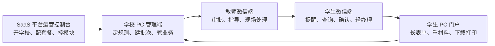
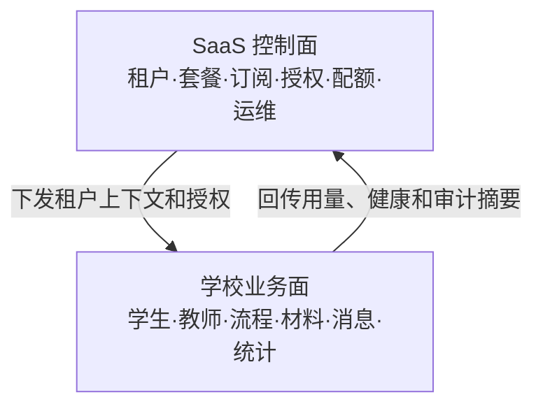

# 五端产品与 SaaS 总体架构规划

> 文档状态：`CURRENT / architecture_baseline_v1`
> 版本：V1.0
> 日期：2026-07-16
> 适用范围：SaaS 平台运营控制台、学校 PC 管理端、教师微信端、学生 PC 门户、学生微信端及统一后端
> 性质：产品边界、工程边界、接口边界、部署边界和迁移顺序的总体基线
> 本次约束：只冻结目标架构和迁移路线；不在教务、学工、毕设并行施工期间移动现有代码目录

---

## 1. 目的与结论

本系统不是一个 PC 后台加几个移动页面，而是面向职业院校销售、部署、长期运营的多租户 SaaS 产品。正式产品由五个前端产品和一个统一业务后端组成：

1. SaaS 平台运营控制台；
2. 学校 PC 管理端；
3. 教师微信端；
4. 学生 PC 门户；
5. 学生微信端；
6. 统一后端、统一数据、统一流程、统一材料和统一消息底座。

总体采用以下架构决策：

- **五端物理分离**：分别构建、发布、授权和监控，避免不同身份能力混入同一前端。
- **后端领域共用**：不为学生门户或小程序复制业务后端；各端通过面向身份的 API 薄层访问同一领域服务。
- **控制面与业务面分离**：平台方管学校、套餐、授权和运维；学校方管学生、教学和校内业务。
- **PC 与微信互补**：PC 承担长流程、长表单、复杂材料、下载打印；微信承担消息、待办、查询、确认和现场操作。
- **同一事项跨端续办**：草稿、状态、材料、待办和审核结果均在后端统一，不能依赖某个前端本地缓存。
- **模块授权贯穿五端**：学校未购买或未启用的模块，在五端入口、接口、待办、消息和统计中同时失效。
- **暂不大搬目录**：先按本规划停止继续混放，再在并行分支稳定后进行纯目录迁移。

---

## 2. 当前工程事实与主要差距

### 2.1 当前工程映射

| 当前目录/能力 | 当前职责 | 当前状态 | 主要差距 |
|---|---|---|---|
| `frontend/` | 学校 PC 管理端，同时包含 `modules/platform` 平台运营能力 | 学校 PC 已较完整，平台端已有基础 | 两种产品身份、路由和发布物仍在同一工程 |
| `student-portal/` | 学生 PC 门户 | 已建立独立 Vue 工程和基础门禁 | 产品信息架构、统一办理中心和各业务专用工作台尚未完整规划 |
| `miniapp/` | 学生微信端与教师微信端 | 两类页面已存在，使用同一 uni-app 工程 | 页面、角色、AppID、发布、埋点和回归互相影响 |
| `backend/` | 五端统一后端 | FastAPI、MySQL、领域模块和 `/mobile/*` 已存在 | API 仍以“移动端”命名聚合身份，控制面/学校端/教师端/学生端边界需逐步显式化 |
| `mobile/` | 共享或历史预留 | 只有 `shared/` | 定位不明确，不能继续承载新业务 |
| `deploy/` | 部署脚本和 Nginx 示例 | 已覆盖 PC、后端、小程序 H5 | 学生门户、五端独立发布、端级健康检查尚未完整进入主编排 |
| `docs/` | 九大类治理文档 | 已形成现行索引和历史归档边界 | 部分旧 project-map 文件仍描述“后端预留/小程序纯 mock”，须服从代码事实和当前有效索引 |

### 2.2 当前必须解决的架构问题

1. SaaS 运营端与学校管理端仍在一个前端工程，容易产生身份误入和发布耦合。
2. 学生微信端与教师微信端仍在同一个小程序工程，角色切换会扩大安全和测试边界。
3. 学生 PC 门户虽已建工程，但没有覆盖全生命周期的正式产品规划。
4. `/mobile/*` 同时承载学生和教师接口，命名不能长期代表身份边界。
5. 文件、草稿、待办、消息、流程时间线、帮助、反馈等学生端公共能力尚未统一成产品底座。
6. 五端模块授权、端级开关和到期只读策略尚未形成一份共同验收矩阵。
7. 主部署编排没有把五端作为五个独立发布物管理。

---

## 3. 五端产品定义

### 3.1 产品总表

| 产品 | 使用者 | 核心任务 | 禁止出现的能力 | 建议入口 |
|---|---|---|---|---|
| SaaS 平台运营控制台 | 平台老板、运营、实施、受控运维 | 租户、套餐、授权、合同、配额、用量、健康状态和平台审计 | 默认查看学校学生业务明细 | `/platform/*` 或独立域名 |
| 学校 PC 管理端 | 校领导、学工、教务、院系、业务管理员 | 规则、批次、名单、审核、统计、档案和学校配置 | 其他学校信息、平台计费和跨租户数据 | `/admin/*` |
| 教师微信端 | 辅导员、任课教师、毕设导师、实习教师 | 待办、审批、指导、课堂/现场记录和学生快速查询 | 全校无范围名单、复杂配置、批量敏感导出 | 独立教师小程序 |
| 学生 PC 门户 | 在校生、实习生、毕业生 | 长表单、重材料、论文、复杂明细、证明下载打印和个人归档 | 管理名单、批量审核、系统配置和他人数据 | `/portal/*` 或独立域名 |
| 学生微信端 | 学生 | 消息、待办、状态、轻申请、确认、签到和移动补充材料 | 复杂大表格、批量文件、长时间编辑和后台管理 | 独立学生小程序 |

### 3.2 端间协作原则

一条业务记录只有一个真实状态源。不同端只是同一业务流程的不同操作窗口：



端间不得用复制表、复制状态或定时对账维持一致。所有端读写同一领域记录、流程实例、文件对象、待办和消息事件。

### 3.3 非核心外部协作入口

五端是当前核心产品，不代表把企业导师、家长、校外评阅专家和上级平台硬塞进五端。后续外部协作者采用最小授权入口：

- 企业导师：独立企业导师门户或受限微信/H5，只看被分配的实习学生；
- 校外评阅/答辩专家：一次性任务链接或受限专家入口，限时、限学生、限材料；
- 家长/监护人：仅在学校制度和学生授权允许时接收特定通知，不默认开放学生档案；
- 教育主管部门/省平台：通过集成网关交换规定数据，不提供学校后台账号；
- 第三方服务商：使用租户级凭证、白名单、最小 scope 和调用审计。

这些入口不共享学校管理员布局，也不能成为绕过五端权限体系的后门。

---

## 4. PC 与微信端职责分配

| 能力 | 学校 PC | 教师微信 | 学生 PC | 学生微信 |
|---|:---:|:---:|:---:|:---:|
| 规则、批次、模板配置 | 主入口 | 不提供 | 不提供 | 不提供 |
| 名单与批量操作 | 主入口 | 仅本人范围轻列表 | 不提供 | 不提供 |
| 审批与批阅 | 完整入口 | 高频轻入口 | 查看结果/整改 | 查看结果/轻确认 |
| 长表单编辑 | 管理配置 | 不建议 | 主入口 | 草稿或简化填写 |
| 大文件、多附件、版本管理 | 管理与审核 | 移动补充 | 主入口 | 拍照/单文件补充 |
| 大表格、统计和导出 | 主入口 | 摘要 | 本人明细 | 摘要 |
| 消息和待办 | 管理视角 | 主入口 | 支持 | 主入口 |
| 签到、打卡、现场记录 | 查看和纠偏 | 主入口 | 查看 | 主入口 |
| 证明、论文、档案包下载打印 | 模板与授权 | 不提供 | 主入口 | 预览与提醒 |
| 业务咨询、帮助和反馈 | 配置与处理 | 辅助 | 主入口 | 主入口 |

必须提供“转到 PC 继续办理”和“在微信查看进度”的跨端引导，但不能用二维码或深链绕过登录和本人权限。

---

## 5. 学生 PC 门户总体规划

### 5.1 产品定位

学生 PC 门户定位为：

> 学生全生命周期自助办理、材料工作、结果下载与个人归档中心。

学生登录后始终能够回答：

1. 我现在处于哪个阶段；
2. 现在轮到我做什么；
3. 截止时间是什么；
4. 为什么不能进入下一步；
5. 老师给了什么意见；
6. 我交过哪些材料；
7. 最终结果在哪里下载和打印。

### 5.2 一级信息架构

学生门户一级导航建议冻结为：

| 一级入口 | 内容 | 是否固定 |
|---|---|:---:|
| 首页 | 生命周期概览、下一步、待办、截止、消息、常用服务 | 是 |
| 我的待办 | 当前必须由学生处理的事项 | 是 |
| 服务大厅 | 按学生语言组织的全部可办服务 | 是 |
| 我的申请 | 草稿、审核中、退回、办结的跨模块申请 | 是 |
| 我的材料 | 个人材料资产、版本、有效期、下载与归档 | 是 |
| 学业与校园 | 教务、学工、迎新等已购模块聚合 | 按授权 |
| 实习·毕设·就业 | 生命周期后段的长流程工作台 | 按授权与阶段 |
| 消息与帮助 | 消息、公告、办事指南、咨询和反馈 | 是 |
| 个人中心 | 学籍摘要、联系方式、账号安全和隐私设置 | 是 |

业务模块不必全部成为一级菜单。服务大厅、生命周期阶段和常用服务负责降低学生认知负担。

### 5.3 首页结构

学生首页至少包含：

- 当前身份、学校、学号和生命周期阶段；
- “下一件最重要的事”主卡；
- 我的待办及截止时间；
- 最近退回和需补材料；
- 最近审核结果与消息；
- 生命周期进度；
- 常用服务；
- 我的材料摘要；
- 风险或异常提示；
- 帮助与咨询入口。

首页所有卡片必须经过：租户模块授权 ∩ 端级开关 ∩ 学生适用范围 ∩ 当前阶段过滤。未购买模块不渲染，已到期模块保留历史只读提示。

### 5.4 统一页面骨架

每个学生业务工作台使用同一骨架：

1. 当前状态和阶段；
2. 下一步动作；
3. 截止时间；
4. 办理条件；
5. 学校要求与模板；
6. 表单或材料；
7. 审核、退回与整改意见；
8. 历史版本和操作时间线；
9. 结果、证明或档案下载；
10. 咨询方式和错误追踪号。

### 5.5 学生门户必须具备的公共能力

| 公共能力 | 核心要求 |
|---|---|
| 统一草稿 | 后端保存、自动保存、跨 PC/微信续办、版本冲突提示 |
| 我的申请 | 跨模块聚合状态，区分草稿、处理中、退回、办结和归档 |
| 我的材料 | 文件版本、引用关系、有效期、预览、下载、水印和个人归档 |
| 统一流程时间线 | 谁、何时、做了什么、意见是什么、下一步是谁 |
| 统一待办 | 当前轮到学生做的动作，支持截止和催办 |
| 统一消息 | 站内、微信订阅、短信/邮件的消息事件统一生成 |
| 下载与打印 | PDF/原文件、学校水印、用途、次数限制和审计 |
| 帮助与反馈 | 办事指南、模板、FAQ、联系人、反馈工单和 traceId |
| 账号安全 | 学生角色强校验、会话隔离、修改密码、设备与登录提醒 |
| 无障碍与兼容 | 键盘可用、清晰错误提示、常用浏览器和常见分辨率 |

### 5.6 毕业设计作为标杆流程

毕业设计负责验证学生门户最复杂的共性能力：

选题 → 任务书 → 开题 → 导师指导 → 中期检查/整改 → 初稿/定稿 → 答辩 → 成绩 → 完整材料归档。

学校 PC 配规则和审核，教师微信做指导和轻批阅，学生 PC 完成长材料和论文，学生微信接收提醒和查看进度。该流程跑通后，其 Stepper、材料版本、整改重交、审核意见、下载打印和归档能力应沉淀为其他模块可复用底座。

---

## 6. 其他四端产品规划

### 6.1 SaaS 平台运营控制台

平台运营端只管理“学校们”，不得默认进入“学生们”的业务数据。

核心模块：

- 运营总览；
- 学校租户管理；
- 开校与学校管理员初始化；
- 套餐、订阅和模块授权；
- 功能开关和配额；
- 试用、到期、只读、续费和停用；
- 合同、订单、开票记录（可分阶段）；
- 用量、存储和消息额度；
- 学校健康状态和告警；
- 平台操作审计；
- 受控运维协助授权；
- 数据交付、冻结、导出和销毁记录。

平台运维需要查看学校业务明细时，必须由学校授权、限定范围和时效，并留下敏感访问审计。

### 6.2 学校 PC 管理端

继续作为学校业务的完整控制台，重点保持：

- 规则、模板和流程配置；
- 批次、名单和组织范围；
- 审核、复核、批阅和归档；
- 统计、预警、导入导出；
- 学校角色、权限和数据范围；
- 学生 360 和跨模块时间线；
- 学校品牌、消息渠道和端级开关配置。

学校端不得配置平台套餐价格、查看其他学校或绕过租户授权。

### 6.3 教师微信端

教师端以“今天要处理什么”为首页，不复制学校 PC 菜单。

固定能力：

- 今日待办；
- 我的学生/班级/课程/指导对象；
- 快速审批；
- 指导记录；
- 现场签到、核验和异常上报；
- 消息和催办；
- 学生摘要与风险提示；
- 离线或弱网恢复提示。

批量配置、复杂统计、敏感导出和大规模名单管理回到学校 PC。

### 6.4 学生微信端

学生微信端首页围绕“消息 + 待办 + 快捷服务 + 当前阶段”。

主要能力：

- 消息和订阅提醒；
- 我的待办；
- 审核状态；
- 轻申请和确认；
- 签到、打卡、扫码；
- 拍照补材料；
- 课表、成绩、答辩安排等摘要；
- 跳转 PC 继续复杂办理；
- 帮助和反馈。

长表单、大文件、多版本论文和复杂明细不在微信端强行实现。

---

## 7. SaaS 控制面与学校业务面

### 7.1 两层架构



控制面只下发商业和运行配置，不参与学校具体业务审批。业务面只消费当前租户授权，不能修改自己的套餐和配额。

### 7.2 租户生命周期

建议统一状态：

`PROVISIONING → TRIAL → ACTIVE → GRACE_PERIOD → READONLY → SUSPENDED → TERMINATED → DATA_FROZEN → DESTROYED`

关键规则：

- 试用和正式状态可以写；
- 宽限期按合同策略决定写能力；
- 到期默认历史只读，不隐藏、不删数据；
- 暂停服务保留登录提示和平台联系入口；
- 终止后进入数据交付与冻结期；
- 销毁必须有审批、备份策略和销毁证明；
- 不允许因欠费静默删除学生或文件。

### 7.3 授权模型

学校任何能力的最终判定链：

`租户有效 → 订阅有效 → 模块授权 → 端级开关 → 功能开关 → 角色权限 → 数据范围 → 业务关系 → 状态机 → 配额`

前端用于展示和引导，后端执行同一判定并作为安全边界。

核心对象：

- tenant：学校租户；
- package：套餐模板；
- subscription：学校订阅；
- license：租户 × 模块授权；
- feature flag：模块内功能开关；
- channel：学校 PC、教师微信、学生 PC、学生微信端级开关；
- quota：学生数、教师数、存储、短信、接口调用等配额；
- entitlement snapshot：业务执行时的授权快照；
- audit：授权变更审计。

### 7.4 模块开关在五端的表现

| 状态 | 菜单 | 直链/API | 历史数据 | 待办消息 | 统计 |
|---|---|---|---|---|---|
| 未购买 | 隐藏 | 403 模块未授权 | 不开放 | 不生成新任务 | 不展示 |
| 已购买未启用 | 隐藏或学校配置提示 | 403 模块未启用 | 管理员按策略可见 | 不生成 | 不展示 |
| 试用/有效 | 展示 | 正常 | 正常 | 正常 | 正常 |
| 到期只读 | 展示并标识到期 | GET 可用，写 403 | 可查可下载（按合同） | 不生成新写待办 | 历史只读 |
| 配额超限 | 展示 | 新增动作 409/403，存量正常 | 保留 | 提示升级 | 展示用量 |
| 租户暂停 | 登录后提示 | 统一拒绝 | 不丢失 | 停止外发 | 平台可看健康摘要 |

---

## 8. 统一后端总体架构

### 8.1 后端分层

```text
API/BFF 层        按五端身份组织响应和可执行动作
Application 层    用例编排、事务、幂等、工作流和消息触发
Domain 层         学工、教务、实习、毕设、就业等领域规则
Platform 层       租户、授权、身份、文件、消息、审计、搜索
Infrastructure    MySQL、对象存储、缓存、队列、第三方集成
```

禁止在五个 API 层复制业务状态机。面向端的 API 只做身份化聚合、字段裁剪和用例调用。

### 8.2 目标 API 边界

| API 域 | 使用端 | 目标前缀 | 规则 |
|---|---|---|---|
| 平台控制面 | SaaS 控制台 | `/api/v1/platform/*` | 平台身份，默认不返回学生业务明细 |
| 学校管理面 | 学校 PC | `/api/v1/school/*` 或保留现有领域前缀 | staff + 模块授权 + permission + scope |
| 教师本人面 | 教师微信 | `/api/v1/teacher/*` | 当前教师、业务关系和数据范围 |
| 学生本人面 | 学生 PC/微信 | `/api/v1/student/*` | STUDENT + token 本人身份，忽略客户端传入他人 studentId |
| 公共身份面 | 全端 | `/api/v1/auth/*`、`/tenant/*` | 登录、刷新、品牌和上下文 |

现有 `/api/v1/mobile/*` 不立即删除：

1. 先声明为兼容层；
2. 新增学生/教师 API 时复用现有 service；
3. 提供旧路径 alias/redirect 或保持响应兼容；
4. 两个小程序迁移完并通过回归后再登记废弃版本；
5. 禁止在一次目录迁移中同时重写所有接口。

### 8.3 统一响应与错误语义

继续使用当前统一响应：

`{ code, bizCode, message, data, traceId, timestamp }`

至少统一处理：未登录、无权限、无数据范围、未授权模块、到期只读、配额超限、业务状态冲突、版本冲突、参数错误、限流和服务异常。业务可预期错误不得返回 500。

---

## 9. 统一公共平台能力

### 9.1 身份与会话

- 五端共用账号和身份源，但使用独立客户端会话和 token key；
- token 标识 tenant、user、active role、client type 和稳定学生/教师身份；
- 学生账号不能进入学校 PC，平台账号不能进入学校业务面；
- 同一自然人多角色使用显式角色上下文，禁止按姓名猜权限；
- 支持失败锁定、刷新轮换、登出吊销、设备/登录审计和密码策略；
- 微信绑定不得自动扩大已有账号权限。

### 9.2 统一流程与待办

- 业务状态机归属各领域；
- 通用流程实例、节点任务和乐观锁复用统一工作流；
- 待办精确到执行人/角色/业务关系；
- 已处理任务不可重复处理；
- 跨端看到同一任务状态；
- 转办、退回、撤回、重提、催办和超期必须有统一语义和审计。

### 9.3 统一草稿

统一草稿服务至少包含：

- draftId、bizType、bizKey、ownerId、schemaVersion；
- payload、attachments、lastSavedAt、clientType；
- 乐观锁 version；
- 自动保存、手动保存、提交后冻结；
- 跨端续办和旧版本兼容；
- 敏感字段最小存储与过期清理。

### 9.4 统一文件与材料中心

- 上传与业务绑定分两步；
- 文件对象只存一份，可被授权业务引用；
- local/COS/OSS/MinIO 通过 storage provider 适配；
- 文件类型、大小、数量、哈希、病毒扫描和租户隔离；
- 材料版本、替换、撤回、有效期和归档锁定；
- 下载必须校验租户、本人/业务关系、模块授权和状态；
- 敏感下载带用途、水印、频率限制和审计；
- 学生可查看“我的材料”，不能浏览底层存储目录。

### 9.5 统一消息中心

业务只产生消息事件，由消息中心选择站内、微信订阅、短信或邮件渠道。包含模板版本、接收人、发送状态、失败重试、已读回执、退订和渠道额度。

### 9.6 搜索、帮助和反馈

- 学校 PC 搜功能、学生和帮助；
- 学生端搜服务、办事指南、模板和本人记录；
- 平台端搜租户、合同和运维事件；
- 反馈工单必须带 tenant、client、route、traceId 和脱敏环境信息；
- 心理、处分等敏感数据不得进入通用搜索索引。

### 9.7 审计与可观测性

统一记录：登录、授权变更、敏感查看、导入导出、文件下载、审批、状态变更、运维协助和数据交付。五端均上报 clientType、version、traceId，后端串联一次请求和领域事件。

### 9.8 统一集成网关

学校 SSO、统一身份、企业微信/微信小程序、短信、邮件、电子签章、查重、教务系统、省级平台和对象存储均通过集成适配层接入。要求：

- 每租户独立凭证和开关，密钥不进入前端；
- 统一超时、重试、熔断、幂等和失败告警；
- 外部字段映射版本化，不直接污染领域模型；
- 入站 webhook 验签、防重放并记录原始事件摘要；
- 出站数据按最小必要字段、脱敏和用途控制；
- 第三方不可用时业务状态必须可解释，不能假成功；
- 私有化部署可替换适配器，不复制领域代码。

---

## 10. 数据、权限与安全边界

### 10.1 多租户

- 生产与正式验收采用 MySQL；
- 业务表强制 tenant_id，查询与写入均带租户条件；
- 平台统计优先使用租户级聚合，不直接跨租户扫描业务明细；
- 文件、缓存、消息、搜索索引和导出任务同样必须租户隔离；
- 任何跨租户运维动作均需受控授权和审计。

### 10.2 五端权限总则

| 端 | 权限基础 | 数据范围 | 业务关系 |
|---|---|---|---|
| 平台控制台 | 平台角色 + 平台权限 | 租户元数据范围 | 运维协助须学校授权 |
| 学校 PC | 模块授权 + 角色 + permission | 学校/学院/专业/班级/学生 | 导师、辅导员、评阅、答辩等关系 |
| 教师微信 | 当前角色 + 移动动作权限 | 本人范围 | 所带班级、指导、授课、审批指派 |
| 学生 PC | STUDENT + 模块/端开关 | SELF | 稳定 studentNo/profileId 本人关系 |
| 学生微信 | STUDENT + 模块/端开关 | SELF | 与学生 PC 相同 |

前端隐藏不是安全边界。所有后端写操作必须同时校验租户、模块授权、权限、数据范围、业务关系、状态、版本和配额。

### 10.3 隐私与数据生命周期

- 学生端只返回本人必要字段；
- 教师端按职责最小返回；
- 心理、处分、家庭经济、身份证、联系方式执行更严格策略；
- 明文查看需要权限、理由和审计；
- 学生毕业后的账号保留、材料下载期限和销毁规则由学校配置并受合同约束；
- 合同结束支持结构化数据、文件和审计清单交付；
- 销毁前完成审批、通知、冻结期和证明。

---

## 11. 目标工程目录

最终建议采用 monorepo 形式：前端五个应用物理隔离，后端继续统一。

```text
职校学生全生命周期系统/
├─ apps/
│  ├─ saas-console-web/          # SaaS 平台运营控制台
│  ├─ school-admin-web/          # 学校 PC 管理端
│  ├─ student-portal-web/        # 学生 PC 门户
│  ├─ student-miniapp/           # 学生微信小程序
│  └─ teacher-miniapp/           # 教师微信小程序
│
├─ backend/
│  ├─ app/
│  │  ├─ api/
│  │  │  ├─ platform/            # 平台控制面
│  │  │  ├─ school/              # 学校管理面
│  │  │  ├─ teacher/             # 教师本人面
│  │  │  └─ student/             # 学生本人面
│  │  ├─ modules/                # 业务领域
│  │  ├─ platform/               # 租户、套餐、授权、配额
│  │  ├─ workflow/               # 流程和待办
│  │  ├─ files/                  # 文件材料与存储适配
│  │  ├─ messaging/              # 消息事件和渠道
│  │  ├─ identity/               # 认证、角色和上下文
│  │  └─ observability/          # 审计、指标和追踪
│  └─ workers/                   # 消息、扫描、归档、导出异步任务
│
├─ packages/
│  ├─ api-contracts/             # 错误码、状态枚举、接口类型
│  ├─ api-client/                # 五端请求客户端基础
│  ├─ design-tokens/             # 品牌无关设计变量
│  ├─ web-ui/                    # 两个 Web 可复用基础组件
│  ├─ miniapp-ui/                # 两个小程序可复用基础组件
│  ├─ workflow-ui/               # Stepper/Timeline/Status
│  ├─ file-sdk/                  # 上传、预览、下载
│  └─ shared-utils/              # 脱敏、格式化、校验
│
├─ infra/
│  ├─ docker/
│  ├─ nginx/
│  ├─ database/
│  ├─ monitoring/
│  └─ backup/
├─ docs/
└─ scripts/
```

### 11.1 共享边界

允许共享：

- 契约类型、错误码和状态枚举；
- 设计 token；
- 无业务权限的基础 UI；
- 请求、文件、格式化和校验工具；
- 测试工具和埋点 SDK。

禁止共享：

- 管理端完整布局给学生端；
- 平台控制面菜单给学校端；
- 包含角色特权的业务组件；
- 用前端共享包代替后端权限；
- 小程序页面直接依赖 Web 页面实现。

### 11.2 当前目录到目标目录映射

| 当前 | 目标 | 迁移方式 |
|---|---|---|
| `frontend/` 学校业务部分 | `apps/school-admin-web/` | 先保持原位，平台模块移出后再整体重命名 |
| `frontend/src/modules/platform` | `apps/saas-console-web/` | 先抽独立入口、路由和构建，再迁文件 |
| `student-portal/` | `apps/student-portal-web/` | 门户规划稳定后纯目录迁移 |
| `miniapp/src/pages/student` | `apps/student-miniapp/` | 先建立独立 pages.json、manifest、store 和发布配置 |
| `miniapp/src/pages/teacher` | `apps/teacher-miniapp/` | 与学生端分波次拆分 |
| `miniapp` 公共代码 | `packages/miniapp-ui` / `shared-utils` | 只抽无角色业务的公共能力 |
| `mobile/shared` | 合并到明确 packages 后删除 | 先做引用审计，未经确认不删除 |
| `deploy/` | `infra/` | 五端部署跑通后再迁移 |

---

## 12. 部署与运行拓扑

### 12.1 推荐访问入口

| 产品 | 推荐生产入口 | 备选 |
|---|---|---|
| SaaS 控制台 | `https://platform.example.com/` | 主域 `/platform/` |
| 学校 PC | `https://<school>.example.com/admin/` 或 `/` | 学校独立域名 |
| 学生 PC | `https://<school>.example.com/portal/` | `portal.<school-domain>` |
| 学生微信 | 独立学生小程序 AppID | H5 仅作兼容/预览 |
| 教师微信 | 独立教师小程序 AppID | 企业微信/公众号入口后置 |
| API | `https://api.example.com/api/v1/` 或学校同源 `/api/` | 私有化同域反代 |

### 12.2 五端独立发布要求

每端必须有：

- 独立构建产物；
- 独立环境配置；
- 独立版本号和发布记录；
- 独立健康检查与错误率；
- 独立回滚；
- 契约兼容检查；
- 对应端的冒烟测试。

后端、数据库迁移和前端发布采用兼容顺序：后端向后兼容上线 → 数据迁移 → 前端分端灰度 → 验证 → 清理废弃契约。

### 12.3 SaaS 与私有化

- SaaS 云版：平台统一控制面，多租户业务面，对象存储和统一监控；
- 私有化：学校独立部署业务面，可选受控平台授权文件/授权服务；
- 两种模式使用同一领域代码和契约，差异通过部署配置、存储适配和授权实现；
- 不为私有化复制另一套业务代码。

---

## 13. 分阶段迁移方案

### 阶段 0：架构冻结（现在）

- 本文成为五端总体架构基线；
- 不移动正在施工的目录；
- 新需求必须标明属于哪一端；
- 停止继续向 `frontend` 混入新的平台运营页面；
- 停止在 `miniapp` 新增跨学生/教师共用的角色判断页面；
- 学生门户先补产品地图，再扩业务。

验收：新任务能明确端、角色、API 面、授权、数据范围和部署物。

### 阶段 1：学生门户产品底座

- 首页、待办、服务大厅、我的申请、我的材料、消息帮助和个人中心；
- 统一 module registry、menu、route、feature flag；
- 统一草稿、流程时间线、文件材料和跨端续办契约；
- 毕业设计作为首条标杆流程；
- 学生门户加入正式部署编排和验收。

验收：学生账号可完成一条真实重流程，教师处理后 PC/微信状态同步。

### 阶段 2：小程序学生/教师逻辑拆分

- 先拆 manifest、pages、入口、会话和发布配置；
- 再迁学生页面；
- 再迁教师页面；
- 最后抽 miniapp 公共包；
- 旧混合工程保持兼容到两个新小程序均发布成功。

验收：两个 AppID/构建产物互不包含对方业务页面，角色越权测试通过。

### 阶段 3：SaaS 控制台与学校 PC 拆分

- 平台端建立独立登录、布局、菜单、路由和构建；
- 迁出租户、授权、套餐、用量、运维和平台审计；
- 学校 PC 清除平台身份分支；
- 后端平台 API 保持严格控制面边界。

验收：平台端不能进入学校业务面；学校端不能访问平台计费和其他租户。

### 阶段 4：API 身份面显式化

- 建立 `/student/*` 和 `/teacher/*`；
- `/mobile/*` 作为兼容适配层；
- 分端迁移 API client；
- 加契约回归和废弃告警；
- 经过至少一个兼容周期后再讨论移除旧路径。

验收：学生 PC 与学生微信共用学生 API，教师微信使用教师 API，领域 service 无复制。

### 阶段 5：目标目录迁移

- 从稳定共同基线开纯迁移分支；
- 一次迁一个应用，业务逻辑不同时重写；
- 调整 CI、部署、文档和开发脚本；
- 保留 Git 历史；
- 每迁一个应用即完成构建、冒烟和回滚验证。

验收：形成 `apps/`、`packages/`、`infra/` 目标结构，旧路径全部有迁移登记。

---

## 14. 并行开发期间的治理规则

1. 教务、学工、毕业设计等业务分支继续在现有目录完成，不中途搬家。
2. 总体架构文档和共享契约由单一集成分支维护，业务分支不得各写一套。
3. 新页面必须声明 `clientSurface`：platform/school/teacher/student-web/student-wechat。
4. 新接口必须声明调用端、角色、模块授权、数据范围、业务关系和状态限制。
5. 新公共能力先判断放领域、平台底座还是共享包，禁止复制五份。
6. 跨端状态必须由后端事实驱动，不在前端硬编码“已完成”。
7. 目录迁移和业务施工不得在同一个 commit 混合。
8. 任何删除旧目录必须先做引用审计、迁移清单和回滚说明，并取得确认。

---

## 15. 五端质量与验收基线

### 15.1 每端共同验收

- 登录、退出、刷新和会话失效；
- 租户品牌和模块开关；
- loading/empty/error/无权限/到期只读状态；
- 正常、异常、重复提交、版本冲突；
- 跨租户、跨范围、跨角色越权；
- 文件类型、大小、下载和审计；
- traceId 可追踪；
- 构建、部署、刷新直达和回滚。

### 15.2 跨端一致性验收

每个核心业务至少验证：

1. 学生微信保存草稿，学生 PC 可继续；
2. 学生 PC 提交，教师微信出现待办；
3. 教师微信退回，学生两端同步显示原因；
4. 学生重交，学校 PC 可审核；
5. 学校 PC 办结，学生两端收到结果；
6. 文件版本、流程时间线、消息和审计一致；
7. 模块关闭或到期后五端表现一致；
8. 任何端都不能通过改 URL/参数访问他人或其他租户数据。

### 15.3 SaaS 商业化验收

- 新建学校并初始化管理员；
- 套餐授权后五端菜单同步变化；
- 配额生效且不破坏存量；
- 到期进入只读而非数据消失；
- 续费后恢复写能力；
- 平台可看用量和健康，不看业务明细；
- 合同终止可导出数据和文件清单；
- 授权、运维和数据交付全程审计。

---

## 16. 架构决策与待学校配置项

### 16.1 已冻结的技术决策

- 五个前端产品物理分离；
- 一个统一后端和一套领域数据；
- 学生 PC 与学生微信共用学生本人服务；
- 教师微信使用教师本人服务；
- 平台控制面与学校业务面分离；
- 模块授权和端级开关同时由前后端执行；
- 到期默认历史只读；
- 学生 PC 负责重任务，微信负责高频轻任务；
- 文件中心、草稿、消息、待办和时间线统一；
- 当前不做全仓目录搬迁。

### 16.2 每所学校可配置但不能写死的事项

- 门户名称、Logo、主色、域名和水印；
- 开通端和开通模块；
- 学年学期、批次和流程版本；
- 审批层级、期限和催办规则；
- 消息渠道；
- 文件模板、大小和保留期限；
- 学生毕业后的账号与材料访问期限；
- 证明打印、电子章和外部查重/教务集成；
- 学校帮助电话、联系人和服务时间；
- 数据导出和合同终止策略。

---

## 17. 文档路由与后续产物

本文是总体架构基线，不替代各端和各业务中心的详细设计。后续按以下位置补充：

| 产物 | 建议位置 |
|---|---|
| 学生 PC 产品地图、页面和交互 | `docs/04-UI与全端交互/design/`，更新现有学生门户方案 |
| 学生/教师微信端产品地图 | `docs/04-UI与全端交互/` 对应端目录 |
| SaaS 套餐与平台后台页面 | `docs/01-产品需求与范围/commercialization/` |
| API 身份面和兼容策略 | `docs/05-数据接口权限与安全/api/` |
| 五端权限矩阵 | `docs/05-数据接口权限与安全/rbac/` |
| 目录迁移施工卡 | `docs/06-开发施工与质量验收/施工记录/` |
| 五端部署、回滚和监控 | `docs/07-部署运维交付与商业化/deploy/`、`ops/` |
| 每个业务的跨端闭环 | 对应 `docs/03-业务模块设计/<中心>/` 主总册和施工包 |

任何旧文档与本文冲突时：权限和安全服从权限总控与安全基线；业务细节服从各中心当前有效主文档；五端产品边界、目标目录和迁移顺序服从本文；代码完成度仍以代码、迁移、测试和状态事实源为准。

---

## 18. 最终实施顺序

综合当前学校 PC 已较强、教务中心正在并行施工、学生 PC 缺整体规划的事实，推荐顺序为：

1. 冻结本文；
2. 完成学生 PC 门户产品地图和公共底座；
3. 用毕业设计跑通首条学生重流程；
4. 接入学工、教务、实习和就业学生服务；
5. 拆学生/教师小程序；
6. 拆 SaaS 控制台/学校 PC；
7. 显式化 student/teacher API；
8. 最后执行纯目录迁移和五端独立部署收口。

这条顺序能够保护当前并行成果，同时让最薄弱的学生 PC 端尽快形成可售卖、可扩展、可验收的完整产品。
