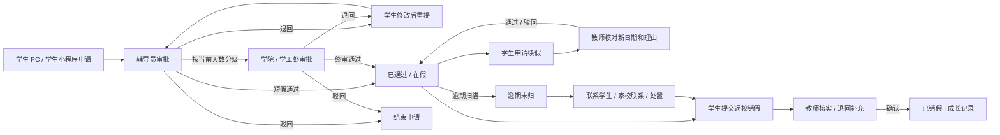

# 请假返校四端施工包

状态：design_ready（本次增量范围）；实现及验收状态见施工进度，不能据此认定模块已完成。

审计日期：2026-09-05。代码基线：`6810bd6284b4d5c69a78947560f808cd7738327e`，main 工作区。
采用模式 A：现有 B 包和旧施工记录不能证明本次四端内容页设计就绪。本包沿用现有状态机及公共服务，补齐具体交互及数据出口。

## 1. 范围与来源

- `user_decision`：保留已确认 UI 壳；教师 PC、学生 PC、学生小程序、教师小程序一起完成业务内容；先审计，必要的关联缺陷同步修复；本批仅请假返校。
- `project_rule`：根 AGENTS.md、公共组件使用指南、系统管理中心权限角色模块授权与权责边界设计。中文展示、本人边界、当前岗位范围、版本控制、真实文件与通知、独立 MySQL 验证均为门禁。
- `existing_code`：下列关联表与状态机。入口不搬迁、不删除历史数据、不修改认证核心；暂无表结构变更需求。
- `ai_proposal`：任务列表与办理详情并列；移动端列表进入详情，阅读后办理；学生以自己的申请与进度为中心，申请表按需展开。

### 外部证据登记（均已实际打开，2026-09-05）

本轮对照三个学校实际使用的系统，不把未披露的供应商推定成三个商业厂商。采购金额、具体版本和当前在线状态均未核实。

| ID | 原发布方 / 系统 / 直接来源 | 正文定位 | 能证明 / 不能证明 |
|---|---|---|---|
| LV-E01 | 上海科技大学信息化处 / 学工（书院）管理系统 / [学工（书院）管理系统](https://it.shanghaitech.edu.cn/8619/list.htm) | 系统简介“学生事务”“移动学工”“系统集成”，2025 年优化说明 | 学校实际提供 PC 与移动请假、对接任务中心；不能证明其审批阈值或厂商。链接手册本次打开失败，未作为证据。 |
| LV-E02 | 呼和浩特民族学院文学院 / 易班小程序 / [文学院学生请销假制度（试行）](https://www.imnc.edu.cn/hwx/info/1046/2038.htm) | 第七条线上流程、第九条续假、第四章销假 | 学校使用小程序申请、逐级审核、查询进度及续销假；同时作为学校制度证据。页面日期与正文落款有差异，不用于判断当前施行日期。不照搬其审批时限、证明种类或个人信息收集要求。 |
| LV-E03 | 西南财经大学天府学院学工官网 / 企业微信请销假流程 / [学生请、销假流程](https://eqsta.tfswufe.edu.cn/article-bxfw-6105) | “具体要求”1–5（2021-05-19） | 学校采用企业微信申请、提供证明、分级审批、返校申请及辅导员确认；不能证明 2026 年界面版本或本项目应使用的阈值。 |

设计采纳：E01 支持同一业务跨 PC/移动与待办联动；E02 支持明确当前节点、退回修改和续假结果；E03 支持返校申请与教师核实分开。外部制度仅参考，本校政策以项目实际状态机为准。

## 2. 代码关联与审计结论

| 层 | 真实入口 / symbol | 现状与本次动作 |
|---|---|---|
| 菜单/路由 | `frontend/src/config/navPlan.js` 的 `sa-leave`；`studentAffairs.routes.js` | 四个三级入口：请假审批、销假与续假、请假台账、请假统计；保持地址及旧入口兼容。 |
| 教师 PC | `frontend/src/modules/studentAffairs/views/leave/` 四个 View、`api/leave.api.js` | 真接口已有，完善紧凑详情、处理上下文、中文数据出口；统计支持下钻，导出沿用后台任务。 |
| 学生 PC | `student-portal/src/views/affairs/AffairsFourEndView.vue`；`portalApi.js`、`affairsFourEndApi.js` | 当前请假与其他业务混在一个组件；本批提取请假工作区，其他业务保持。 |
| 学生小程序 | `miniapp/src/pages/student/affairs/leave.vue`；`studentApi.js`、`affairsContractApi.js` | 真写入已有；补本人详情、进度和时间展示，失败留住输入。 |
| 教师小程序 | `miniapp/src/pages/teacher/affairs-leave/index.vue`；`teacherApi.js`、`realApi.js` | 详情仅 toast；列表固定 50 条；修复详情、服务端搜索/分页、续假及返校证据展示。 |
| API | `backend/app/api/v1/student_affairs.py` 的 leave 路由；`mobile.py` 的 teacher_affairs_leave_*；`affairs_leave_self_api.py`；`affairs_four_end.py` | 学生本人入口与教师范围入口分开；新增本人只读详情投影，复用已有身份/功能门。 |
| 主流程 | `backend/app/services/affairs_leave_service.py` 的 apply_leave/approve/return_leave/resubmit/apply_extension/approve_extension/submit_cancel/confirm_cancel/proxy_cancel/handle_overdue | 工作流、待办、消息、审计、统计、成长事件已有；不替换状态机。当前 `_thresholds` 硬编码 3/7，不宣称可配置。 |
| 日期 | `affairs_leave_date_contract.py`、`affairs_leave_self_api.py`、`core/timeutil.py` | 纯日期含结束当天；现有解析无法完整支持带时区时间。统一 UTC 入库，避免重复偏移。 |
| 归属 | `mobile_affairs_service.py:leave_my` | 旧记录按学号或姓名查找，存在同名误匹配；只用可信学生关联/唯一学号兼容，不以姓名授权。 |
| 数据 | `models/campus_service.py:CsLeave`、AffairsLeaveExtension、AffairsLeaveCancelRecord、AffairsAuditTrail、WorkflowInstance/Task、UnifiedTodo | 本批不新增表；不回写不确定归属的旧数据。 |
| 材料 | `modules/student_affairs/services/affairs_material_center_service.py`；File Center；`affairs_student_contract_security_guard.py` | 材料要求/逐版本补交已有 LEAVE 场景；复用受控入口，不能把旧附件列表或短期 URL 当业务真相。 |
| 测试 | `backend/tests/test_affairs_leave.py`、`test_affairs_leave_pending_search_contract.py`、四端/身份切换合同测试及各端 package.json | 旧测试只提供测试入口；本批需实跑，不引用历史“通过”。 |

## 3. 实际流程与施工顺序

每次流转沿用服务器版本、真实工作流和消息；学生与教师重新读取同一记录，不复制四份状态。先修查询归属、日期及分页，再补详情投影，然后四端内容页，最后正常/异常/越权及构建验收。续假驳回保留原截止日期；销假退回不冒充已办结。

## 4. 四端任务与权限矩阵

所有行均先校验当前租户有效、学工模块/学生功能授权、当前身份、数据范围；ID 从路径读取。学校管理员身份本身不授予学生本人动作。字段仅姓名、班级、假种、起止日期、事由及办理结果；不新增身份证、定位、家庭信息。

| 三级/动作 | 学生 PC/小程序 | 教师 PC/小程序 / 权限 | 状态、关系、版本与审计 | 必测拒绝 |
|---|---|---|---|---|
| 申请与本人详情 | 本人档案，AFFAIRS_LEAVE 功能 | 代发仅现有 create 入口，不扩权 | 学生 ID 服务端解析；冲突假期拒绝；APPLY/流程/待办/消息 | 无学生档案、功能关闭、他人/跨租户记录、同名旧记录 |
| 修改重提 | 仅本人 RETURNED | 教师不借学生入口修改 | EDIT_RETURNED、RESUBMIT；版本必填；修改成功重提失败明确区分 | 非退回、旧版本、越权ID |
| 审批 | 只看本人结果 | `studentAffairs.leave.view` + `studentAffairs.leave.approve`，本岗位/节点/班级或学院范围 | 当前审批节点与真实处理关系；通过/驳回/退回；版本与留痕 | 非本人待办、越节点、跨班级、跨租户、重复点击 |
| 续假 | 本人可续假状态提交日期/理由 | view + `studentAffairs.leave.extension.approve` | EXTENSION_REVIEW；新截止晚于旧截止；通过/驳回保留记录 | 旧版本、无待审续假、倒序/非法日期、越范围 |
| 返校销假 | 本人 SUBMIT_CANCEL，教师确认前不显示办结 | view + `studentAffairs.leave.cancelLeaveConfirm` | WAIT_CANCEL_LEAVE；核实或退回；代登记需实际返校时间；版本/审计 | 未通过、未来返校时间、越权确认、重复确认 |
| 逾期处置 | 本人状态提示及可用动作 | view + `studentAffairs.leave.overdue.handle` | OVERDUE；扫描幂等；联系/家校/处置说明，沿用现有联动 | 未逾期、缺说明、越权扫描/处置 |
| 台账/详情 | 本人申请记录 | view，后端筛选在 COUNT/OFFSET/LIMIT 前收敛范围 | 只读；明确处理人/截止/流程；内部审计不下发到学生 | 查询关键词越范围、分页漏项、错误被显示为空 |
| 统计/导出 | 不提供全校统计导出 | view；导出再校验 `studentAffairs.leave.export` | 真实统计、筛选下钻、xlsx 异步任务、文件下载授权与导出审计 | 跨租户计数、无导出权限、过期下载、失败假成功 |
| 材料要求/补交 | 本人材料要求与允许补交状态 | 既有材料中心 LEAVE 权限、对应学生范围 | 复用 FileAsset/Version/Binding 与扫描，学生只见授权版本 | 他人文件、跨租户、无扫描/下载权限、旧版本 |

后端拒绝沿用项目 401/403、DATA_NOT_FOUND/NO_PERMISSION、VALIDATION_ERROR、VERSION_CONFLICT/DATA_CONFLICT 等实际契约，前端统一映射中文。没有独立草稿接口就不承诺跨设备恢复未提交表单。

## 5. 三级施工卡

### LV-01 请假审批

目标：教师快速定位待审申请并完成一次有依据的判断。PC：短标题+搜索+真分页队列+详情；移动：搜索/队列进入独立详情层，底部办理区。详情顺序为状态/当前处理人、学生及假期、事由/退回意见、续销假记录、材料入口、时间线。通过意见可选；驳回/退回必须指出原因。连续办理保留筛选，服务端成功后进入下一条。失败不丢意见；版本冲突刷新并要求重新判断。对应权限/字段/API/拒绝及审计见上表，`designSource=existing_code+external_evidence(LV-E01/E02)+ai_proposal`。

### LV-02 续假与返校

目标：教师明确区分续假审核、返校核实、逾期跟进。PC 筛选+队列+详情；移动与审批详情复用排版。续假必须对比原截止与新截止并展示理由；返校核实先看申请说明，代登记使用日期/时间选择器；逾期处置先选处理方式再填写说明。学生端从自己的申请详情发起，不找管理端菜单。状态与按钮完全依据真实记录。`designSource=existing_code+external_evidence(LV-E02/E03)+ai_proposal`。

### LV-03 请假台账

目标：找到历史申请并查看结果、记录和材料。PC 列表按姓名/学号、状态、类型、日期查询；详情侧栏显示真实加载/错误，分页不丢筛选。学生只见本人历史，小程序个人记录同范围；教师移动使用现有后续队列及记录深链，不提供越权全校导出。xlsx 复用现有异步任务与下载权限。`designSource=existing_code+project_rule+ai_proposal`。

### LV-04 请假统计

目标：知道范围内待审、在假、待返校及逾期情况并进入记录处理。PC 简短口径、指标、按班级/类型/状态分布，点击有确定筛选映射的分组进入台账；统计口径不得由前端数组推算。移动端用队列真实总数完成待办提示，不复制桌面大报表。学生无此管理功能。`designSource=existing_code+project_rule+ai_proposal`。

## 6. 验证与交付门

- 独立新建 MySQL 测试库，不对现有运行库写测试数据；任何 drop/create 仅限这次记录的隔离测试库。
- 先跑请假现有链路基线，再补本人详情/旧身份/日期/分页/中文合同回归；四端构建及浏览器实际检查。
- 材料、消息、统计、成长事件复用原链路；不能以 UI 存在证明真实投递或持久化已通过。
- 无数据库结构变更时不新造迁移。回滚限恢复本次代码差异，不删真实数据；保留历史路由。
- 在进度记录列出每项实际命令与结果；未运行的迁移/微信设备/完整 E2E 必须如实保留，不称已上线。
