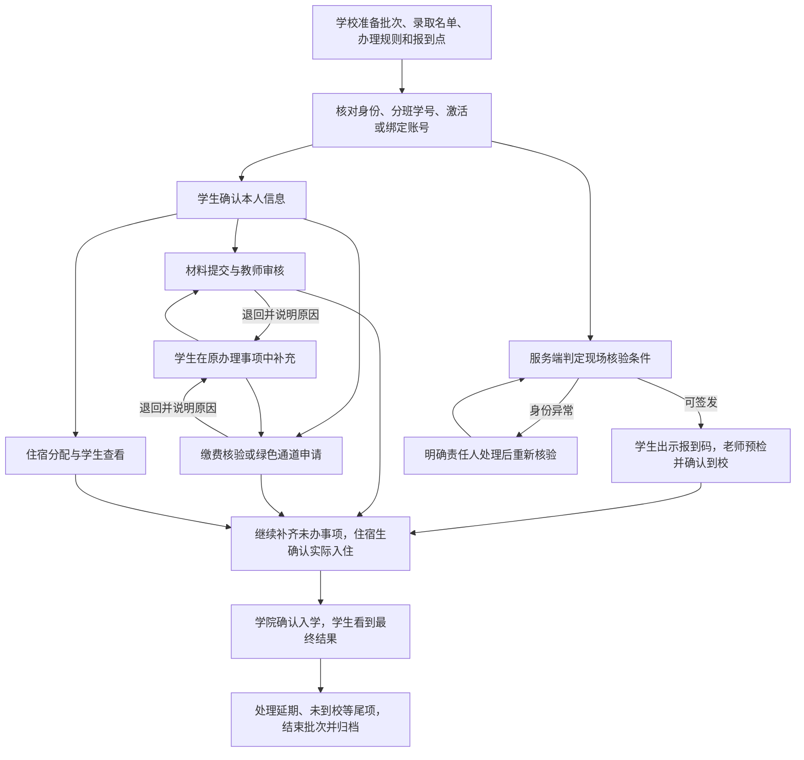
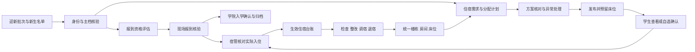

# 迎新与住宿统一流程：教师 PC 规划

日期：2026-09-06。依据当前工作区真实代码审计；本轮先落地房态可视化与教师 PC 入口收口，以下跨端、服务端和其他页面事项按批推进，不代表全部已完成。

## 2026-09-22 修订：教师电脑端与学生小程序连续办理

本节为本轮现行重构方案，替代下文旧版“迎新 10 个入口”规划；旧版住宿业务分析保留作为背景。本轮对象是数字迎新，复用住宿、文件、消息、权限能力，不另建一套学生或宿舍系统。状态：审计及方案已形成，实施与联调进行中，尚未验收通过。

### 审计结论

用户目标：老师不用记菜单顺序，学生不用猜下一步；同一批次、同一名学生，从录取名单到入学办结连续完成。

审计基线：`b7cfdb74987e19f8dad407ff830622ef5fcd2834`，本地 `main`；原有未提交文件 `RELEASE_RUNBOOK.md` 不属于本轮。2026-09-22 通过日常沙箱学校管理员会话查看真实页面，并核对两端代码及后端正式服务。普通教师、学生完整办理尚未据此认定通过。

| 现状 | 对办理的影响 | 重构处理 | 证据 |
|---|---|---|---|
| 19 个并列菜单，工作台待办在首屏下方 | 老师自行寻找功能、拼接顺序 | 8 个任务工作区，待办前置，各工作区内保留明确功能标签 | 截图 01；`frontend/src/config/navPlan.js` |
| 工作台 1 人，资格页面变成全校 7001 人 | 批次交接丢失；重复筛选 | 批次贯穿工作区、名单、审核与详情，服务端分页前过滤 | 截图 05；资格和缴费列表服务 |
| 新生详情离开数字迎新导航 | 不知道回哪里继续 | 详情固定归属“新生办理”，保留返回与批次 | 截图 07；导航归属逻辑 |
| 住宿未办完也显示“暂不具备报到资格” | 把可到校核验误解为不可报到 | 分开展示“现场核验条件”和“全部手续” | 截图 05；资格服务 `checkinEligibility` |
| 详情进入材料、缴费要重新找人 | 重复搜索，容易处理错对象 | 携带稳定的新生编号与批次直达对应办理页 | 截图 07；详情跳转 |
| 绿色通道退回后学生只能看提示 | 学生无法从页面补充重交 | 显示原因、原申请内容及补充提交，教师接续审核 | 学生小程序绿色通道页面 |
| 学生报到成功后部分待办入口消失 | 现场到校与最终办结脱节 | 报到前后都显示完整清单与待补事项 | 小程序迎新首页 |
| 学生电脑端首页把现场报到计为迎新已完成 | 学生误以为无需补材料和等待最终确认 | 学院确认才显示完成；首页提示未办齐并直达正式迎新页，保持真实待办数量 | 本轮正常学生页面；首页服务投影 |
| 到校计划排在报到码前，已通过与待审材料混合时仍提示上传 | 非必办事项挡住主操作，重复提交 | 主按钮消费服务端可办理条件；到校计划为便民登记 | 小程序首页与正式资格服务 |
| 教师移动绿色通道先取最近 50 条再筛待审，且未带批次 | 较早的待办可能漏出队列；从看板进入后混用全校范围 | 按批次与审核状态先筛选、计数再分页，待审核与全部申请分开；冲突保留意见，刷新并重新核对后才允许提交 | 2026-09-23 续审；移动绿色通道接口、正式列表服务与教师移动审核页；具体通过范围见执行记录 |
| 统计待办跳转丢批次，部分导出隐式选择第一个开放批次，新生查询只提示成功 | 老师离开统计后混入全校名单，文件可能不是正在查看的批次，无法实际取到台账 | 统计跳转携带所见批次，全部导出明确指定批次；查询页接正式下载，生成后保留重新下载入口 | 2026-09-23 正常教师页面、实际下载文件、前端调用与表格回归，见执行记录 |
| 综合台账缺少财务记录时直接显示未缴费，没有独立列出绿色通道结果 | 已通过绿色通道的学生可能被误催缴费 | 沿用权威财务和申请记录，分别显示缴费事实、绿色通道审批；缺记录明确显示未同步，所有台账使用中文状态 | 2026-09-23 下载核对发现；报表服务与真实表格回归，见执行记录 |
| 未报到名单跳报到安排只搜索姓名，跳详情丢批次，且展示未接通的提醒按钮 | 收尾办理可能串批次或找错人，老师点提醒仍办不成 | 按稳定学生编号与原批次交接，遵循现行权限；移除未接通按钮，失败不留旧名单 | 2026-09-23 正常教师跳转与刷新、前端行为检查；未将读取冒称延期/取消写入通过 |
| 取消后仍提示补材料、提供激活按钮，教师激活命令未拒绝停止办理状态 | 已结束的迎新记录仍可能创建账号，老师误以为还要继续审核 | 前端展示历史及恢复入口；激活服务拒绝延期、未到校、取消、作废与关闭批次，保留正常激活与幂等能力 | 2026-09-23 独立虚构学生实际延期→恢复→取消、操作留痕、账号拒绝无副作用及正常激活回归；见执行记录 |

截图目录：`.codex-artifacts/orientation-audit-20260922/`，01 工作台、02 批次、03 名单、04 核验、05 资格范围、06 卡点、07 详情、08 报到、09 材料、10 缴费、11 住宿。均为本轮本地沙箱证据，不代表生产系统验收。

### 完整业务流程

这里的材料、缴费与住宿可以并行，不人为制造一条所有人必须逐级通过的长队。现场核验条件和最终入学条件继续由现行服务端决定；本轮不变更学校政策。选到床位、现场报到、实际入住、入学办结分别显示结果。到校计划、接站、物品领取均不能擅自变成入学前置条件；物品领取当前没有确认完整能力，不制作假入口。

| 阶段 | 学生小程序看到什么、做什么 | 教师电脑端做什么 | 交接成功终点 |
|---|---|---|---|
| 开放准备 | 可办理批次、身份激活入口、开始日期 | 导入预检、名单核对、班级学号、规则与报到点检查 | 正确学生能进入自己的迎新记录 |
| 线上准备 | 当前下一步、已有信息回填、必交材料、进度 | 待审核队列定位学生；审核意见写清修改点 | 待办交给正确角色，退回可继续 |
| 费用与困难 | 缴费结果、绿色通道状态、退回原因 | 核验正式缴费事实；审核绿色通道材料 | 学生刷新看到真实结果，无重复申请 |
| 住宿安排 | 已预留床位或无需住宿；按学校模式确认 | 共用住宿分配计划，发布预留，处理冲突 | 两端同一床位，预留不冒充入住 |
| 到校报到 | 可用报到码、到校地点、未办事项 | 扫码预检、核对身份、选择授权报到点、确认 | 防重放的正式到校记录，双方回读一致 |
| 补办办结 | 报到成功后继续补材料或查看待审，最终入学结果 | 跟进未结事项；有权限的学院人员最终确认 | 同一学生正式入学，相关待办消失 |
| 收尾 | 延期或取消等真实结果与联系入口 | 核实未到校、结清本批次、统计归档 | 未结记录明确；服务端禁止错误提前归档 |

### 电脑端菜单：19 项收拢为 8 个工作区

| 侧栏菜单 | 工作区内部功能 | 使用重点 |
|---|---|---|
| 迎新工作台 | 当前批次、待我处理、进度与异常提示 | 进入后知道今天先做什么 |
| 批次准备 | 批次与名单、流程设置、报到点 | 开始前集中准备，不混进日常审批 |
| 新生办理 | 新生名单、信息核验、入学确认、共用学生详情 | 找到一名学生即可查看并继续全过程 |
| 审核与缴费 | 材料审核、缴费核验、绿色通道 | 待处理优先，原材料与意见可对照 |
| 现场报到 | 扫码报到、报到进度 | 高频操作突出，办理回执明确下一步 |
| 住宿安排 | 分配床位、确认入住 | 复用宿舍系统真实资源和台账 |
| 异常跟进 | 异常处理、未报到跟进、迎新通知 | 按问题处理，不反复建学生记录 |
| 统计归档 | 迎新统计、新生查询、迎新归档 | 先看未结事项，再结束与归档 |

导航收拢必须与页内入口一起交付，不能删掉菜单后把功能藏起来。原页面仍作为工作区功能页使用；本轮未退役其路由或写接口。整体学工中心导航、其他模块、已认可色彩与组件体系保持现有结构。

### 首屏与操作规范

- 教师首屏：当前批次与数据范围 → 待处理事项 → 精确学生 → 处理 → 实际结果及下一角色。跨页保留批次；从详情进入材料或费用携带学生编号，不依赖同名检索。
- 学生首屏：我的身份与批次 → 最重要的下一步按钮 → 始终可见的全部办理清单 → 住宿及联系老师。已完成、待我处理、学校待审、退回补充、无需办理分开呈现。
- 退回必须显示原因、补充入口与重交结果；不让学生猜改什么，不用“联系老师”替代系统已有能力。
- 未开放、无权限、冲突、加载失败分别解释；接口失败不得显示零人或已完成。重复点击受限，冲突保留输入；服务端仍独立判断权限及版本。
- 手机流程与电脑端共享同一迎新记录和权威服务。电脑端可批量处理，学生端只看本人；不要求两端页面长得相同。

### 权限与验收边界

现行电脑端入口读取受 `studentAffairs.orientation.view` 控制，管理动作受 `studentAffairs.orientation.manage` 控制，导入与导出分别沿用 `.import`、`.export`；正式接口继续要求教职工身份及可信学校、数据范围。前端动作来自 `frontend/src/modules/orientation/api/orientation.api.js` 的权限投影，不能通过菜单分组授予新权限。

| 工作区/动作组 | 责任身份及范围 | 状态与敏感数据要求 | 必须检查 |
|---|---|---|---|
| 工作台、名单、详情、进度、查询统计 | 已授权教职工；本校且在既有班级/学生范围内 | 身份证、电话默认脱敏；批次过滤只缩小范围 | 未授权拒绝、跨校不可见、跨批次隔离、总数分页一致 |
| 批次、规则、点位、名单维护 | 拥有迎新管理或导入权限的人员 | 沿用生效批次/冻结流程规则；不覆盖已有事实 | 修改冲突、已生效规则、导入预检与回执 |
| 核验、材料、费用、绿色通道 | 拥有迎新管理权限且覆盖学生的人员 | 原始附件授权读取；按当前版本审核、必填退回理由 | 退回重交、过期版本、重复操作、附件越权 |
| 现场核验 | 正式报到服务允许的教职工与点位 | 签名凭证、有效期、学生身份、幂等及防重放 | 重复扫码、失效码、身份阻断、正确报到点 |
| 住宿 | 共用住宿管理权限和房源范围 | 一人一床、床位冲突；预留和实际入住分开 | 预留发布、学生回读、现场入住、错误跨校床位 |
| 异常、未到校、最终确认、归档 | 当前迎新管理/归档服务允许的人员 | 异常原因和审计；延期/取消影响按原合同；终态检查 | 未办完不得最终确认/归档、取消后学生显示停止 |
| 学生查看与提交 | 学生正常账号，关联自己的主档和当前迎新记录 | 开放时间与终态限制；材料、申请只绑定本人 | 不能提交他人编号、返回刷新、失败保留输入 |

这张表是本轮约束清单，不替代后端精确权限实现；未实测的负向用例不能据此记为通过。重点验证同一名虚构新生从激活/登录到最终确认，另覆盖材料退回、绿色通道退回、身份阻断、住宿、重复核验和跨批次。按学生小程序网页运行、微信构建、微信宿主分别记录，不能相互冒充。

### 外部参考及适用范围

本轮查阅日期均为 2026-09-22；这些是学校公开的实际迎新操作文件，证明其使用场景，不证明本项目已实现或具有相同性能。对应设计来源：用户图片及菜单诉求为用户决定；导航 8 分组为本轮设计提案；状态与权限取自现有代码；以下资料支撑办理角色和阶段划分。

- E1 重庆交通大学《2025 年迎新系统操作指南》，正文信息采集、宿舍、绿色通道、缴费、行程与报到说明：<https://yx.cqjtu.edu.cn/info/1004/1092.htm>。用于参考学生事项清单及线上线下衔接，不复制其宿舍开放政策。
- E2 烟台大学计算机与控制工程学院《2025 年本科新生入学须知》，网上预报到及入校报到流程：<https://computer.ytu.edu.cn/info/1026/5303.htm>。用于区分预报到、现场扫码、宿舍实际入住；延期规则仅属该校政策。
- E3 中国石油大学（华东）《关于做好 2025 年易班迎新工作的通知》，第一部分线上预报到、第二部分现场迎新：<https://csun.upc.edu.cn/_t1756/2025/0815/c14687a468840/pagem.htm>。用于参考教师分班学号、预报到审核、学生小程序事项与未到校登记的责任交接；通知同时作为学校组织制度证据。
- 用户提供的其他学校学生端照片：参考“流程状态 + 直接入口”的表达。照片不能证明后台审批、缴费、入住已闭环，不能据图新增本校强制流程。

### 实施顺序与通过标准

1. 入口和上下文：8 个工作区、页内功能、详情导航、批次及精确学生交接；所有现有功能仍可到达。
2. 两端待办：教师队列、学生清单、现场资格与全部手续分开；材料和绿色通道退回能继续。
3. 真实联调：在固定日常沙箱使用同一虚构新生与正常角色逐步办理，正式页面提交、服务端回读、返回/刷新确认；独立测试库运行会清理数据的自动化。
4. 收尾复核：最终确认、未到校/延期、归档限制、受影响端回归；记录前后截图、点击和重复输入减少情况。

只有完成上述适用验证，才可写“本条迎新故事已跑通”。规则配置、新页面截图或构建通过均不能代替业务闭环。

---

## 1. 老师实际怎么用

**新生批量安排**：选迎新批次 → 核对学生名单和住宿需求 → 选可用楼栋/床位池 → 生成分配方案 → 处理未分配与冲突 → 发布预留 → 学生查看或按规则选床 → 到校核验 → 宿管确认实际入住。

**零星办理入住**：房态图 → 选楼栋 → 选房间 → 点空床 → 搜学生 → 确认入住。成功后回到原房间，床位、空床数更新；已有床位的学生转正式调宿。

**日常住宿管理**：入住后形成住宿台账 → 查寝/检查 → 异常跟进/整改复查 → 调宿或退宿。调宿执行时才变更床位，退宿最终确认后才释放床位。

**核心区分**：新生已报到、住宿已安排、学生已确认床位、实际已入住，是四件事。不能共用一个“已完成”标签。

学校可以配置“先报到后公布住宿”等顺序；图中是推荐的常规流程，前端不能绕过服务端批次模式、时间窗和资格结论。住宿是否必办、走读是否免办以真实配置为准。

## 2. 菜单怎么整理

一级仍为学工中心；二级保留“数字迎新”和“宿舍与公寓”。公共宿舍事务只有一套页面。三级菜单展示老师的任务名称，技术参数、权限码、接口名不进入主工作区。

### 迎新：目标为 10 个常用入口

| 三级入口 | 工作区与页内切换 | 对应现有页面与迁移方式 |
|---|---|---|
| 迎新工作台 | 当前批次、待办队列、卡点、临近到校、未报到跟进 | `/admin/orientation`；进度 `/progress` 作为工作台页内“全批次进度”，保留旧地址 |
| 批次准备 | 批次、流程、报到点 | `/batches`、`/flow-config`、`/checkin-points`；用页内标签组织，不能先删菜单导致页面失联 |
| 新生名单 | 导入与数据校验、学生列表、个人详情 | `/data`、`/students`、`/students/:studentId`；详情成为共用学生办理页 |
| 身份与资格 | 信息核验、报到资格、阻断项 | `/verify`、`/qualification`；资格以服务端结论为准，点击阻断项进入对应处理页 |
| 材料审核 | 待审核、待补充、已通过 | `/materials`；左列表右材料，处理后进入下一条，保留筛选 |
| 缴费与通道 | 缴费核对、绿色通道审批 | `/payment`、`/green-channels`；使用页内标签，审批权限分别保留，不把未缴费直接判断为不可报到 |
| 宿舍安排 | 分配计划入口、迎新住宿核对 | `/dorm-preassign`、`/dorm`；进入同一 `/admin/student-affairs/dorm/allocation` 和房态图，禁止另一套手填房号分寝 |
| 现场报到 | 搜学生/扫码、资格预检、现场确认、办理回执、学院入学确认 | 复用新生详情、报到点和已存在的报到/入学确认接口；报到点配置与实际办理区分 |
| 异常跟进 | 待处理、未报到、住宿异常、已关闭 | `/exceptions`、`/no-show`；异常记录和未报到联系事实各保留自己的状态，不合并数据表 |
| 通知与收尾 | 通知发布、迎新统计、入学确认结果、归档 | `/notices`、`/statistics`、`/archive`；完成归档前显示未结事项 |

这是**目标菜单**。本轮仅调整住宿相关入口并补充宿舍“分配计划”菜单，其余页面分批完成页内导航后再收缩三级目录，旧收藏/页签地址继续可用。

### 宿舍：8 个任务入口

| 三级入口 | 主要用途 |
|---|---|
| 住宿工作台 | 待入住、调宿待审、退宿待确认、整改待复查；逐项进入办理 |
| 房态与房源 | 楼栋 → 楼层/房间 → 床位，同屏选床、入住；新建/导入/铺床为辅助操作 |
| 分配计划 | 新生自动、人工和学生自选；选择迎新批次，方案预检后发布 |
| 入住台账 | 按人查住宿、预留入住核对、入住记录、退宿发起；共用真实住宿事实 |
| 调宿与退宿 | 两个页内标签，待我处理优先；沿用正式审批与终审 |
| 检查与整改 | 检查任务、检查记录、整改、复查；异常可关联学生/房间 |
| 住宿异常 | 晚归/未归及其他异常，核实、联系、跟进、关闭 |
| 住宿统计 | 空床、已住、预留、入住率、楼栋分布；指标可下钻 |

保留现有地址 `/dormitory`、`/dorm/resource`、`/dorm/allocation`、`/dorm/checkin`、`/dorm/transfer`、`/dorm/check`、`/dorm/exception`、`/dorm/stats`，先调整标签与页面内容，不因改名重建后端。

## 3. 自动分寝应怎么操作

教师 PC 工作区采用“步骤栏 + 名单/结果 + 异常处理区”，不是一组大统计卡片。

1. **选名单**：迎新批次、住宿需求；明确已绑定学生主档人数、走读免办、资料缺失、已有床位、已有预留。当前自动分配服务从迎新批次关联的 `StudentProfile` 取人，不能把迎新记录 ID 当作学生主档 ID。
2. **选房源**：房态图勾选楼栋/房间或床位池，显示男/女寝限制、启用状态、真实空床；容量不是实际已建床位数。
3. **设偏好**：同班优先、同专业优先、同学院优先、尽量住满、楼层均衡。现有代码已有这些评分规则；属于尽量满足的偏好，不能向老师承诺全部同班同寝。性别匹配、一人一床、已占用/预留冲突属于硬约束。
4. **生成方案**：沿用现有 `dryRunDormAllocation`，用“生成方案 / 重新计算”替代用户界面中的 Dry Run。先显示分配名单与异常原因，不立即占床。
5. **人工调整**：老师从可用床位中选择，界面提交稳定 ID；现有人工调整输入要求 studentId/bedId，不适合小白，应替换为姓名搜索和房态选床。重新计算会改变建议结果，必须标明是否覆盖人工调整。
6. **核对发布**：预留成功后才展示“已预留”。出现资源被其他人占用时返回冲突名单，保留筛选，重新核对；不能只改前端数字。
7. **现场入住**：核对预留学生后将预留住宿转为实际住宿；学生在线确认只是确认分配结果，不能标成“实际已入住”。

学生自选、报到后公布、管理员自动、管理员人工继续共用同一计划模型。专门的无障碍床位、费用标准、退宿验房/钥匙交接等在当前审计链路中未确认有完整实现，列为后续能力，不虚构成现有按钮。

## 4. 真实代码审计结果

| 发现 | 代码证据 | 处理 |
|---|---|---|
| 原房源为三张纵向表，反复下钻；选择后还要去另一页再点入住 | `frontend/src/modules/studentAffairs/views/dorm/DormResourceView.vue` | 本轮改为三栏同屏，空床直接打开学生选择确认 |
| 原床位将非 OCCUPIED 都显示为空床，掩盖 LOCKED | 房源页、宿舍 `DormCheckinView.vue`；`backend/app/models/affairs_dorm.py` | 本轮分清空床、已入住、预留/锁定和未知状态；预留入住保留核验专用路径 |
| 默认楼栋/房间接口有分页，超过 50 栋/100 间会漏选项 | `affairs_dorm_service.list_buildings/list_rooms`；B 层已有 `listAllDormBuildings/listAllDormRooms` | 本轮房态图与入住初次选择接完整分页助手；床位仍按房间加载 |
| 快速切楼栋/房间时旧响应可能覆盖新选择 | 原房源 `openBuilding/openRoom` | 本轮加请求序号，丢弃过时响应 |
| 迎新预分配靠手填楼栋、房间；没有实际床位预留 | `OrientationDormPreassignView.vue` → `orientation_service.update_dorm` | 本轮教师页面收口到正式分配计划；旧服务端接口仍需后续统一约束 |
| 旧批量确认仅修改迎新住宿状态和步骤，不建立实际住宿记录 | `orientation_service.batch_confirm_checkin` | 本轮从教师住宿核对页面撤下该写入入口，导向房态办理；后端历史入口仍待迁移，不宣称已彻底封堵 |
| 自动分配有正式批次、学生/床位池、预检、原子锁床和预留住宿 | `dorm_allocation_service._dry_run/_reserve/publish`，`DormAllocationBatch/Item`、`DormStay` | 直接复用，避免重做分寝算法 |
| 分配发布/学生自选写入 ASSIGNED 与 DORM 步骤；资格允许有效 RESERVED 或 ACTIVE | `dorm_allocation_service._link_orientation`；`orientation_qualification_service.evaluate` | 这是“住宿条件满足”的口径，界面不可解释为实际已入住；后续将安排/预留/入住分别呈现 |
| 实际入住会把 DormStay 变 ACTIVE，但未在该入住函数发现将旧迎新 dorm_status 同步 CHECKED_IN 的调用 | `affairs_dorm_stay_service.activate_checkin`；`affairs_dorm_reliability_service.checkin` | 后续以 DormStay 投影迎新住宿展示，补状态一致性测试；本轮不修改服务端 |
| 现场报到预检已直接读 DormStay 并给出 buildingId/roomId/bedId | `orientation_checkin_service._dorm_projection/preflight` | 将核验结果的住宿地址用于直达床位，不能把迎新台账主键冒充主档 ID |
| 入学确认已有专门流程，要求现场报到记录并再次核验资格 | `orientation_enrollment_finalize_service` | 复用；批量“入学成功”不能在浏览器直接改状态 |
| 退宿是正式申请与最终确认两个阶段，生效住宿、床位和版本必须一致 | `affairs_dorm_stay_service.create_checkout_request/confirm_checkout` | 保持审批流程；床位图“退宿”进入既有办理页，不直接清空床位 |

审计边界：宿舍分配—入住—迎新投影链路读到了函数实现；迎新其他业务完成路由、主要服务和入口级核对，并非所有控制器、后台任务、权限角色、历史数据均已全量验证。上述问题不能仅靠 UI 重排宣称解决。

## 5. 四端怎么联动（教师 PC 优先）

| 端 | 负责的工作 | 应读取/回写的共同事实 |
|---|---|---|
| 教师 PC | 批次准备、核验、自动分配、人工调整、现场办理、批量审核、统计 | 分配计划、预留住宿、实际住宿、资格和现场报到记录 |
| 教师小程序 | 查学生/扫码报到、床位核对、查寝、异常拍照、整改复查 | 同一学生主档 ID、同一床位 ID、同一办理状态；不单独造移动端入住单 |
| 学生 PC | 激活与补充资料、查看卡点、材料/绿色通道、查看或确认住宿、调宿申请 | 与教师处理同一笔申请；已预留和已入住分开展示 |
| 学生小程序 | 查看安排与到校指引、凭证、选床确认、消息、整改补充 | 与学生 PC 共用状态，消息跳转携带真实业务 ID |

当前 `miniapp/src/pages/student/affairs/dorm.vue` 已调用住宿/调宿/住宿历史/整改接口；本轮未改小程序，也未声称四端联调完成。通知发送仅发生在正式业务命令成功后，由既有消息服务承接，不能在预览方案时通知学生。

## 6. 分批施工与验收

| 批次 | 交付范围 | 完成标准 |
|---|---|---|
| A：房态与入口（本轮） | 教师房态三栏、点空床入住、已住/预留详情、分配计划菜单、迎新住宿页面转统一入口 | 不跳旧壳、不误选锁床、不丢床位上下文，实际接口调用保持 |
| B：住宿事实统一（下一批先做） | 迎新住宿只读投影、旧手填/状态确认 API 兼容约束、实际入住同步、预留与入住独立标签 | 同一学生在迎新、房态、住宿台账状态一致；历史仅文字记录标为待核对，不自动生成占床 |
| C：自动分配工作区 | 名单准备、规则、可视化床位池、方案预览、中文异常清单、人工改床、发布确认 | 一次完成一个批次；冲突不静默跳过；多次重试不重复预留 |
| D：迎新办理区 | 按目标菜单逐组整合，统一新生详情、材料/资格/缴费卡点、现场报到、入学确认 | 老师能从同一学生记录完成查询—处理—返回；旧路由/收藏可达 |
| E：日常住宿与收尾 | 调退宿、检查整改、异常、未报到跟进、通知、统计归档 | 从入住到退宿形成完整历史，待办关闭和统计一致 |
| F：四端回归 | 学生 PC/小程序、教师小程序联动与岗位权限 | 按场景贯通，不只看四个页面长得一样 |

每批合并修改后做一次对应模块回归；不每改一行跑全量。业务修改批必须覆盖：未绑定主档、姓名重名/主键混用、缺床、性别不匹配、重复入住、两人抢同床、预留床错学生、取消分配、调宿在途、退宿未确认、导入部分错误、切角色/范围、分页遗漏、网络重试。

## 7. 页面共同规则

- 老师先看到待办理记录，使用紧凑工具栏、表格/房态图和详情抽屉；避免大横幅、装饰统计卡、重复身份范围。
- 筛选范围显示当前批次；返回后保留批次、筛选、当前房间、页签和滚动位置，跨身份切换清理不再有权的数据。
- 只在失败或确实有业务阻断时展开解释；空状态给实际下一步，不提示不存在的按钮。
- 房源详情的按钮必须与状态一致；未知状态不给入住动作。颜色配文字，不仅凭绿/蓝判断。
- 列表中的学生显示姓名+学号；服务端提交稳定主档 ID。当前房源床位接口只给占用人姓名，后续补最小必要学号信息帮助同名核对。
- 切批次或重新生成方案涉及未保存调整时提醒；失败保留输入，成功刷新真实状态。
- 不按浏览器端颜色或按钮禁用来授权；新增的导航入口与目的页原权限分别生效。只有迎新权限的教师可能没有分配权限，应委派宿管/学工负责人，不扩权。

## 8. 外部参考及采用方式

[Roompact 的宿舍结构说明](https://tech-docs.roompact.com/info/campus-structure-import)按楼栋/楼层/房间组织资源，并强调与入住名单匹配；本系统进一步保留自己已有的床位层，不照搬其“不跟踪床位”的模型。

[Roompact 产品说明](https://www.roompact.com/why-roompact/)将虚拟楼栋、楼层、房间和学生详情串联，用于老师按位置查学生；这里借鉴联动方式，仍沿用本系统配色和权限。

[高校 StarRez 调房流程](https://vanguard.starrezhousing.com/StarRezPortal/0ED5EE22/1/699/Home-ROOM_CHANGE_WINDOW__)把申请、住宿办公室处理、通知搬迁分开；这里保留正式调宿流程，不把“拖到另一张床”直接当审批已完成。

外部参考用于交互规划，具体学校审批顺序、入住规则、缴费和免办条件以本系统配置及学校制度为准。
