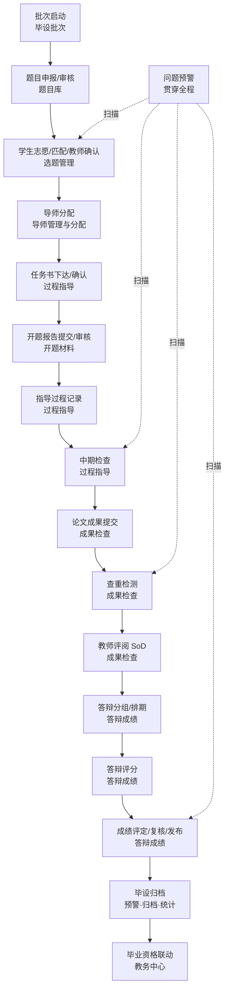
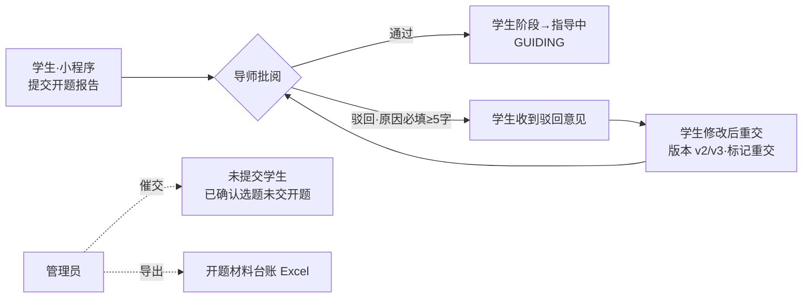
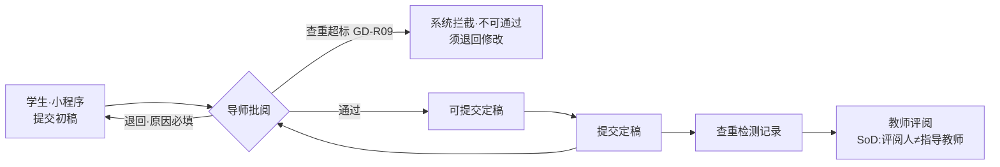
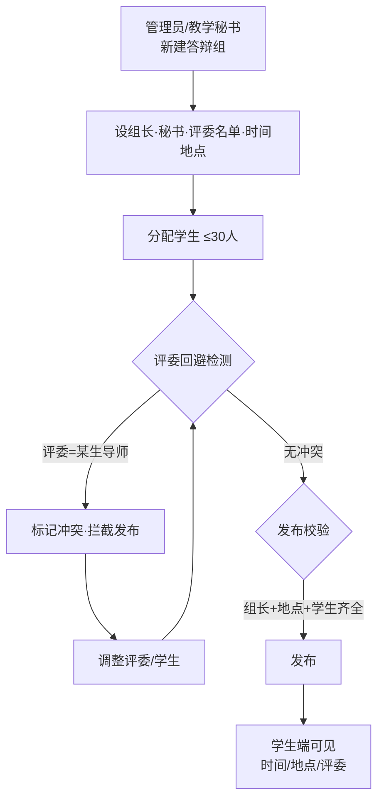
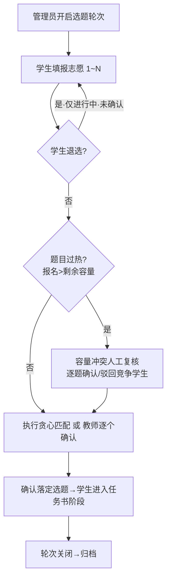
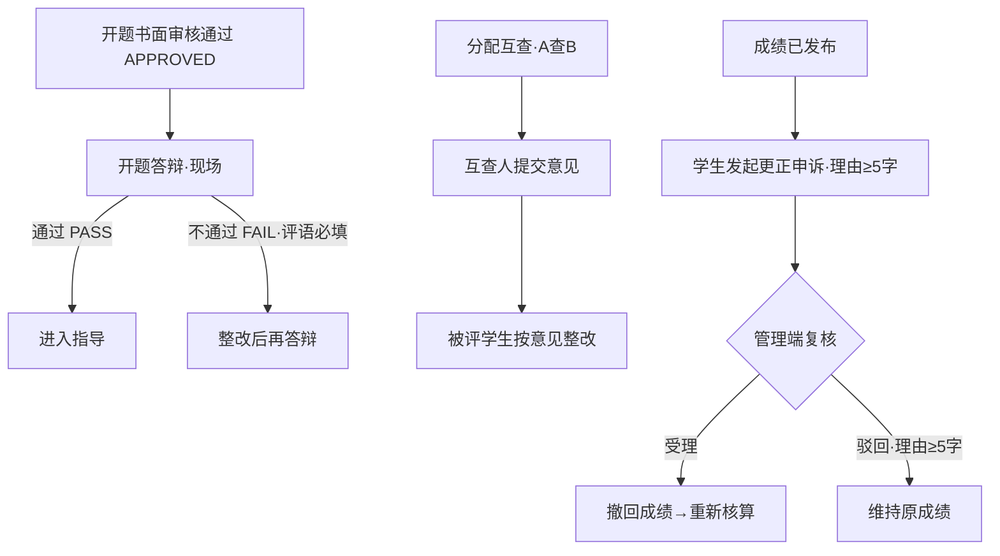

# 毕业设计中心 · 业务流程与操作手册

> 面向学校毕设管理员 / 指导教师 / 学生的操作手册与业务流程图。
> 对标同方知网(CNKI)、强智科技、维普三家成熟商业毕业设计管理系统的全流程闭环。
> 本文档随各三级模块生产级收口持续更新;流程图使用 Mermaid,可在支持 Mermaid 的 Markdown 查看器中渲染。

---

## 一、毕业设计全生命周期主流程图



**学生主状态机(贯穿全模块):**

```
未启动 → 选题中(TOPIC_SELECTING) → 任务书确认(TASKBOOK_CONFIRM) → 指导中(GUIDING)
→ 中期检查(MIDTERM) → 成果检查(FINAL_CHECK) → 答辩中(DEFENSE) → 已完成 → 已归档(ARCHIVED)
```

---

## 二、各阶段业务流程图与操作说明

### 2.1 开题材料(开题报告)



**操作说明:**
- **学生端(小程序 → 毕业设计 → 开题报告):** 确认选题后填写「选题背景 / 研究方案与进度 / 预期成果」提交;被驳回后可修改重交(自动预填上一版)。
- **指导教师端:** 毕业设计中心 → 开题材料 → 点「批阅」进入详情 → 通过 / 驳回(驳回须填≥5字原因,同步学生端)。
- **管理员端:** 「逾期未交」页签查看未提交学生 → 催交(留痕);「导出开题材料」下载台账 Excel。

### 2.2 成果检查(论文提交 + 查重 + 评阅)



**操作说明:**
- **学生端:** 先交初稿,导师通过后方可交定稿;被退回可重交(版本自增)。
- **查重超标(>30%):** 系统硬拦截,导师不能直接通过,必须退回修改(GD-R09)。
- **教师评阅:** 评阅人不得是该生指导教师(职责分离 SoD),对齐维普专家评审回避规则。

### 2.3 答辩安排



**操作说明:**
- **新建/编辑答辩组:** 毕业设计中心 → 答辩成绩 → 答辩批次 → 新增答辩组 → 填组名/时间/地点/组长/秘书/评委。
- **分配学生:** 编辑抽屉内从候选学生勾选分配(单组≤30人);评委/组长不得是本组学生的指导教师,系统自动检测并拦截发布。
- **发布:** 须组长、地点、学生齐全且无冲突方可发布;发布后学生端即时可见。
- **导出:** 「导出答辩表」下载答辩安排台账 Excel。

### 2.3b 选题管理（志愿 / 退选重选 / 容量冲突复核）



**操作说明:**
- **学生端:** 填报志愿;未被确认/匹配前可「退选」后重填。
- **容量冲突复核:** 选题轮次 → 某轮次「志愿」→「容量冲突复核」,系统列出报名数超过剩余容量的过热题目及竞争学生,管理员逐个确认/驳回。
- **选题统计:** 同页顶部显示志愿分布 / 参与学生 / 已确认匹配 / 过热题目数。
- **归档:** 已关闭/已匹配的轮次可「归档」,不再出现在进行中列表。

### 2.4 毕设看板

- **今日待办:** 开题待审、开题未交催交、成果待审、答辩组待发布、未处理风险,各带真实数量与跳转。
- **跨模块统计:** 导师已合格 / 指导平均次数 / 中期检查 / 教师评阅 / 成绩已发布均分 / 归档率,聚合各模块 `/stats`。
- **风险预警:** 展示未关闭的过程风险(编码 / 等级 / 学生 / 导师 / 时间),点击进入预警处置。

---

### 2.5 开题答辩 / 成果互查 / 成绩申诉（Batch 6-8 新增）



**操作说明：**
- **开题答辩（现场）：** 毕业设计中心 → 开题材料 → 进某学生开题详情，书面审核通过后出现「答辩通过/不通过」录入区（不通过评语必填）。
- **成果互查整改：** 毕业设计中心 → 互查/专家/申诉 → 成果互查整改 → 分配互查（A 查 B）；学生端小程序提交互查意见、被评学生提交整改。
- **答辩专家库：** 同页「答辩专家库」tab，维护评委库 + 回避说明（对齐维普专家评审回避）。
- **答辩通知：** 答辩安排页对已发布答辩组点「通知」，向组内学生发送通知并留痕。
- **成绩更正申诉：** 学生端小程序在已发布成绩下「发起申诉」；管理端「成绩更正申诉」tab 受理（撤回成绩重核）/驳回。
- **统计报表中心：** 毕业设计中心 → 各「统计报表」入口 → 统计中心页，一屏展示开题/指导/中期/成果/查重/评阅/互查/答辩/成绩 9 域统计。
- **批量归档：** 预警·归档·统计 → 毕设归档 →「批量生成提交」（材料齐全一键提交）/「一键核验备案」。

## 三、角色与权限速查

| 角色 | 开题 | 成果 | 答辩 | 说明 |
|---|---|---|---|---|
| 学生 | 提交/重交 | 提交初稿/定稿 | 查看安排 | 仅本人数据 |
| 指导教师 | 批阅 | 批阅(查重超标拦截) | — | 本人指导学生 |
| 评阅教师 | — | 评阅(SoD 回避) | — | 分配的评阅任务 |
| 答辩评委 | — | — | 评分 | 本组学生 |
| 毕设管理员 | 催交/导出 | 催交/导出 | 建组/分配/发布/导出 | 按学院数据范围 |

> 敏感操作(导出台账、发布、批阅)均写审计日志。细粒度 permission key 随全局 RBAC 上线前补齐。

---

## 四、更新记录

- 2026-07-08:开题材料 / 成果提交 / 答辩安排 / 毕设看板 4 个模块生产级闭环,补齐主流程图与各阶段流程图。
- 2026-07-08:毕设看板接入跨模块统计。
- 2026-07-08:模板中心、选题管理(退选/容量冲突/统计/归档)、导师管理(评价/批量分配/冲突检测/批量归档)收口。
- 2026-07-08:开题答辩/成果互查整改/答辩专家库/答辩通知/成绩更正申诉/统计中心/批量归档/风险编码补齐收口——**毕业设计中心所有三级项全部达生产级闭环**。
