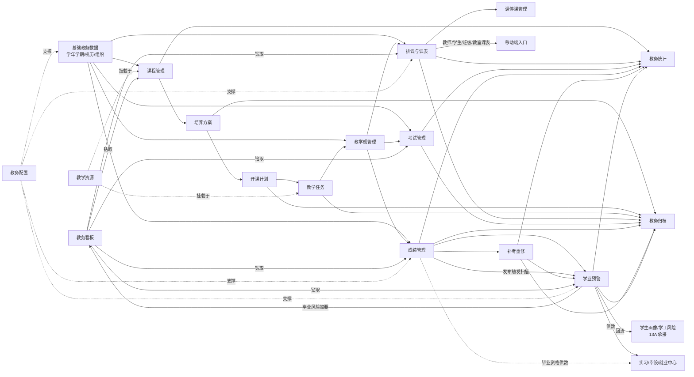

# 13B 教务中心页面树与路由设计

> 版本：V1.1 页面级设计 · 依据《_13-需求输入-V1.1.md》§3/§10/§11 与《_13-现有系统集成事实速查.md》
> 范围：教务中心 PC 管理端（/admin/academic-affairs/*）+ 移动端入口索引（详见 13B-教务中心移动端入口设计.md）
> 标记：★ = V1 必做；☆ = P2/P3 后置。本文档不写代码、不改现有路由。

---

## 1. 总体定位与现有系统区隔

### 1.1 与现有 /admin/academic 学业过程模块的关系（必须先读）

| 维度 | 现有「学业过程」模块 | 新「教务中心」模块（本设计） |
|---|---|---|
| PC 路由前缀 | `/admin/academic/*`（已占用，禁止改动） | `/admin/academic-affairs/*`（全部新增页面用此前缀） |
| 菜单名称 | 学业过程（过程性学业数据） | 教务中心（教学运行管理） |
| 职责 | 成绩查询骨架（t_acad_grade）、学业预警处置（t_acad_warning）、补考/重修骨架（t_acad_makeup/t_acad_retake） | 学年学期/校历/学籍/异动/培养方案/课程库/教学任务/课表/调停课/选课/考务/成绩全流程/毕业资格/归档 |
| 数据表 | `t_acad_*`（继续使用，不迁移） | 新表 `t_aa_*`；成绩、预警、补考重修**读写既有 t_acad_* 表**（扩展字段，不新建平行表） |
| 后端 API | `/api/v1/academic/*` 已占 students/grades/warnings 等 | 13B 新建路径 `/api/v1/academic-affairs/terms|programs|courses|teaching-tasks|schedule|enrollments|graduation-audit|roll-changes` 等；复用既有 `/api/v1/academic/students|grades|warnings`（复用既有 academic 学业过程模块） |
| 学业预警 | 预警处置 API（close/escalate/assign/remind）与移动端处理已实现 | 教务中心提供**同数据源的新视图**：规则配置页 + 预警列表/处置页（复用既有 API，扩展规则引擎与来源），不新建预警表 |
| 菜单关系 | 保留为二级菜单入口（历史数据入口），后续版本可整体收编为教务中心的「学业过程」子菜单 | 侧边栏新增一级菜单「教务中心」；两模块间通过页面跳转互链（见 §4 链路） |

### 1.2 全局约定

- **谁能进**：PC 仅教职工（require_staff，学生令牌 403）；学生新建教务走小程序 `/api/v1/mobile/academic-affairs/*`；复用既有 `/api/v1/mobile/academic/my`（学业过程聚合）。
- **角色缩写**：教务处=教务处管理员（全校）；学院教务=学院教务员（本学院）；专业负责人=本专业；教师=任课教师（本人课程/授课学生）；督导=授权课程学院；辅导员=负责班级（部分只读联动页）；学生=本人（仅移动端）。
- **路由动词约定**（§11 要求，全模块统一）：
  - 列表 `/xxx`；详情 `/xxx/:id`；新增 `/xxx/create`；编辑 `/xxx/:id/edit`；审批 `/xxx/:id/approve`；统计 `/xxx/stats`；配置 `/xxx/:id/config` 或 `/xxx/rules`；归档 `/xxx/archive`；发布 `/xxx/:id/publish`。
- **审批一律复用 Workflow**（t_workflow_instance/t_workflow_task，新增 workflow_code），待办进 t_unified_todo，通知进 t_unified_message。
- **权限点命名**：`academicAffairs.<biz>.<action>`，如 `academicAffairs.term.publish`、`academicAffairs.rollChange.approve`。

---

## 2. 教务中心完整页面树

```
教务中心 /admin/academic-affairs
│
├── 01 教务首页 ★
│   └── 教务驾驶舱（按角色视图：教务处/学院教务/教师）  /admin/academic-affairs
│
├── 02 学年学期与校历 ★
│   ├── 学期列表 ★            /terms
│   ├── 学年学期新增 ★        /terms/create
│   ├── 学年学期编辑 ★        /terms/:termId/edit
│   ├── 校历编辑 ★（教学周/考试周/实习周/节假日/调休）  /terms/:termId/calendar
│   ├── 节次配置 ★（作息时间/上下课节次）              /terms/:termId/time-slots
│   ├── 校历发布 ★            /terms/:termId/publish
│   └── 校历归档查看 ☆        /terms/:termId/archive
│
├── 03 学籍管理 ★
│   ├── 学籍档案列表 ★        /roll/students
│   ├── 学籍档案详情 ★        /roll/students/:studentId
│   ├── 入学注册批次 ★        /roll/registration
│   ├── 注册名单核对 ★        /roll/registration/:batchId/check
│   ├── 学年注册 ☆            /roll/annual-registration
│   ├── 异动申请列表 ★（转专业/休学/复学/退学/留级/转学） /roll/changes
│   ├── 异动申请详情 ★        /roll/changes/:changeId
│   ├── 异动代录新增 ★（教务代学生发起）                /roll/changes/create
│   ├── 异动审批 ★            /roll/changes/:changeId/approve
│   └── 异动统计 ★            /roll/changes/stats
│
├── 04 院系专业班级（复用现有组织表 t_college/t_major/t_class，教务视角只读+关联维护）
│   ├── 专业一览 ★（只读复用，展示方案绑定情况）  /majors
│   └── 班级一览 ★（只读复用，展示课表/任务关联） /classes
│
├── 05 培养方案 ★（基础）
│   ├── 方案列表 ★            /programs
│   ├── 方案新增 ★            /programs/create
│   ├── 方案详情 ★            /programs/:programId
│   ├── 方案编制 ★（基本信息/毕业要求/学分结构）   /programs/:programId/edit
│   ├── 方案课程配置 ★（模块/学分学时/开课学期）   /programs/:programId/courses
│   ├── 方案审核 ★（学院审→教务审）               /programs/:programId/approve
│   ├── 版本对比 ☆            /programs/:programId/versions/compare
│   └── 方案发布 ★（发布+绑定专业年级）           /programs/:programId/publish
│
├── 06 课程库 ★
│   ├── 课程列表 ★            /courses
│   ├── 课程新增 ★            /courses/create
│   ├── 课程详情 ★            /courses/:courseId
│   ├── 课程编辑 ★            /courses/:courseId/edit
│   ├── 课程审核 ★（学院审→教务审→启用）  /courses/:courseId/approve
│   └── 课程库导入 ★（复用导入管线 dry-run→confirm）  /courses/import
│
├── 07 教学任务 ★
│   ├── 任务批次列表 ★        /teaching-tasks/batches
│   ├── 任务批次新增 ★        /teaching-tasks/batches/create
│   ├── 任务生成 ★（按培养方案生成应开课程）      /teaching-tasks/batches/:batchId/generate
│   ├── 任务核对 ★（学院核对课程/班级/人数/分配教师） /teaching-tasks/batches/:batchId/check
│   ├── 教师确认 ★            /teaching-tasks/batches/:batchId/teacher-confirm
│   ├── 任务审核 ★（学院提交→教务处审）           /teaching-tasks/batches/:batchId/approve
│   └── 任务统计 ☆            /teaching-tasks/stats
│
├── 08 排课与课表（V1=课表查看+人工维护+冲突检测；自动排课 P2）
│   ├── 排课批次 ☆            /schedule/batches
│   ├── 手工排课工作台 ☆      /schedule/batches/:batchId/edit
│   ├── 课表导入 ★（V1 数据来源之一，复用导入管线） /schedule/import
│   ├── 总课表 ★              /schedule/overview
│   ├── 班级课表 ★            /schedule/class/:classId
│   ├── 教师课表 ★            /schedule/teacher/:teacherId
│   ├── 教室课表 ☆            /schedule/room/:roomId
│   ├── 冲突报告 ★（教师/班级/教室/容量/周学时冲突） /schedule/batches/:batchId/conflicts
│   ├── 课表发布 ★            /schedule/batches/:batchId/publish
│   └── 课表导出 ☆（复用导出管线，水印留痕）        /schedule/export
│
├── 09 调停课 ☆（P2）
│   ├── 调停课申请列表 ☆      /course-adjustments
│   ├── 调停课申请新增 ☆（教师发起：调/停/补）  /course-adjustments/create
│   ├── 调停课审批 ☆（学院审→教务审）          /course-adjustments/:adjustId/approve
│   └── 调停课记录 ☆          /course-adjustments/records
│
├── 10 选课 ☆（P2）
│   ├── 选课批次列表 ☆        /enrollment/batches
│   ├── 选课批次配置 ☆（时间/范围/容量/规则）  /enrollment/batches/:batchId/config
│   ├── 选课监控 ☆（进度/低人数课程/锁定）     /enrollment/batches/:batchId/monitor
│   └── 选课名单导出 ☆        /enrollment/batches/:batchId/export
│
├── 11 考务与缓考 ☆（P2）
│   ├── 考试批次列表 ☆        /exams/batches
│   ├── 考试课程确认 ☆        /exams/batches/:batchId/courses
│   ├── 考场与座位 ☆          /exams/batches/:batchId/rooms
│   ├── 监考安排 ☆            /exams/batches/:batchId/invigilation
│   ├── 考试发布 ☆            /exams/batches/:batchId/publish
│   ├── 考试记录 ☆（缺考/违纪/缓考标记）  /exams/records
│   ├── 缓考申请列表 ☆        /exams/deferrals
│   └── 缓考审批 ☆（辅导员初审→教师确认→学院→教务终审） /exams/deferrals/:deferralId/approve
│
├── 12 成绩管理（V1=成绩查看；录入/审核/发布/更正 P2；数据落既有 t_acad_grade 扩展）
│   ├── 成绩任务列表 ☆        /grades/tasks
│   ├── 成绩录入 ☆（平时/期末/总评构成）  /grades/tasks/:taskId/input
│   ├── 成绩审核 ☆（学院审完整性）        /grades/tasks/:taskId/review
│   ├── 成绩发布 ☆（教务处发布）          /grades/publish
│   ├── 学生成绩单 ★（按学生汇总，V1 读既有成绩数据）  /grades/transcript/:studentId
│   ├── 成绩更正申请 ☆        /grades/corrections
│   ├── 成绩更正审核 ☆        /grades/corrections/:correctionId/approve
│   └── 成绩统计 ★（挂科率/录入率/发布率，V1 基础口径） /grades/stats
│
├── 13 补考/重修/免修 ☆（P2，扩展既有 t_acad_makeup/t_acad_retake）
│   ├── 补考名单 ☆            /makeup/list
│   ├── 补考批次安排 ☆        /makeup/batches
│   ├── 重修报名列表 ☆        /retake/applications
│   ├── 重修审核 ☆            /retake/applications/:applicationId/approve
│   ├── 免修申请列表 ☆        /exemptions
│   └── 免修审批 ☆            /exemptions/:exemptionId/approve
│
├── 14 学业预警 ★（扩展既有 t_acad_warning，不新建预警表）
│   ├── 预警规则配置 ★（挂科/低绩点/学分不足/缺考/未注册等，接平台规则中心） /warnings/rules
│   ├── 学业预警列表 ★（复用既有预警 API + 新来源）  /warnings
│   ├── 预警处置 ★（处置/转谈话/转家校/升级/关闭）   /warnings/:warningId/handle
│   └── 预警统计 ★            /warnings/stats
│
├── 15 毕业资格审核 ★（预审 V1；复杂规则 P2）
│   ├── 审核批次列表 ★        /graduation/batches
│   ├── 审核批次新增 ★        /graduation/batches/create
│   ├── 预审结果列表 ★（系统预审：学分/课程/实习/毕设/处分/材料/就业） /graduation/batches/:batchId/precheck
│   ├── 学生预审详情 ★        /graduation/batches/:batchId/students/:studentId
│   ├── 异常处理 ★（逐项异常→责任模块联动）  /graduation/batches/:batchId/exceptions
│   ├── 学院初审 ★            /graduation/batches/:batchId/college-review
│   ├── 教务终审 ★            /graduation/batches/:batchId/final-review
│   └── 名单导出 ★（毕业/结业/延毕名单，水印+留痕）  /graduation/batches/:batchId/export
│
├── 16 教材管理 ☆（P2/P3）
│   ├── 教材目录 ☆            /textbooks
│   ├── 教材征订 ☆            /textbooks/orders
│   └── 教材发放 ☆            /textbooks/distribution
│
├── 17 教室资源 ☆（P2）
│   ├── 教室列表 ☆（校区/楼/教室/实训室/机房/容量/设备） /rooms
│   ├── 教室借用申请 ☆        /rooms/borrow
│   └── 借用审批 ☆            /rooms/borrow/:borrowId/approve
│
├── 18 教学评价与质量 ☆（P2/P3）
│   ├── 评教任务 ☆            /evaluation/tasks
│   ├── 问卷配置 ☆            /evaluation/questionnaires
│   └── 评价结果统计 ☆        /evaluation/stats
│
├── 19 等级考试 ☆（P3）
│   ├── 等级考试报名 ☆        /level-exams
│   └── 等级考试成绩登记 ☆    /level-exams/scores
│
├── 20 教学计划（方案学期执行计划）☆（P2，衔接培养方案与教学任务）
│   └── 学期开课计划 ☆        /teaching-plans
│
├── 21 教务材料归档 ☆（P2，复用导出/水印/审计管线）
│   ├── 归档批次 ☆            /archive
│   └── 归档包详情 ☆          /archive/:archiveId
│
├── 22 教务统计分析 ★（基础）
│   └── 教务统计总览 ★（注册率/任务完成率/排课冲突/挂科率/预警数/毕业通过率，扩展 stats_service） /stats
│
└── 23 移动端教务服务（页面详见《13B-教务中心移动端入口设计.md》）
    ├── 学生小程序（9 页）：我的课表★ / 我的课程★ / 我的考试☆ / 我的成绩★(只读) /
    │   我的补考重修☆ / 我的学籍★ / 异动申请★(可写) / 我的学业预警★ / 毕业资格进度★
    └── 教师移动端（6 页）：今日课程★ / 授课班级★ / 成绩录入进度☆(只读) /
        调停课申请☆ / 监考任务☆ / 学业预警跟进★(复用既有)
```

---

## 3. 一行速览表（路由 / 谁能进 / 从哪进 / V1 或 P2）

> 路由均省略前缀 `/admin/academic-affairs`。「从哪进」指主入口，页面间跳转见 §4。

### 3.1 教务首页与校历

| # | 页面 | 路由 | 谁能进 | 从哪进 | 版本 |
|---|---|---|---|---|---|
| 1 | 教务首页 | `/` | 教务处/学院教务/教师（角色视图） | 侧边栏「教务中心」 | ★V1 |
| 2 | 学期列表 | `/terms` | 教务处（管）；学院教务（看） | 菜单「学年学期与校历」 | ★V1 |
| 3 | 学年学期新增 | `/terms/create` | 教务处 | 学期列表【新增】 | ★V1 |
| 4 | 学年学期编辑 | `/terms/:termId/edit` | 教务处（DRAFT 态） | 学期列表【编辑】 | ★V1 |
| 5 | 校历编辑 | `/terms/:termId/calendar` | 教务处 | 学期列表【校历】 | ★V1 |
| 6 | 节次配置 | `/terms/:termId/time-slots` | 教务处 | 学期列表【节次】 | ★V1 |
| 7 | 校历发布 | `/terms/:termId/publish` | 教务处 | 校历编辑【去发布】 | ★V1 |
| 8 | 校历归档查看 | `/terms/:termId/archive` | 教务处/学院教务（只读） | 学期列表（ARCHIVED 行） | ☆P2 |

### 3.2 学籍与组织

| # | 页面 | 路由 | 谁能进 | 从哪进 | 版本 |
|---|---|---|---|---|---|
| 9 | 学籍档案列表 | `/roll/students` | 教务处（全校）/学院教务（本院） | 菜单「学籍管理」 | ★V1 |
| 10 | 学籍档案详情 | `/roll/students/:studentId` | 同上（scope 校验） | 档案列表行点击 | ★V1 |
| 11 | 入学注册批次 | `/roll/registration` | 教务处/学院教务 | 菜单「入学注册」 | ★V1 |
| 12 | 注册名单核对 | `/roll/registration/:batchId/check` | 学院教务（核）→教务处（审） | 注册批次【核对】 | ★V1 |
| 13 | 学年注册 | `/roll/annual-registration` | 教务处/学院教务 | 菜单 | ☆P2 |
| 14 | 异动申请列表 | `/roll/changes` | 教务处/学院教务/辅导员（本班只读） | 菜单「学籍异动」 | ★V1 |
| 15 | 异动申请详情 | `/roll/changes/:changeId` | 同上（scope 校验） | 异动列表行点击 | ★V1 |
| 16 | 异动代录新增 | `/roll/changes/create` | 教务处/学院教务 | 异动列表【代录】 | ★V1 |
| 17 | 异动审批 | `/roll/changes/:changeId/approve` | 当前节点审批人（辅导员/原学院/目标学院/教务处） | 统一待办 / 异动列表待审 tab | ★V1 |
| 18 | 异动统计 | `/roll/changes/stats` | 教务处/学院教务 | 异动列表【统计】 | ★V1 |
| 19 | 专业一览 | `/majors` | 教务处/学院教务（只读复用组织表） | 菜单「专业与班级」 | ★V1 |
| 20 | 班级一览 | `/classes` | 教务处/学院教务（只读复用组织表） | 菜单「专业与班级」 | ★V1 |

### 3.3 培养方案与课程库

| # | 页面 | 路由 | 谁能进 | 从哪进 | 版本 |
|---|---|---|---|---|---|
| 21 | 方案列表 | `/programs` | 教务处/学院教务/专业负责人 | 菜单「培养方案」 | ★V1 |
| 22 | 方案新增 | `/programs/create` | 教务处（建编制任务）/专业负责人 | 方案列表【新增】 | ★V1 |
| 23 | 方案详情 | `/programs/:programId` | 全教务角色（只读） | 方案列表行点击 | ★V1 |
| 24 | 方案编制 | `/programs/:programId/edit` | 专业负责人（DRAFT/RETURNED 态） | 方案详情【编制】 | ★V1 |
| 25 | 方案课程配置 | `/programs/:programId/courses` | 专业负责人（DRAFT/RETURNED 态） | 方案编制【课程配置】 | ★V1 |
| 26 | 方案审核 | `/programs/:programId/approve` | 学院教务（初审）→教务处（终审） | 统一待办 / 方案列表待审 tab | ★V1 |
| 27 | 版本对比 | `/programs/:programId/versions/compare` | 教务处/学院教务/专业负责人 | 方案详情【版本对比】 | ☆P2 |
| 28 | 方案发布 | `/programs/:programId/publish` | 教务处（ACADEMIC_REVIEW 通过后） | 方案审核通过页 / 方案详情 | ★V1 |
| 29 | 课程列表 | `/courses` | 教务处/学院教务/专业负责人/教师（只读） | 菜单「课程库」 | ★V1 |
| 30 | 课程新增 | `/courses/create` | 课程负责人/学院教务 | 课程列表【新增】 | ★V1 |
| 31 | 课程详情 | `/courses/:courseId` | 全教务角色（只读） | 课程列表行点击 | ★V1 |
| 32 | 课程编辑 | `/courses/:courseId/edit` | 课程负责人（DRAFT/RETURNED 态） | 课程详情【编辑】 | ★V1 |
| 33 | 课程审核 | `/courses/:courseId/approve` | 学院教务（初审）→教务处（终审启用） | 统一待办 / 课程列表待审 tab | ★V1 |
| 34 | 课程库导入 | `/courses/import` | 教务处/学院教务 | 课程列表【导入】 | ★V1 |

### 3.4 教学任务与课表

| # | 页面 | 路由 | 谁能进 | 从哪进 | 版本 |
|---|---|---|---|---|---|
| 35 | 任务批次列表 | `/teaching-tasks/batches` | 教务处（管）/学院教务/专业负责人 | 菜单「教学任务」 | ★V1 |
| 36 | 任务批次新增 | `/teaching-tasks/batches/create` | 教务处 | 批次列表【新增】 | ★V1 |
| 37 | 任务生成 | `/teaching-tasks/batches/:batchId/generate` | 教务处 | 批次详情【生成】 | ★V1 |
| 38 | 任务核对 | `/teaching-tasks/batches/:batchId/check` | 学院教务/专业负责人 | 批次列表【核对】/统一待办 | ★V1 |
| 39 | 教师确认 | `/teaching-tasks/batches/:batchId/teacher-confirm` | 任课教师（本人任务） | 统一待办 / 教务首页教师视图 | ★V1 |
| 40 | 任务审核 | `/teaching-tasks/batches/:batchId/approve` | 教务处（学院提交后） | 统一待办 / 批次列表待审 tab | ★V1 |
| 41 | 任务统计 | `/teaching-tasks/stats` | 教务处/学院教务 | 批次列表【统计】 | ☆P2 |
| 42 | 排课批次 | `/schedule/batches` | 教务处/学院教务 | 菜单「排课管理」 | ☆P2 |
| 43 | 手工排课工作台 | `/schedule/batches/:batchId/edit` | 学院教务/教务处 | 排课批次【排课】 | ☆P2 |
| 44 | 课表导入 | `/schedule/import` | 教务处/学院教务 | 菜单「课表」【导入】 | ★V1 |
| 45 | 总课表 | `/schedule/overview` | 教务处/学院教务/督导 | 菜单「课表」 | ★V1 |
| 46 | 班级课表 | `/schedule/class/:classId` | 教务处/学院教务/辅导员（本班） | 总课表下钻 / 班级一览 | ★V1 |
| 47 | 教师课表 | `/schedule/teacher/:teacherId` | 教务处/学院教务；教师看本人 | 总课表下钻 / 教务首页教师视图 | ★V1 |
| 48 | 教室课表 | `/schedule/room/:roomId` | 教务处/学院教务 | 总课表下钻 / 教室列表 | ☆P2 |
| 49 | 冲突报告 | `/schedule/batches/:batchId/conflicts` | 教务处/学院教务 | 排课批次【冲突】/ 课表导入结果页 | ★V1 |
| 50 | 课表发布 | `/schedule/batches/:batchId/publish` | 教务处 | 冲突报告（0 冲突后）【去发布】 | ★V1 |
| 51 | 课表导出 | `/schedule/export` | 教务处/学院教务（水印+留痕） | 总课表【导出】 | ☆P2 |

### 3.5 调停课 / 选课 / 考务与缓考

| # | 页面 | 路由 | 谁能进 | 从哪进 | 版本 |
|---|---|---|---|---|---|
| 52 | 调停课申请列表 | `/course-adjustments` | 教务处/学院教务/教师（本人） | 菜单「调停课」 | ☆P2 |
| 53 | 调停课申请新增 | `/course-adjustments/create` | 任课教师 | 申请列表【新增】/ 教师课表格子 | ☆P2 |
| 54 | 调停课审批 | `/course-adjustments/:adjustId/approve` | 学院教务→教务处 | 统一待办 | ☆P2 |
| 55 | 调停课记录 | `/course-adjustments/records` | 教务处/学院教务 | 菜单「调停课」【记录】 | ☆P2 |
| 56 | 选课批次列表 | `/enrollment/batches` | 教务处 | 菜单「选课」 | ☆P2 |
| 57 | 选课批次配置 | `/enrollment/batches/:batchId/config` | 教务处 | 批次列表【配置】 | ☆P2 |
| 58 | 选课监控 | `/enrollment/batches/:batchId/monitor` | 教务处/学院教务 | 批次列表【监控】 | ☆P2 |
| 59 | 选课名单导出 | `/enrollment/batches/:batchId/export` | 教务处/学院教务 | 选课监控【导出】 | ☆P2 |
| 60 | 考试批次列表 | `/exams/batches` | 教务处/学院教务 | 菜单「考务」 | ☆P2 |
| 61 | 考试课程确认 | `/exams/batches/:batchId/courses` | 学院教务 | 批次列表【确认】 | ☆P2 |
| 62 | 考场与座位 | `/exams/batches/:batchId/rooms` | 教务处/学院教务 | 批次详情【考场】 | ☆P2 |
| 63 | 监考安排 | `/exams/batches/:batchId/invigilation` | 教务处/学院教务 | 批次详情【监考】 | ☆P2 |
| 64 | 考试发布 | `/exams/batches/:batchId/publish` | 教务处 | 批次详情【发布】 | ☆P2 |
| 65 | 考试记录 | `/exams/records` | 教务处/学院教务/教师（本人监考课） | 菜单「考务」【记录】 | ☆P2 |
| 66 | 缓考申请列表 | `/exams/deferrals` | 教务处/学院教务/教师/辅导员 | 菜单「缓考」 | ☆P2 |
| 67 | 缓考审批 | `/exams/deferrals/:deferralId/approve` | 节点审批人（辅导员→教师→学院→教务） | 统一待办 | ☆P2 |

### 3.6 成绩 / 补考重修免修 / 学业预警

| # | 页面 | 路由 | 谁能进 | 从哪进 | 版本 |
|---|---|---|---|---|---|
| 68 | 成绩任务列表 | `/grades/tasks` | 教务处/学院教务/教师（本人任务） | 菜单「成绩管理」 | ☆P2 |
| 69 | 成绩录入 | `/grades/tasks/:taskId/input` | 任课教师（本人任务，INPUTTING 态） | 成绩任务列表【录入】 | ☆P2 |
| 70 | 成绩审核 | `/grades/tasks/:taskId/review` | 学院教务（SUBMITTED 态） | 统一待办 / 任务列表待审 tab | ☆P2 |
| 71 | 成绩发布 | `/grades/publish` | 教务处（COLLEGE_REVIEW 通过） | 菜单「成绩发布」/ 统一待办 | ☆P2 |
| 72 | 学生成绩单 | `/grades/transcript/:studentId` | 教务处/学院教务/辅导员（scope 校验） | 学籍档案详情【成绩单】/ 预警处置页 | ★V1 |
| 73 | 成绩更正申请 | `/grades/corrections` | 教师（发起）/教务处/学院教务（查看） | 菜单「成绩更正」/ 成绩任务列表（已发布行） | ☆P2 |
| 74 | 成绩更正审核 | `/grades/corrections/:correctionId/approve` | 学院教务→教务处 | 统一待办 | ☆P2 |
| 75 | 成绩统计 | `/grades/stats` | 教务处/学院教务 | 菜单「成绩管理」【统计】 | ★V1（基础口径） |
| 76 | 补考名单 | `/makeup/list` | 教务处/学院教务 | 菜单「补考重修」 | ☆P2 |
| 77 | 补考批次安排 | `/makeup/batches` | 教务处 | 补考名单【安排】 | ☆P2 |
| 78 | 重修报名列表 | `/retake/applications` | 教务处/学院教务 | 菜单「补考重修」 | ☆P2 |
| 79 | 重修审核 | `/retake/applications/:applicationId/approve` | 教务处 | 统一待办 | ☆P2 |
| 80 | 免修申请列表 | `/exemptions` | 教务处/学院教务/教师 | 菜单「免修」 | ☆P2 |
| 81 | 免修审批 | `/exemptions/:exemptionId/approve` | 教师→学院→教务 | 统一待办 | ☆P2 |
| 82 | 预警规则配置 | `/warnings/rules` | 教务处（接平台规则中心 safe_rule） | 菜单「学业预警」【规则】 | ★V1 |
| 83 | 学业预警列表 | `/warnings` | 教务处/学院教务/辅导员（本班） | 菜单「学业预警」/ 教务首页卡片 | ★V1 |
| 84 | 预警处置 | `/warnings/:warningId/handle` | 辅导员/学院教务（scope 校验，复用既有处置 API） | 预警列表行【处置】/ 统一待办 | ★V1 |
| 85 | 预警统计 | `/warnings/stats` | 教务处/学院教务 | 预警列表【统计】 | ★V1 |

### 3.7 毕业资格审核

| # | 页面 | 路由 | 谁能进 | 从哪进 | 版本 |
|---|---|---|---|---|---|
| 86 | 审核批次列表 | `/graduation/batches` | 教务处/学院教务 | 菜单「毕业资格」 | ★V1 |
| 87 | 审核批次新增 | `/graduation/batches/create` | 教务处 | 批次列表【新增】 | ★V1 |
| 88 | 预审结果列表 | `/graduation/batches/:batchId/precheck` | 教务处/学院教务（本院） | 批次列表【预审结果】 | ★V1 |
| 89 | 学生预审详情 | `/graduation/batches/:batchId/students/:studentId` | 同上 + 辅导员（本班只读） | 预审结果行点击 | ★V1 |
| 90 | 异常处理 | `/graduation/batches/:batchId/exceptions` | 学院教务/辅导员（补充说明） | 预审结果【异常】tab / 统一待办 | ★V1 |
| 91 | 学院初审 | `/graduation/batches/:batchId/college-review` | 学院教务 | 统一待办 / 批次详情 | ★V1 |
| 92 | 教务终审 | `/graduation/batches/:batchId/final-review` | 教务处 | 统一待办 / 批次详情 | ★V1 |
| 93 | 名单导出 | `/graduation/batches/:batchId/export` | 教务处（用途必填≥5字，水印留痕） | 教务终审完成页 / 批次详情 | ★V1 |

### 3.8 教材 / 教室 / 评价 / 等级考试 / 计划 / 归档 / 统计

| # | 页面 | 路由 | 谁能进 | 从哪进 | 版本 |
|---|---|---|---|---|---|
| 94 | 教材目录 | `/textbooks` | 教务处/学院教务 | 菜单「教材」 | ☆P2/P3 |
| 95 | 教材征订 | `/textbooks/orders` | 学院教务/教师 | 教材目录【征订】 | ☆P2/P3 |
| 96 | 教材发放 | `/textbooks/distribution` | 教务处/学院教务 | 菜单「教材」 | ☆P2/P3 |
| 97 | 教室列表 | `/rooms` | 教务处 | 菜单「教室资源」 | ☆P2 |
| 98 | 教室借用申请 | `/rooms/borrow` | 教师/学院教务 | 教室列表【借用】 | ☆P2 |
| 99 | 借用审批 | `/rooms/borrow/:borrowId/approve` | 教务处 | 统一待办 | ☆P2 |
| 100 | 评教任务 | `/evaluation/tasks` | 教务处 | 菜单「教学评价」 | ☆P2/P3 |
| 101 | 问卷配置 | `/evaluation/questionnaires` | 教务处 | 评教任务【问卷】 | ☆P2/P3 |
| 102 | 评价结果统计 | `/evaluation/stats` | 教务处/学院教务/督导 | 菜单「教学评价」 | ☆P2/P3 |
| 103 | 等级考试报名 | `/level-exams` | 教务处/学院教务 | 菜单「等级考试」 | ☆P3 |
| 104 | 等级考试成绩登记 | `/level-exams/scores` | 教务处 | 等级考试报名【成绩】 | ☆P3 |
| 105 | 学期开课计划 | `/teaching-plans` | 教务处/学院教务 | 菜单「教学计划」 | ☆P2 |
| 106 | 归档批次 | `/archive` | 教务处 | 菜单「教务归档」 | ☆P2 |
| 107 | 归档包详情 | `/archive/:archiveId` | 教务处（只读+水印导出） | 归档批次行点击 | ☆P2 |
| 108 | 教务统计总览 | `/stats` | 教务处/学院教务（scope 过滤） | 菜单「统计分析」/ 教务首页【更多】 | ★V1（基础） |

### 3.9 页面数量汇总

| 范围 | 总页数 | V1★ | P2/P3☆ |
|---|---|---|---|
| PC 教务中心（#1–#108） | 108 | 58 | 50 |
| 学生小程序（详见移动端文档） | 9 | 7 | 2 |
| 教师移动端（详见移动端文档） | 6 | 3 | 3 |
| **合计** | **123** | **68** | **55** |

---

## 4. 核心流程页面跳转链路（≥6 条）

> 格式：角色@页面（路由）→ 动作 → 下一页面。所有审批节点同时生成 t_unified_todo 待办与 t_unified_message 通知。

### 链路 1：成绩发布（需求 §11 必备示例）☆P2（V1 仅成绩查看段生效）

```
任课教师@成绩任务列表 /grades/tasks
  → 点击【录入】→ 成绩录入 /grades/tasks/:taskId/input
  → 填平时/期末/总评构成 → 【提交】（状态 INPUTTING→SUBMITTED）
学院教务@统一待办 → 成绩审核 /grades/tasks/:taskId/review
  → 【审核通过】（SUBMITTED→COLLEGE_REVIEW 通过）；【退回】则回到教师录入页（RETURNED）
教务处@成绩发布 /grades/publish
  → 勾选课程 → 【发布】（→PUBLISHED，写 t_acad_grade，触发预警扫描）
学生@小程序「我的成绩」 pages/student/academic/grades（只读）
  → 收到 PUBLISHED_NOTICE，查看成绩明细
系统 → 挂科/低绩点命中规则 → 生成学业预警（t_acad_warning）
辅导员@预警列表 /warnings → 预警处置 /warnings/:warningId/handle
  → 可跳 学生成绩单 /grades/transcript/:studentId 佐证 → 转谈话/家校 → 关闭 → 写入学生360时间线
```

### 链路 2：学生看课表 ★V1

```
教务处@课表导入 /schedule/import（或 P2 排课工作台）
  → dry-run 校验 → 冲突报告 /schedule/batches/:batchId/conflicts
  → 冲突清零 → 课表发布 /schedule/batches/:batchId/publish（DRAFT→PUBLISHED）
  → 系统写 PUBLISHED_NOTICE 至相关班级学生与教师
学生@小程序「我的课表」（周视图，读 /api/v1/mobile/academic-affairs/my/schedule）
  → 切换周次（教学周来自已发布校历）→ 点击课程格 → 课程详情（教师/教室/节次）
教师@PC 教师课表 /schedule/teacher/:teacherId 或 移动端「今日课程」同步可见
```

### 链路 3：转专业 ★V1

```
学生@小程序「异动申请」→ 选类型=转专业 → 填目标专业/理由/材料 → 【提交】
  （校验：申请时间窗内/在籍/成绩条件；防重复：同类型在途申请 409）
辅导员@移动端审批（/api/v1/mobile/teacher/approvals/:id/approve）或 PC 统一待办 → 初审通过
原学院教务@异动审批 /admin/academic-affairs/roll/changes/:changeId/approve → 【同意转出】
目标学院教务@同页（节点流转）→ 【同意接收】（校验目标专业容量/班级）
教务处@同页 → 【终审通过】
  → 更新 t_student_profile 专业/班级 + 培养方案重绑（旧课程成绩保留）
  → 写 StudentStageEvent（进学生360时间线）→ 异动统计 /roll/changes/stats 计数
学生@小程序 收到 WORKFLOW_RESULT，「我的学籍」页显示新专业班级
```

### 链路 4：休学（含复学提醒）★V1

```
学生@小程序「异动申请」→ 类型=休学 → 起止期限/原因/证明材料 → 【提交】
辅导员@待办 → 确认情况属实 → 通过
学院教务@异动审批 /roll/changes/:changeId/approve → 通过
教务处@同页 → 【终审通过】→ student_status=SUSPENDED
  → 联动：禁选课/禁考试/禁实习/禁毕设（各模块读 student_status）
  → 写 360 时间线；「我的学籍」显示休学中与复学期限
系统@休学到期前 30 天 → DEADLINE_REMINDER 推学生+辅导员
学生@小程序「异动申请」→ 类型=复学 → 提交 → 辅导员确认 → 学院定班
  → 教务处通过 → student_status=ACTIVE，重绑班级/培养方案/课程
```

### 链路 5：教学任务生成 ★V1

```
教务处@学期列表 /terms → 校历已 PUBLISHED（前置校验）
教务处@任务批次新增 /teaching-tasks/batches/create → 选学期/范围 → 【创建】
  → 任务生成 /teaching-tasks/batches/:batchId/generate
  → 按已发布培养方案生成应开课程清单（缺方案专业列入异常清单）
学院教务@任务核对 /teaching-tasks/batches/:batchId/check
  → 核对课程/班级/人数 → 分配教师（无教师不能提交；容量<班级人数提示；工作量超限提示）
  → 专业负责人确认 → 【提交学院意见】
任课教师@教师确认 /teaching-tasks/batches/:batchId/teacher-confirm（或移动端查看）
  → 【确认任务】/【有异议退回】
学院教务 → 【提交教务处】
教务处@任务审核 /teaching-tasks/batches/:batchId/approve → 【审核通过】
  → 任务状态=可排课 → 进入 课表导入/排课批次（链路 2 前置）
```

### 链路 6：毕业资格预审 ★V1

```
教务处@审核批次新增 /graduation/batches/create → 选届别/范围 → 【创建并生成应审学生】
系统 → 逐生预审（学籍/方案学分/必修/选修/实习/毕设/处分/材料/就业，各模块供数）
  → 每生状态 SYSTEM_PASSED / SYSTEM_ABNORMAL
学院教务@预审结果列表 /graduation/batches/:batchId/precheck → 筛「异常」
  → 学生预审详情 /graduation/batches/:batchId/students/:studentId（逐条件红绿灯）
  → 异常处理 /graduation/batches/:batchId/exceptions
     → 学分缺口→跳补考重修；实习未完成→跳实习模块；处分未解除→跳学工处分页；
       就业未填报→通知辅导员（t_unified_todo）；辅导员补充说明
学院教务@学院初审 /graduation/batches/:batchId/college-review → 逐生【初审通过/暂缓】
教务处@教务终审 /graduation/batches/:batchId/final-review → 定 毕业/结业/延毕
  → 名单导出 /graduation/batches/:batchId/export（水印+t_export_task 留痕）
学生@小程序「毕业资格进度」→ 实时看逐条件状态与最终结论 → 写 360 归档
```

### 链路 7（补充）：缓考申请 ☆P2

```
学生@小程序「我的考试」→ 考试行【申请缓考】→ 原因+材料 → 提交（在途 409 防重复）
辅导员@待办 → 初审 → 任课教师@待办 → 确认 → 学院教务 → 教务处@缓考审批
/exams/deferrals/:deferralId/approve → 通过 → 考试记录标记「缓考」→ 进缓考安排批次
学生@小程序「我的考试」显示缓考安排；与请假模块联动（考试期间已批请假可一键带入）
```

### 链路 8（补充）：调停课 ☆P2

```
教师@移动端「调停课申请」或 PC /course-adjustments/create
  → 选原课程（本人课表）→ 调/停/补 → 目标时间教室 → 系统冲突检查（教师/班级/教室）
学院教务@待办 → 审 → 教务处@调停课审批 /course-adjustments/:adjustId/approve → 通过
  → 更新已发布课表（记录变更流水）→ 通知本班学生与教师（STATUS_CHANGED）
  → 调停课记录 /course-adjustments/records 留痕，供工作量与督导统计
```

---

## 5. 菜单结构建议（侧边栏二级菜单）

```
教务中心
├── 教务首页            ★
├── 学年学期与校历      ★（学期列表為入口，校历/节次/发布为其下钻页）
├── 学籍管理            ★（档案 / 入学注册 / 学籍异动 / 异动统计）
├── 专业与班级          ★（只读复用组织数据）
├── 培养方案            ★
├── 课程库              ★
├── 教学任务            ★
├── 课表管理            ★（总课表/班级/教师/导入/冲突/发布；排课工作台 P2 后挂入）
├── 调停课              ☆P2
├── 选课管理            ☆P2
├── 考务与缓考          ☆P2
├── 成绩管理            V1 仅显示「学生成绩单查询」「成绩统计」两项；P2 展开全流程
├── 补考重修免修        ☆P2
├── 学业预警            ★（列表/处置/规则/统计；与现有 /admin/academic 预警共用数据）
├── 毕业资格审核        ★
├── 教材管理            ☆P2/P3
├── 教室资源            ☆P2
├── 教学评价            ☆P2/P3
├── 等级考试            ☆P3
├── 教务归档            ☆P2
└── 统计分析            ★
```

菜单显隐由权限点驱动：无 `academicAffairs.<biz>.view` 则整项隐藏；V1 阶段 P2 菜单不渲染（feature flag 控制），避免出现空壳页面。

---

## 6. 路由冲突与共存清单（与事实速查 §10 对齐）

| 冲突点 | 处理方案 |
|---|---|
| `/admin/academic/*` 已被学业过程模块占用 | 教务中心一律 `/admin/academic-affairs/*`，两模块菜单并存，互链跳转 |
| `/api/v1/academic/students|grades|warnings`（复用既有 academic 学业过程模块）已占用 | 教务中心复用这些端点读成绩/预警；**13B 新建**端点统一 `/api/v1/academic-affairs/terms|programs|courses|teaching-tasks|schedule|enrollments|graduation-audit|roll-changes` 等 |
| `t_acad_*` 表名已占用（学业过程） | 教务中心新表用 `t_aa_*`；成绩/预警/补考/重修直接扩展 t_acad_grade / t_acad_warning / t_acad_makeup / t_acad_retake |
| 学生 PC 门户 | 本轮不开；学生页面全部在小程序（见移动端文档） |
| demo-school 只读锁 | 教务中心全部写操作在 demo-school 返回 403 并引导 sandbox-school |
| 平台管理端 | 预警规则/长假天数等可配置项接入现有平台规则中心（/admin/platform + safe_rule），不新建管理端 |

---

## 7. 验收要点（本文档自身）

1. 页面树覆盖需求 §3 全部一级功能（33 项），无遗漏；每页有唯一路由且符合动词约定。
2. 成绩管理 8 个三级页、学籍 5 类页、校历 4 类页、培养方案 6 类页、课程库 3 类页、教学任务 5 类页、课表 6 类页、调停课 3 类页、考务缓考、毕业资格 6 类页粒度达标。
3. 速览表 108 行与页面树一一对应；V1/P2 标记与需求 §10 一致。
4. 跳转链路 ≥6 条（实际 8 条），成绩发布链路与需求 §11 示例一致。
5. 全部路由不与现有 /admin/academic、/api/v1/academic 既有端点、t_acad_* 表冲突，并给出共存方案。

---

## 附录：商业化页面树补强清单

> 口径说明：本附录为**追加式商业化补强**，不改动上文任何原有页面树与路由。原文中的历史 `V1/P2/P3` 字样统一按「高频核心底座 + 商业化能力池 + 补强包 A–I」口径理解：`V1`＝高频核心底座已交付；`P2/P3`＝商业化能力池补强能力（多数状态机与预留表已冻结，属「已设计好、待建 UI」，非「未做」）。
> 本清单目的：让每个页面从「路由占位」升级到「前端可直接施工」的深度——明确每页解决的真实教务业务问题、必须展示的数据区块、必须有真实接口的核心按钮、必须与状态机一致的状态、以及导入导出/打印/审计/验收口径。**严禁菜单占位、空页面、假按钮。**
> 接口前缀：PC 端 `/api/v1/academic-affairs/*`（均 require_staff）；移动端 `/api/v1/mobile/academic-affairs/*`；统计 `/api/v1/stats/*`。状态机引用《13B-教务中心状态机与权限矩阵.md》SM-01~SM-14。

| 页面名称 | 原有路由 | 所属施工包 | 使用角色 | 页面真实业务目的 | 必须展示的数据区块 | 必须具备的核心按钮 | 必须绑定的接口 | 必须绑定的状态机 | 移动端 | 导入导出 | 打印 | 审计 | 前端实现注意事项 | 验收标准 |
|---|---|---|---|---|---|---|---|---|---|---|---|---|---|---|
| 教务首页/教学运行驾驶舱 | `/admin/academic-affairs` | A | 教务处/学院教务/教师/领导 | 一屏看清「今天教学在运行什么、哪里有待办、哪里有风险」，领导下钻、教务处调度 | 运行指标卡（教学任务执行率/排课完成率/成绩提交率/毕业预审通过率）、今日教学运行、本周教学安排、待办区（成绩待录/待审、异动待审、调停课待办）、毕业风险学生、趋势区 | 层级切换（校→院→专业→年级→班→课程→教师）、各卡下钻、进待办处理页、导出汇总 | `GET /dashboard?drillLevel=&parentId=` | 无（聚合各业务终态） | 否（PC） | 汇总导出 | 否 | 下钻到含敏感页按目标页审计 | 分卡异步加载，单卡失败卡内 error 不塌整页；未开通业务卡显「未开通」不报错；范围经 getAcademicScope，前端不传范围 | 每层数字与下钻明细对账 0 差异；未开通卡不报错；越权层不可见 |
| 学年学期与校历 | `/terms`、`/terms/:id/calendar` | B | 教务处 | 维护全域教学时间基线，发布后驱动排课/考试/课表/毕业 | 学期列表（状态徽标）、校历编辑（教学周/考试周/实习周/毕业周/节假日/调休）、变更影响范围面板 | 新建、编辑、发布、冻结/解冻、查看影响范围、导入节假日、导出校历 | `GET/POST /terms`、`POST /terms/:id/publish|freeze`、`GET /terms/:id/impact` | SM-01（DRAFT/PUBLISHED/FROZEN/ARCHIVED） | 学生校历只读 | 节假日模板导入、校历导出 | 校历 PDF | 发布/解冻/调休变更 record | PUBLISHED 后起止与节次不可改、节假日调休可增改并广播；未发布学期下游创建批次 409 | 发布后下游可创建批次；调休精确定向受影响师生；历史学期只读可导出 |
| 作息时间与节次 | `/terms/:id/time-slots` | B | 教务处 | 维护节次/午别/单双周/特殊作息，供排课与考务 | 节次列表（节次号/起止/午别）、单双周与特殊作息模板、校区作息 | 新增节次、编辑、启用/停用、复制模板、查看影响范围 | `GET/POST /terms/:id/time-slots` | 复用 SM-01（随学期冻结） | 否 | 导出 | 否 | 变更 record | 历史学期作息只读，改需解冻+审计；节次与排课/考试联动校验 | 节次配置被排课冲突检测正确读取；历史作息不可随意改 |
| 学籍档案 | `/roll/students` | A/B | 教务处/学院教务 | 查全校/本院学生学籍主数据、状态、异动史，形成台账 | 学籍列表（状态标签）、学籍详情抽屉（基础+学籍状态+异动时间线）、台账统计区 | 查看详情、查看完整敏感值（填原因）、导出台账、异动发起入口 | `GET /roll/students`、`GET /roll/students/:id`、`GET /roll/ledger`、`GET /roll/stats` | 展示 SM-02（14 态）徽标 | 学生「我的学籍」只读 | 学籍台账导出 | 否 | 敏感字段查看填原因+审计 | student_status 只读（教务不改主档，更正走学生中心）；身份证等出口脱敏 | 台账可多维导出；敏感脱敏+查看审计；状态标签与 SM-02 一致 |
| 入学注册 | `/roll/registration/:batchId/check` | B | 教务处/学院教务/教学秘书 | 新生注册核对，欠费/未报到/信息缺失异常识别 | 注册批次、注册名单核对表（异常标记）、异常清单 | 批量确认、标异常、导入核对、导出、注册结果入档 | `GET /roll/registration/:batchId`、`POST .../check`、`POST .../batch-confirm` | 注册状态（复用既有节点） | 学生看注册状态 | 名单导入导出 | 否 | 注册确认 record | orientation 取数初始化；跨租户批次拒绝 | 批量注册+异常清单；结果写学籍档案；学生端可见注册状态 |
| 学年注册 | `/roll/annual-registration` | B | 教务处/学院教务 | 每学年在册学生注册确认 | 学年注册批次、名单、欠费/未报到提示 | 批量确认、导入、导出 | `POST /roll/annual-registration/:batchId/batch-confirm` | 注册状态 | 学生端注册确认 | 导入导出 | 否 | record | 欠费为供数接口位（默认提醒不卡） | 学年注册批量跑通；异常提示准确 |
| 学籍异动 | `/roll/changes`、`/roll/changes/:id/approve` | B | 教务处/学院教务/教学秘书/学生 | 转专业/休学/复学/退学/留级申请→审批→生效→回滚 | 异动申请列表、异动详情（时间线+审批进度）、审批弹窗 | 发起、审批（通过/退回/驳回）、撤回、回滚、导出台账 | `GET /status-change`、`POST /status-change`、`POST .../:id/approve`、`POST .../:id/rollback` | SM-03（11 态，AC_SC_TRANSFER/SUSPEND/RESUME/WITHDRAW） | 学生「异动申请」可写 | 异动台账导出 | 否 | 审批/生效/回滚全 record | 生效前可撤销、生效后经审批回滚，全程 append-only；审批中学生被处分挂起提示人工裁定 | 异动可回滚留痕；状态影响选课/考试/成绩/毕业拦截生效 |
| 学院/专业/班级 | `/orgs`（复用组织） | B/C | 教务处/学院教务 | 组织主数据与教学秘书/班主任绑定 | 学院/专业/年级/班级树、绑定关系、历史组织 | 建/改、绑定教学秘书、导入学生、历史只读 | `GET/POST /orgs`、`PATCH /orgs/:id` | 无（组织变更 record） | 否 | 学生导入 | 否 | 组织变更 record | 复用 t_college/t_major/t_class，加列全 nullable；历史专业/班级只读 | 教学秘书可绑定；历史组织只读；变更留痕 |
| 培养方案 | `/programs/:id/edit`、`/programs/:id/approve`、`/programs/:id/versions/compare` | C | 教务处/学院教务/专业负责人 | 编制→两审→发布→版本化，作为毕业审核与教学任务依据 | 方案基本信息、课程配置表（必修/限选/任选/学分/实践）、版本列表、版本对比 | 编制、提交、审核、发布、复制、版本对比、导入 | `GET/POST /programs`、`POST .../:id/approve|publish`、`GET .../versions/compare`、`POST .../copy` | SM-04（8 态版本化） | 否 | 方案导入导出 | 方案书打印 | 发布/版本变更 record | 发布强制新版本、历史年级锁旧版本；学分汇总实时校验 422 | 版本对比 diff 正确；复制后发新版本；毕业审核读方案要求 |
| 课程库 | `/courses`、`/courses/:id/approve` | C | 教务处/学院教务 | 课程主数据两审启用，方案与任务的前置 | 课程列表（状态）、课程详情（学分/理论实践学时/考核方式/先修/替代）、审核弹窗 | 新增、提交、审核、启用/停用、维护先修/替代、导入 | `GET/POST /courses`、`POST .../:id/approve`、`GET/POST .../:id/prerequisites|equivalents` | SM-05（6 态审核启用） | 否 | 课程导入导出 | 否 | 启用/停用 record | 未启用课程不可被方案引用；被任务/方案引用后限删；理论/实践学时分列 | 未启用不可引用；先修关系被选课校验读取；被引用限删 |
| 教学计划 | `/teaching-plans` | C | 教务处/学院教务 | 方案→学期执行计划→教学任务三层贯通 | 学期应开课程计划、方案-学期映射 | 生成计划、调整、下发生成任务 | `GET/POST /teaching-plans` | 无（衔接 SM-04→SM-06） | 否 | 导出 | 否 | record | 计划按方案+学期推导，人工可调 | 计划与方案口径一致；可下发生成任务 |
| 教学任务 | `/teaching-tasks/batches`、`/batches/:id/check` | C | 教务处/学院教务/教师 | 生成→分配→教师确认→学院审→教务发布，课表的前置 | 任务批次、任务核对表（教学班/教师/班级/周次/学时/容量）、合拆班区 | 生成、分配、合班、拆班、教师确认、学院审核、教务发布、导入 | `GET/POST /teaching-tasks/batches`、`POST .../:id/check|confirm|review|publish`、`.../merge|split` | SM-06（8 态生成→确认→审核→可排课） | 教师端任务确认 | 任务导入导出 | 否 | 确认/审核/发布 record | generate 幂等；无教师提交 422；容量/工作量为 warning 非阻断 | generate 幂等；合拆容量校验；READY 任务进排课池 |
| 排课管理 | `/schedule/batches`、`/schedule/batches/:id/edit`、`/conflicts` | D | 教务处/学院教务 | 人工排课+六类冲突检测+发布；自动排课只做建议草稿接口位（**不写算法**） | 排课工作台（任务/教室/教师可用时间）、冲突报告（六类）、批次状态 | 新建批次、人工排课、实时冲突检测、生成建议草稿（接口位）、人工确认、预发布、正式发布、回滚 | `GET/POST /schedule/batches`、`POST .../:id/publish`、`POST .../:id/suggest`（接口位）、`POST .../:id/rollback` | SM-07（7 态） | 否 | 课表导出（水印） | 课表打印 | 发布/作废重发 record | **没有算法也能人工排课跑通**；suggest 未启用返回「未启用」，草稿必须人工逐条确认才落课表项；发布后走作废重发运维通道留审计 | 六类冲突检测齐备；无算法可发布；有算法仅出草稿；批次可回滚 |
| 课表管理 | `/schedule/class/:id`、`/teacher/:id`、`/room/:id` | A/D | 教务处/学院教务/教师/学生 | 班级/教师/教室课表查看与发布状态 | 周视图课表、发布状态、调停课标注 | 切换视图、导出、打印 | `GET /schedule/class|teacher|room/:id` | 展示 SM-07 发布态 | 学生/教师课表 | 课表导出 | 课表打印 | 否 | 调休日自动标「按 X 日课表执行」 | 课表按校历周渲染；发布状态正确；调停课变更即时刷新 |
| 调停课管理 | `/course-adjustments`、`/create`、`/:id/approve`、`/records` | D | 教务处/学院教务/教师/教学秘书 | 教师发起调/停/补→冲突检测→审批→变更进课表+通知师生 | 申请列表、申请表单（原课次/目标时间/教室）、审批弹窗、记录台账 | 发起、代录、冲突检测、审批、发布变更、导出台账 | `GET/POST /course-adjustments`、`POST .../:id/approve` | SM-08（SUBMITTED→COLLEGE_REVIEW→ACADEMIC_REVIEW→APPROVED→APPLIED/REJECTED/CANCELLED） | 教师端发起 | 台账导出 | 否 | 审批/生效 record | ACAD_SCHEDULE_CHANGE 已冻结；考试周禁调入；APPLIED 后反向=再发起 | APPLIED 即时刷新师生课表+定向通知；台账可导出；停课未补进缺口报表 |
| 选课管理 | `/enrollment/batches`、`/:id/config`、`/:id/monitor` | E | 教务处/学院教务/学生/教师 | 建批次→规则→学生选→校验→锁定；抽签只做接口位（**不写算法**） | 批次列表、规则配置、选课监控、名单 | 建批次、配规则、发布、监控、抽签（接口位）、导出名单 | `GET/POST /enrollment/batches`、`POST .../:id/config|publish`、`GET .../:id/monitor`、`POST .../:id/lottery`（接口位） | SM-09（批次 6 态+记录 4 态） | 学生选课 | 名单导出 | 否 | 选课/退选 record | **没有复杂算法也能按规则先到先得跑通**；容量原子扣减超员 409；退选自动递补 | 先到先得可跑通、容量不超发；抽签为接口位；结果进教学班 |
| 免修管理 | `/exemption`（新） | E | 教务处/学院教务/教师/学生 | 免修申请→三级审→写成绩 EXEMPTED | 申请列表、资格校验面板、审批弹窗 | 学生申请、教师审、学院审、教务审、导出 | `GET/POST /exemption`、`POST .../:id/approve` | SM-12 免修（DRAFT→…→APPROVED/REJECTED/RETURNED） | 学生申请 | 台账导出 | 否 | 审批/生效 record | ACAD_COURSE_EXEMPT 冻结；生效写 t_acad_grade（EXEMPTED 无分数） | 资格校验拦截 422；生效写成绩标记；台账可导出 |
| 重修管理 | `/retake`（基于骨架升级） | E | 教务处/教师/学生 | 补考后仍不及格→重修报名→审批→入选课/跟班→成绩回写 | 可重修课程、报名列表、审批 | 报名、审核、入选课、导出 | `GET/POST /retake`、`POST .../:id/approve` | SM-12 重修（OPEN→APPLIED→ACADEMIC_REVIEW→APPROVED→ENROLLED→…→GRADED） | 学生报名 | 台账导出 | 否 | 报名/审批 record | 基于 t_acad_retake 加 apply_id 升级；次数受 retake.maxCount 限制 | 报名到成绩回写闭环；次数校验；不平行建台账 |
| 补考管理 | `/makeup`（基于骨架升级） | E | 教务处/教师/学生 | 成绩发布后识别不及格→生成补考名单→批次→回写成绩 | 补考名单、补考批次、场次安排 | 生成名单、建批次、排场次、录成绩、导出 | `GET/POST /makeup`、`POST .../batch` | SM-12 补考（ELIGIBLE→PUBLISHED→TAKEN→GRADED→PASSED/FAILED_AGAIN） | 学生看安排 | 台账导出 | 准考证打印 | 成绩回写 record | 基于 t_acad_makeup 加 batch_id；按 makeup.scoreRule 回写 t_acad_grade | 名单按 FAILED 自动生成；成绩按规则回写；仍不及格进重修池 |
| 缓考管理 | `/exam/deferral`（新） | E | 教务处/学院/教师/辅导员/学生 | 学生缓考申请→多级审→并入补考场次 | 申请列表、关联请假单/材料、审批 | 申请、辅导员初审、教师确认、学院审、教务终审、导出 | `GET/POST /exam/deferral`、`POST .../:id/approve` | SM-10 缓考（DRAFT→SUBMITTED→COUNSELOR_REVIEW→TEACHER_CONFIRM→COLLEGE_REVIEW→ACADEMIC_REVIEW→APPROVED→SCHEDULED→TAKEN→GRADED） | 学生缓考申请 | 台账导出 | 否 | 审批 record | ACAD_EXAM_DEFER 冻结；关联生效请假单（§5.3 闭环）；APPROVED 后缺考 ABSENT | 与请假联动；批准后考务名单自动摘除并通知监考 |
| 考务管理 | `/exam/batches`、`/rooms`、`/invigilation` | E | 教务处/学院教务/教师 | 考试批次→考场座位→监考→异常；人工排考+建议草稿（**不写算法**） | 考试批次、考场座位、监考安排、异常登记 | 建批次、生成考试课程、人工排时间、分考场座位、排监考、生成建议草稿（接口位）、发布、准考证打印 | `GET/POST /exam/batches`、`POST .../rooms|invigilation|publish`、`POST .../suggest`（接口位） | SM-10 考试批次（6 态） | 学生考试/教师监考 | 考务台账导出 | 准考证打印 | 发布/异常 record | **无算法人工排考可跑通**；避让课表与校历考试周；suggest 未启用返回占位 | 人工排考冲突检测齐备；准考证含水印；缺考/违纪登记进成绩链 |
| 等级考试 | `/level-exam`（新） | E/G | 教务处/学生 | 报名→资格→成绩导入→证书台账 | 考试项目、报名批次、报名名单、成绩、证书 | 建项目、开报名、资格校验、导入成绩、登记证书、导出 | `GET/POST /level-exam`、`POST .../:id/enroll|import-grade` | 报名批次状态（新） | 学生报名/查询 | 成绩导入、台账导出 | 准考证打印 | 报名/成绩 record | 缴费为接口位；外部对接属性强 | 报名到证书闭环；缴费为接口位；异常报名可处理 |
| 成绩管理 | `/grades/input`、`/grades/transcript/:studentId` | F | 教务处/学院教务/教师/学生 | 录入→暂存→提交→审核→发布→更正全流程，总评唯一真相 t_acad_grade | 录入任务、成绩录入表（平时/期末/构成）、成绩单、台账 | 录入、暂存、批量导入、提交、退回、审核、发布、撤回发布、更正、成绩单打印、导出 | `GET/POST /grade-tasks`、`POST .../:id/submit|review|publish`、`POST /grade-correction` | SM-11（9 态含 CHANGE_REVIEW） | 教师录入进度、学生查询 | 成绩 Excel 导入 dry-run、导出 | 成绩单打印（水印） | 发布/更正原值 record | 发布原子回写 t_acad_grade（发布/更正/补录三口）；发布前学生不可见分数；SUBMITTED 后教师不可改 | 发布原子回写+台账刷新；更正原值留痕；成绩单含水印 |
| 成绩审核 | `/grade-tasks/:id/review` | F | 学院教务员 | 完整性审核（全员有分/构成合规/异常分布） | 待审任务、完整性面板、异常提示 | 通过、退回（行级原因）、导出 | `POST /grade-tasks/:id/review` | SM-11 COLLEGE_REVIEW/ACADEMIC_REVIEW | 否 | 否 | 否 | 审核 record | RETURNED 必附行级原因，已录分数保留 | 完整性校验；退回原因逐行；越权 403 |
| 成绩发布 | `/grade-tasks/:id/publish` | F | 教务处 | 发布并原子回写 t_acad_grade，触发预警扫描 | 待发布任务、发布确认 | 发布、撤回发布 | `POST /grade-tasks/:id/publish` | SM-11 PUBLISHED | 学生成绩可见 | 否 | 否 | 发布 record | 发布事务原子回写 + 刷新 t_acad_student 台账 + PUBLISHED_NOTICE | 发布后学生可见；触发预警扫描；撤回留审计 |
| 成绩更正 | `/grade-correction` | F | 教师/学院/教务/学生 | 发布后唯一修改通道，原值 append-only | 更正申请、原值/新值对比、审批 | 发起更正、审核、审批、导出 | `POST /grade-correction`、`POST .../:id/approve` | SM-11 CHANGE_REVIEW | 学生看更正进度 | 否 | 否 | 更正前后值 record | ACAD_GRADE_CHANGE 冻结；同一成绩行在途更正唯一；生效重跑预警/毕业增量 | 更正原值留痕；前后对比可见；生效重跑预警 |
| 学业预警 | `/warnings`、`/warnings/:id/handle` | A/F | 教务处/学院/辅导员/学生 | 挂科/学分不足/未修/重修未完成/毕业风险预警→处置→关闭→重开 | 预警列表（来源/等级）、处置面板、台账 | 处置、关闭、重开、分派、导出台账 | `GET /warnings`、`POST /warnings/:id/handle`、`POST /warnings/:id/reopen`、`GET /warnings/ledger` | SM-13（PENDING_HANDLE/PROCESSING/ESCALATED/CLOSED + REOPEN） | 学生「我的预警」 | 台账导出 | 否 | 处置/重开 record | 复用 t_acad_warning，扩展来源；13A 辅导员处置协同（成绩发布触发扫描） | 各类规则可配、可重开；台账导出；13A/13B 协同 |
| 毕业资格审核 | `/graduation/batches`、`/:id/precheck`、`/:id/exceptions` | F | 教务处/学院/学生 | 预审→异常清单→申诉→人工调整→终审→毕业/结业/肄业 | 批次、预审结果、问题清单、申诉、供数矩阵 | 建批次、预审、异常处理、学生申诉、人工调整、终审、导出三名单 | `GET/POST /graduation-audit/batches`、`POST .../:id/precheck|appeal|adjust|final` | SM-14（10 态 WAIT_PRECHECK→…→ARCHIVED） | 学生毕业进度/申诉 | 三名单导出（水印） | 毕业名单打印 | 审核/调整 record | ACAD_GRADUATION_AUDIT 冻结；七项供数只读六域；UNKNOWN≠FAIL；重跑幂等 | 四类学生走通；申诉留痕；分流结论可导出 |
| 教材管理 | `/textbooks`（新） | G | 教务处/学院/教师/学生 | 目录→选用→征订→发放→费用台账 | 教材目录、选用申报、征订单、发放记录、费用台账 | 建目录、申报选用、审核、征订、到货、发放、导出 | `GET/POST /textbooks`、`POST .../orders|issue` | 征订单（DRAFT→CONFIRMED→ORDERED→ARRIVED→ISSUING→SETTLED） | 学生领用确认 | 目录/台账导出 | 征订单打印 | 发放 record | 费用记台账不做支付；教学任务确定后才可申报 | 选用到发放闭环；费用台账；学生扫码签收 |
| 教学资源 | `/teaching-resources`（新） | G | 教师/专业负责人/学生 | 课程级资源上传/版本/共享/授权查看 | 资源列表、版本、共享设置 | 上传、审核共享、授权、导出 | `GET/POST /teaching-resources` | 资源（DRAFT→SUBMITTED→SHARED/PRIVATE→ARCHIVED） | 学生授权只读 | 下载走水印审计 | 否 | 下载 record | 文件走 t_file_object 不另建文件表；无任务不能传 | 按授权只读；版本不覆盖历史；下载留痕 |
| 教室资源 | `/classrooms`（新） | G | 教务处/学院/后勤 | 校区楼宇教室主数据+可用时间+借用+维修 | 教室档案（容量/类型/设备）、占用表、借用/维修 | 建档、维护可用时间、借用申请审批、维修停用、导出 | `GET/POST /classrooms`、`POST .../borrow|maintenance` | 教室（ENABLED→MAINTENANCE→DISABLED）、借用单 | 否 | 台账导出 | 否 | 借用/维修 record | 排课已用清单为首批数据；维修停用触发受影响课表提醒 | 占用与排课/考务联动；维修联动调课提醒 |
| 教学评价 | `/evaluations`（新） | G | 教务处/督导/师生 | 评教批次→多方评价→分级结果→整改 | 评价方案、问卷、评价记录、结果统计 | 建方案、发布、评价、汇总、分级发布、导出 | `GET/POST /evaluations` | 方案（DRAFT→PUBLISHED→OPEN→CLOSED→RESULT_PUBLISHED） | 学生评教 | 结果导出 | 质量报告打印 | 评价 record | 评价记录匿名化单向散列防反查；结果分级可见 | 匿名不可反查；结果按角色分级；整改跟踪留痕 |
| 教学质量 | `/quality`（新） | G | 教务处/督导/领导 | 教学质量报告与整改跟踪 | 质量指标、低分课程、整改任务 | 生成报告、下发整改、跟踪、导出 | `GET /quality`、`POST .../rectification` | 整改（跟踪态） | 否 | 报告导出 | 报告打印 | record | 结果供教学口自用；低分触发督导听课建议 | 报告可生成；整改可跟踪；权限受控 |
| 教务材料归档 | `/archive/batches`（新） | G | 教务处/学院教务 | 按学生/课程/教师/班级/学期多维归档 | 归档批次、完整性检查、缺失清单 | 建批次、抓取、补缺、完整性检查、生成归档包、导出 | `GET/POST /archive/batches`、`POST .../:id/check|package` | 归档（收集→审核→ARCHIVED 只读） | 否 | 归档包导出（水印+sha256） | 否 | 下载审计 | 复用 13A 归档模式；缺失自动催办；归档后只读 | 五维归档包可生成；缺失催办；归档后单据只读 |
| 教务统计分析 | `/stats`（新） | A/G | 教务处/学院/领导/教师 | 8 维交叉、趋势/分布/排行、明细钻取 | 多维筛选、趋势图、分布图、排行榜、明细 | 切维度、下钻、导出 | `GET /api/v1/stats/*`（多维参数） | 无（读各业务终态） | 否 | 导出（脱敏） | 否 | 导出 record | 走 getAcademicScope；实时 count；首页-明细对账 | 任一指标 8 维可下钻到学生/课程/教师明细，对账 0 差异 |
| 移动端教务服务 | `/mobile/academic-affairs/*` | A/H | 学生/教师 | 学生看课表成绩、报考试选课；教师看课表录成绩监考 | 学生 9 页+教师 6 页（详见移动端文档附录） | 各页高频动作（详见移动端附录） | `/api/v1/mobile/academic-affairs/*`、教师 `/api/v1/mobile/teacher/*` | 复用各 SM 移动入口 | 全端 | 否 | 否 | 教师写操作走包装层审计 | 未启用补强入口 feature flag 隐藏不空壳；弱网草稿；敏感不本地缓存 | 详见《13B-教务中心移动端入口设计.md》附录验收标准 |

**本附录统一验收红线**：① 每页可进入且数据加载；② 筛选生效、表格字段完整；③ 每个按钮有真实接口、出现条件与权限正确，无空按钮/假按钮；④ 状态流转与 SM-01~SM-14 一致，终态只读；⑤ 接口错误按 §1.2 错误码正确提示、绝不 500；⑥ 敏感字段脱敏、查看填原因+审计；⑦ 导出带水印+下载审计、打印用指定模板；⑧ 排课/选课/排考「无算法可人工跑通、有算法只出草稿由老师确认」。

---

## 附录二：按 13A 学工 B 包深度补齐的 13B 教务中心施工卡

> 口径说明：本附录与上文《附录：商业化页面树补强清单》配合使用，不重复维护同一批字段——上文已经按 42 个页面给了业务目的/数据区块/按钮/接口/状态机/移动端/导入导出/审计/验收标准的深度，**P0 页面的完整六段式深度请查上文对应行**；本附录补齐 13A 学工中心 B 包标准要求、但上文缺少的四样东西：①按用户 18 个二级模块分组的三级页面**全量索引**（含未在上文单独展开的字段级/合并项）、②优先级与阻断标记、③`implemented/partial/planned/external-link/merged` 状态口径判定、④《13B 教务中心前端 UI 三级模块关系图》与**三级页面关联矩阵**。两份附录合起来才是完整的页面施工卡。
>
> 状态口径判定依据（与 13A 施工地图文档 §9 同一口径）：教务中心前端**当前 0 实现**（后端 `academic_affairs`/`t_aa_*` 已建成 10 个 service + 6 个迁移 + 11 个测试文件，`navPlan.js` 中 27 个二级菜单仍为 `disabled: true` 占位），因此下表**没有一行可以标 `implemented`**；有真实后端等待前端接入的页面标 `planned`（备注注明"后端已就绪"）；复用既有 `/admin/academic`（t_acad_ 学业过程模块）或复用系统管理/组织管理等其他中心能力的页面标 `external-link`；同一父页下的 Tab/字段/按钮标 `merged`。

### 二.1 前端 UI 二级/三级模块全量索引（18 个二级模块）

| 二级模块 | 三级页面 | 路由建议 | 实现形态 | 父页/面板 | 优先级 | 阻断PC | 阻断上线 | 推荐分包 | 状态 | 备注 |
|---|---|---|---|---|---|---|---|---|---|---|
| 教务看板 | 教务总览 | `/admin/academic-affairs` | 独立页 | — | P0 | 是 | 是 | B1 | planned | 后端待补聚合接口 |
| 教务看板 | 今日待办 | `?panel=todos` | 看板分栏 | 教务总览 | P0 | 是 | 是 | B1 | merged | |
| 教务看板 | 排课异常 | `?panel=scheduleConflicts` | 看板分栏 | 教务总览 | P1 | 否 | 是 | B1/B4 | merged | |
| 教务看板 | 成绩待录 | `?panel=gradePending` | 看板分栏 | 教务总览 | P0 | 是 | 是 | B1/B6 | merged | |
| 教务看板 | 成绩待审 | `?panel=gradeReview` | 看板分栏 | 教务总览 | P1 | 否 | 是 | B1/B6 | merged | |
| 教务看板 | 考试待发布 | `?panel=examPending` | 看板分栏 | 教务总览 | P2 | 否 | 否 | B1/B5 | merged | |
| 教务看板 | 学业预警概览 | `?panel=warningOverview` | 看板分栏 | 教务总览 | P0 | 是 | 是 | B1/B7 | merged | |
| 教务看板 | 教务公告提醒 | `?panel=notice` | 看板分栏 | 教务总览 | P2 | 否 | 否 | B1 | merged | 复用统一消息中心 |
| 基础教务数据 | 学年学期 | `/terms` | 独立页 | — | P0 | 是 | 是 | B1 | planned | 后端 SM-01 已就绪 |
| 基础教务数据 | 校历 | `/terms/:termId/calendar` | Tab | 学年学期详情 | P0 | 是 | 是 | B1 | planned | |
| 基础教务数据 | 作息与节次 | `/terms/:termId/time-slots` | Tab | 学年学期详情 | P1 | 否 | 是 | B1 | planned | |
| 基础教务数据 | 院系管理 | `/orgs?tab=college` | 外链/Tab | 组织管理（系统管理中心） | P1 | 否 | 是 | B1 | external-link | 复用既有组织管理，教务只读引用 |
| 基础教务数据 | 专业管理 | `/orgs?tab=major` | 外链/Tab | 同上 | P1 | 否 | 是 | B1 | external-link | |
| 基础教务数据 | 行政班管理 | `/orgs?tab=class` | 外链/Tab | 同上 | P2 | 否 | 否 | B1 | external-link | |
| 基础教务数据 | 学籍状态摘要 | `/roll/students?view=summary` | merged | 学籍档案 | P0 | 是 | 是 | B1/B3 | planned | 与学生主档承接，教务只做教务视图 |
| 基础教务数据 | 教师基础信息摘要 | 外链 | 外链 | 现有教师管理 | P2 | 否 | 否 | B1 | external-link | |
| 基础教务数据 | 教室基础信息摘要 | `/classrooms?view=summary` | merged | 教室资源 | P1 | 否 | 是 | B4 | planned | |
| 基础教务数据 | 教务字典配置 | `/admin/academic-affairs/config?tab=dict` | Tab | 教务配置 | P1 | 否 | 是 | B1 | planned | |
| 课程管理 | 课程库 | `/courses` | 独立页 | — | P0 | 是 | 是 | B2 | planned | |
| 课程管理 | 课程详情 | `/courses/:id` | 独立页 | 课程库 | P0 | 是 | 是 | B2 | planned | |
| 课程管理 | 课程分类 | `?tab=category` | Tab | 课程库 | P2 | 否 | 否 | B2 | merged | |
| 课程管理 | 课程学分 | 字段 | merged | 课程详情 | P0 | 是 | 是 | B2 | merged | 课程详情字段，非独立页 |
| 课程管理 | 课程适用专业（先修/替代） | 字段 | merged | 课程详情 | P1 | 否 | 是 | B2 | merged | |
| 课程管理 | 课程启停 | 按钮 | merged | 课程库列表 | P0 | 是 | 是 | B2 | merged | |
| 课程管理 | 课程导入 | `?action=import` | 抽屉 | 课程库 | P1 | 否 | 是 | B2 | planned | |
| 课程管理 | 课程导出 | `?action=export` | 抽屉 | 课程库 | P1 | 否 | 是 | B2 | planned | |
| 培养方案 | 培养方案列表 | `/programs` | 独立页 | — | P0 | 是 | 是 | B2 | planned | |
| 培养方案 | 培养方案详情 | `/programs/:id/edit` | 独立页 | 培养方案列表 | P0 | 是 | 是 | B2 | planned | |
| 培养方案 | 课程结构 | `?tab=courses` | Tab | 培养方案详情 | P0 | 是 | 是 | B2 | merged | |
| 培养方案 | 学分要求 | `?tab=credits` | Tab | 培养方案详情 | P1 | 否 | 是 | B2 | merged | |
| 培养方案 | 方案版本 | `/programs/:id/versions/compare` | 抽屉 | 培养方案详情 | P1 | 否 | 是 | B2 | planned | |
| 培养方案 | 方案审核 | `/programs/:id/approve` | 抽屉 | 培养方案详情 | P0 | 是 | 是 | B2 | planned | |
| 培养方案 | 方案发布 | 按钮 | merged | 培养方案详情 | P0 | 是 | 是 | B2 | merged | |
| 培养方案 | 方案归档 | 状态展示 | merged | 培养方案列表 | P2 | 否 | 否 | B8 | merged | |
| 开课计划 | 学期开课计划 | `/teaching-plans` | 独立页 | — | P0 | 是 | 是 | B2 | planned | 对应现有"教学计划"页 |
| 开课计划 | 开课计划详情 | `/teaching-plans?termId=` | Tab | 学期开课计划 | P0 | 是 | 是 | B2 | planned | |
| 开课计划 | 开课课程 | merged | merged | 学期开课计划 | P1 | 否 | 是 | B2 | merged | |
| 开课计划 | 开课班级 | merged | merged | 教学任务列表 | P1 | 否 | 是 | B2/B3 | merged | |
| 开课计划 | 开课人数 | 字段 | merged | 教学任务核对 | P1 | 否 | 是 | B3 | merged | |
| 开课计划 | 开课计划审核 | merged | merged | 教学任务核对 | P1 | 否 | 是 | B2 | merged | |
| 开课计划 | 开课计划发布 | 按钮 | merged | 学期开课计划 | P1 | 否 | 是 | B2 | merged | |
| 开课计划 | 开课计划导入导出 | `?action=import|export` | 抽屉 | 学期开课计划 | P2 | 否 | 否 | B2 | planned | |
| 教学任务 | 教学任务列表 | `/teaching-tasks/batches` | 独立页 | — | P0 | 是 | 是 | B2 | planned | |
| 教学任务 | 任务生成 | 按钮+弹窗 | merged | 教学任务列表 | P0 | 是 | 是 | B2 | merged | |
| 教学任务 | 任课教师分配 | `/teaching-tasks/batches/:id/check` | Tab | 教学任务列表 | P0 | 是 | 是 | B3 | planned | |
| 教学任务 | 教学任务审核 | merged | merged | 任务核对 | P0 | 是 | 是 | B2 | merged | |
| 教学任务 | 教学任务发布 | 按钮 | merged | 任务核对 | P0 | 是 | 是 | B2 | merged | |
| 教学任务 | 教学任务变更（合班/拆班） | merged | merged | 任务核对 | P1 | 否 | 是 | B3 | merged | |
| 教学任务 | 教学任务台账 | `/teaching-tasks/ledger` | 独立页 | — | P2 | 否 | 是 | B8 | planned | |
| 教学班管理 | 教学班列表 | `/teaching-tasks/batches?view=class` | 独立页 | — | P0 | 是 | 是 | B3 | planned | 现有设计以教学任务为教学班载体，未单独开教学班主档表 |
| 教学班管理 | 教学班详情 | merged | merged | 教学任务详情 | P0 | 是 | 是 | B3 | merged | |
| 教学班管理 | 教学班学生名单 | `/schedule/class/:classId?tab=roster` | Tab | 班级课表 | P0 | 是 | 是 | B3 | planned | |
| 教学班管理 | 教学班任课教师 | merged | merged | 教学任务详情 | P0 | 是 | 是 | B3 | merged | |
| 教学班管理 | 教学班容量 | 字段 | merged | 教学任务核对 | P1 | 否 | 是 | B3 | merged | |
| 教学班管理 | 教学班合班 | `/teaching-tasks/batches/:id/merge` | 抽屉 | 教学任务核对 | P1 | 否 | 是 | B3 | planned | |
| 教学班管理 | 教学班拆班 | `/teaching-tasks/batches/:id/split` | 抽屉 | 教学任务核对 | P1 | 否 | 是 | B3 | planned | |
| 教学班管理 | 教学班导入导出 | merged | merged | 教学任务列表 | P2 | 否 | 否 | B3 | merged | |
| 教学班管理 | 选课名单（用户清单未单列） | `/enrollment/batches` | merged | 教学班学生名单 | P1 | 否 | 是 | B3 | planned | 对应现有 SM-09 选课管理，按数据归属并入 |
| 排课与课表 | 排课任务 | `/schedule/batches` | 独立页 | — | P0 | 是 | 是 | B4 | planned | |
| 排课与课表 | 排课规则 | `?tab=rules` | Tab | 排课任务 | P1 | 否 | 是 | B4 | planned | |
| 排课与课表 | 教室资源 | `/classrooms` | 独立页（共用） | — | P1 | 否 | 是 | B4/B8 | planned | 与教学资源模块共用 |
| 排课与课表 | 教师时间约束 | `?tab=teacherConstraint` | Tab | 排课工作台 | P2 | 否 | 否 | B4 | planned | |
| 排课与课表 | 班级时间约束 | `?tab=classConstraint` | Tab | 排课工作台 | P2 | 否 | 否 | B4 | planned | |
| 排课与课表 | 冲突检测 | `/schedule/batches/:id/conflicts` | Tab | 排课工作台 | P0 | 是 | 是 | B4 | planned | |
| 排课与课表 | 课表生成 | 按钮 | merged | 排课工作台 | P0 | 是 | 是 | B4 | merged | 人工排课为主，算法为接口位 |
| 排课与课表 | 人工调整 | `/schedule/batches/:id/edit` | 独立页 | — | P0 | 是 | 是 | B4 | planned | |
| 排课与课表 | 课表发布 | 按钮 | merged | 排课任务 | P0 | 是 | 是 | B4 | merged | |
| 排课与课表 | 教师课表 | `/schedule/teacher/:teacherId` | 独立页 | — | P0 | 是 | 是 | B4 | planned | |
| 排课与课表 | 学生课表 | `/schedule/class/:classId`（学生视角） | 独立页/外链小程序 | — | P0 | 是 | 是 | B4/B8 | planned | |
| 排课与课表 | 班级课表 | `/schedule/class/:classId` | 独立页 | — | P0 | 是 | 是 | B4 | planned | |
| 排课与课表 | 教室课表 | `/schedule/room/:roomId` | 独立页 | — | P1 | 否 | 是 | B4 | planned | |
| 调停课管理 | 调课申请 | `/course-adjustments/create?type=adjust` | 抽屉 | 调停课列表 | P0 | 是 | 是 | B4 | planned | |
| 调停课管理 | 停课申请 | `/course-adjustments/create?type=stop` | 抽屉 | 调停课列表 | P1 | 否 | 是 | B4 | planned | |
| 调停课管理 | 补课安排 | merged | merged | 调课申请 | P1 | 否 | 是 | B4 | merged | |
| 调停课管理 | 调停课审批 | `/course-adjustments/:id/approve` | 抽屉 | 调停课列表 | P0 | 是 | 是 | B4 | planned | |
| 调停课管理 | 调停课发布 | 按钮 | merged | 调停课列表 | P0 | 是 | 是 | B4 | merged | |
| 调停课管理 | 调停课通知 | 系统自动 | merged | — | P1 | 否 | 是 | B4 | merged | 复用统一消息中心 |
| 调停课管理 | 调停课台账 | `/course-adjustments/records` | 独立页 | — | P1 | 否 | 是 | B4/B8 | planned | |
| 调停课管理 | 调停课归档 | merged | merged | 调停课台账 | P2 | 否 | 否 | B8 | merged | |
| 考试管理 | 考试计划 | `/exam/batches` | 独立页 | — | P0 | 是 | 是 | B5 | planned | |
| 考试管理 | 考试科目 | merged | merged | 考试计划 | P0 | 是 | 是 | B5 | merged | |
| 考试管理 | 考场安排 | `/exam/rooms` | Tab | 考试计划 | P0 | 是 | 是 | B5 | planned | |
| 考试管理 | 监考安排 | `/exam/invigilation` | Tab | 考试计划 | P0 | 是 | 是 | B5 | planned | |
| 考试管理 | 考试冲突检测 | merged | merged | 考试计划 | P0 | 是 | 是 | B5 | merged | |
| 考试管理 | 考试发布 | 按钮 | merged | 考试计划 | P0 | 是 | 是 | B5 | merged | |
| 考试管理 | 考试异常处理 | `?tab=exceptions` | Tab | 考试计划 | P1 | 否 | 是 | B5 | planned | 缺考/违纪登记 |
| 考试管理 | 考试台账 | `?view=ledger` | 独立页 | — | P1 | 否 | 是 | B5/B8 | planned | |
| 考试管理 | 考试归档 | merged | merged | 考试台账 | P2 | 否 | 否 | B8 | merged | |
| 考试管理 | 缓考管理（用户清单未单列） | `/exam/deferral` | 独立页 | — | P1 | 否 | 是 | B5 | planned | 对应 SM-10 缓考，按业务并入考试管理 |
| 成绩管理 | 成绩录入 | `/grades/input` | 独立页 | — | P0 | 是 | 是 | B6 | planned | |
| 成绩管理 | 成绩暂存 | 按钮 | merged | 成绩录入 | P0 | 是 | 是 | B6 | merged | |
| 成绩管理 | 成绩提交 | 按钮 | merged | 成绩录入 | P0 | 是 | 是 | B6 | merged | |
| 成绩管理 | 成绩审核 | `/grade-tasks/:id/review` | 独立页 | — | P0 | 是 | 是 | B6 | planned | |
| 成绩管理 | 成绩退回 | 按钮（行级原因） | merged | 成绩审核 | P0 | 是 | 是 | B6 | merged | |
| 成绩管理 | 成绩发布 | `/grade-tasks/:id/publish` | 抽屉 | 成绩审核 | P0 | 是 | 是 | B6 | planned | |
| 成绩管理 | 学生查成绩 | `/grades/transcript/:studentId` | 独立页 | — | P0 | 是 | 是 | B6/B8 | planned | |
| 成绩管理 | 成绩更正申请 | `/grade-correction` | 独立页 | — | P1 | 否 | 是 | B6 | planned | |
| 成绩管理 | 成绩更正审核 | `/grade-correction/:id/approve` | 抽屉 | 成绩更正申请 | P1 | 否 | 是 | B6 | planned | |
| 成绩管理 | 成绩导入 | `?action=import` | 抽屉 | 成绩录入 | P0 | 是 | 是 | B6 | planned | |
| 成绩管理 | 成绩导出 | `?action=export` | 抽屉 | 学生成绩单 | P1 | 否 | 是 | B6 | planned | |
| 成绩管理 | 成绩台账 | merged | merged | 学生查成绩 | P2 | 否 | 否 | B8 | merged | |
| 补考重修 | 不及格名单 | `/makeup?view=failList` | Tab | — | P0 | 是 | 是 | B7 | planned | |
| 补考重修 | 补考资格 | merged | merged | 不及格名单 | P0 | 是 | 是 | B7 | merged | |
| 补考重修 | 补考安排 | `/makeup/batch` | 抽屉 | 补考名单 | P0 | 是 | 是 | B7 | planned | |
| 补考重修 | 补考成绩 | merged | merged | 补考安排 | P0 | 是 | 是 | B7 | merged | |
| 补考重修 | 重修报名 | `/retake` | 独立页 | — | P1 | 否 | 是 | B7 | planned | |
| 补考重修 | 重修教学班 | merged | merged | 重修报名 | P1 | 否 | 是 | B7 | merged | |
| 补考重修 | 重修成绩 | merged | merged | 成绩录入 | P1 | 否 | 是 | B6/B7 | merged | |
| 补考重修 | 成绩回写 | 系统自动 | merged | — | P0 | 是 | 是 | B7 | merged | |
| 补考重修 | 补考重修台账 | merged | merged | 补考名单/重修报名 | P2 | 否 | 否 | B8 | merged | |
| 补考重修 | 免修管理（用户清单未单列） | `/exemption` | 独立页 | — | P2 | 否 | 否 | B7 | planned | 对应 SM-12 免修，按业务并入补考重修 |
| 学业预警 | 预警看板 | `?view=dashboard` | 看板分栏 | 学业预警列表 | P0 | 是 | 是 | B7 | merged | |
| 学业预警 | 预警规则 | `/admin/academic-affairs/config?tab=warningRule` | Tab | 教务配置 | P1 | 否 | 是 | B7 | planned | |
| 学业预警 | 挂科预警 | merged（按来源筛选） | merged | 学业预警列表 | P0 | 是 | 是 | B7 | merged | |
| 学业预警 | 学分预警 | merged | merged | 学业预警列表 | P1 | 否 | 是 | B7 | merged | |
| 学业预警 | 缺勤预警 | merged | merged | 学业预警列表 | P2 | 否 | 否 | B7 | merged | 依赖过程性考勤数据来源，现场确认 |
| 学业预警 | 毕业资格风险摘要 | merged | merged | 学业预警列表 | P1 | 否 | 是 | B7 | merged | |
| 学业预警 | 预警学生 | `/warnings` | 独立页 | — | P0 | 是 | 是 | B7 | planned | |
| 学业预警 | 预警推送 | 系统自动 | external-link | 统一消息中心 | P1 | 否 | 是 | B7 | external-link | |
| 学业预警 | 预警处置 | `/warnings/:id/handle` | 抽屉 | 预警学生 | P0 | 是 | 是 | B7 | planned | |
| 学业预警 | 预警跟进 | merged | merged | 预警处置 | P1 | 否 | 是 | B7 | merged | |
| 学业预警 | 预警关闭 | 按钮 | merged | 预警处置 | P0 | 是 | 是 | B7 | merged | |
| 学业预警 | 学工风险联动 | 外链 | external-link | 13A 学工中心风险预警 | P1 | 否 | 是 | B7 | external-link | 双向引用，不重复建模 |
| 学业预警 | 学生画像回流 | 外链 | external-link | 学生画像模块 | P1 | 否 | 是 | B7 | external-link | |
| 教学资源 | 教室管理 | `/classrooms` | 独立页（共用） | — | P1 | 否 | 是 | B4/B8 | planned | |
| 教学资源 | 教材管理 | `/textbooks` | 独立页 | — | P2 | 否 | 否 | B8 | planned | |
| 教学资源 | 教学资源预约 | merged | merged | 教室管理 | P2 | 否 | 否 | B8 | merged | |
| 教学资源 | 实训室摘要 | 外链 | external-link | 现有实训室管理（若有） | P2 | 否 | 否 | B8 | external-link | |
| 教学资源 | 教学设备摘要 | merged | merged | 教室管理 | P2 | 否 | 否 | B8 | merged | |
| 教学资源 | 教学资源统计 | merged | merged | 教务统计 | P2 | 否 | 否 | B8 | merged | |
| 教学资源 | 课程级教学资源（用户清单未单列） | `/teaching-resources` | 独立页 | — | P3 | 否 | 否 | B8 | planned | 课件/大纲/题库版本共享 |
| 教学资源 | 教学评价（用户清单未单列） | `/evaluations` | 独立页 | — | P2 | 否 | 否 | B8 | planned | 按业务并入教学资源域 |
| 教学资源 | 教学质量（用户清单未单列） | `/quality` | 独立页 | — | P2 | 否 | 否 | B8 | planned | |
| 教学资源 | 等级考试（用户清单未单列） | `/level-exam` | 独立页 | — | P2 | 否 | 否 | B8 | planned | |
| 教务统计 | 课程统计 | `/stats?domain=course` | Tab | 教务统计首页 | P1 | 否 | 是 | B8 | planned | |
| 教务统计 | 排课统计 | `/stats?domain=schedule` | Tab | 教务统计首页 | P1 | 否 | 是 | B8 | planned | |
| 教务统计 | 考试统计 | `/stats?domain=exam` | Tab | 教务统计首页 | P2 | 否 | 否 | B8 | planned | |
| 教务统计 | 成绩统计 | `/stats?domain=grade` | Tab | 教务统计首页 | P0 | 是 | 是 | B8 | planned | |
| 教务统计 | 补考重修统计 | `/stats?domain=retake` | Tab | 教务统计首页 | P2 | 否 | 否 | B8 | planned | |
| 教务统计 | 学业预警统计 | `/stats?domain=warning` | Tab | 教务统计首页 | P1 | 否 | 是 | B8 | planned | |
| 教务统计 | 教师教学工作量统计 | `/stats?domain=workload` | Tab | 教务统计首页 | P2 | 否 | 否 | B8 | planned | |
| 教务统计 | 学院教务统计 | `/stats?domain=college` | Tab | 教务统计首页 | P1 | 否 | 是 | B8 | planned | |
| 教务归档 | 培养方案归档 | merged | merged | 培养方案列表 | P2 | 否 | 否 | B8 | merged | |
| 教务归档 | 开课计划归档 | merged | merged | 学期开课计划 | P2 | 否 | 否 | B8 | merged | |
| 教务归档 | 教学任务归档 | merged | merged | 教学任务台账 | P2 | 否 | 否 | B8 | merged | |
| 教务归档 | 课表归档 | merged | merged | 班级课表 | P2 | 否 | 否 | B8 | merged | |
| 教务归档 | 考试归档 | merged | merged | 考试台账 | P2 | 否 | 否 | B8 | merged | |
| 教务归档 | 成绩归档 | merged | merged | 成绩台账 | P1 | 否 | 是 | B8 | merged | |
| 教务归档 | 补考重修归档 | merged | merged | 补考重修台账 | P2 | 否 | 否 | B8 | merged | |
| 教务归档 | 学业预警归档 | merged | merged | 预警学生列表 | P2 | 否 | 否 | B8 | merged | |
| 教务归档 | 导出水印台账 | `/archive/batches?tab=exportLedger` | Tab | 教务归档批次 | P0 | 是 | 是 | B8 | planned | |
| 教务归档 | 审计台账 | 外链 | external-link | 系统管理审计中心 | P0 | 是 | 是 | B8 | external-link | |
| 教务配置 | 学期配置 | merged | merged | 学年学期 | P0 | 是 | 是 | B1 | merged | |
| 教务配置 | 审批流配置 | 外链 | external-link | 系统管理流程配置 | P1 | 否 | 是 | B0 | external-link | |
| 教务配置 | 成绩规则配置 | `?tab=gradeRule` | Tab | 教务配置 | P1 | 否 | 是 | B6 | planned | |
| 教务配置 | 排课规则配置 | `?tab=scheduleRule` | Tab | 教务配置 | P1 | 否 | 是 | B4 | planned | |
| 教务配置 | 考试规则配置 | `?tab=examRule` | Tab | 教务配置 | P2 | 否 | 否 | B5 | planned | |
| 教务配置 | 预警规则配置 | merged | merged | 学业预警规则 | P1 | 否 | 是 | B7 | merged | 统一入口，不重复建 |
| 教务配置 | 导入模板配置 | 外链 | external-link | 系统管理导入模板中心 | P2 | 否 | 否 | B0 | external-link | |
| 教务配置 | 数据权限配置 | 外链 | external-link | 系统管理角色权限 | P0 | 是 | 是 | B0 | external-link | |
| 移动端入口 | 学生课表 | `/mobile/academic-affairs/schedule` | 独立页（小程序） | — | P0 | 是 | 是 | B8 | planned | |
| 移动端入口 | 学生成绩 | `/mobile/academic-affairs/grades` | 独立页 | — | P0 | 是 | 是 | B8 | planned | |
| 移动端入口 | 学生考试安排 | `/mobile/academic-affairs/exams` | 独立页 | — | P1 | 否 | 是 | B8 | planned | |
| 移动端入口 | 学业预警提醒 | `/mobile/academic-affairs/warnings` | 独立页 | — | P1 | 否 | 是 | B8 | planned | |
| 移动端入口 | 教师课表 | `/mobile/teacher/academic-affairs/schedule` | 独立页 | — | P0 | 是 | 是 | B8 | planned | |
| 移动端入口 | 教师成绩录入 | `/mobile/teacher/academic-affairs/grade-input` | 独立页 | — | P1 | 否 | 是 | B8 | planned | |
| 移动端入口 | 教师调停课申请 | `/mobile/teacher/academic-affairs/course-adjustment` | 独立页 | — | P2 | 否 | 否 | B8 | planned | |
| 移动端入口 | 教师考试监考 | `/mobile/teacher/academic-affairs/invigilation` | 独立页 | — | P2 | 否 | 否 | B8 | planned | |

**用户 18 模块清单缺口说明**：用户给的 18 个二级模块三级页面清单未单列"选课管理""缓考管理""免修管理""课程级教学资源""教学评价""教学质量""等级考试"为独立二级模块，但既有 13B 设计（SM-09/SM-10/SM-12 及施工包 G）已完整设计这些能力。本轮按业务归属就近并入相邻二级模块（见上表"备注"列），不丢能力、不强行拆分成用户清单外的新二级模块，避免与本文档主体页面树、`13A-13B-V1范围冻结表.md` 冻结的范围产生第二套口径。

### 二.2 Mermaid：13B 教务中心前端 UI 三级模块关系图



**关系说明**：教务看板向课程/排课/考试/成绩/预警五个主链路下钻；基础教务数据（学年学期/校历/组织）是课程、教学班、排课、考试、成绩五个链路的公共依赖；课程库→培养方案→开课计划→教学任务是唯一主链路，教学任务是唯一能流向教学班/排课/考试/成绩的枢纽；排课影响教师/学生/班级/教室四类课表（含移动端）和调停课；成绩是补考重修、学业预警、学生画像的公共上游；学业预警是唯一双向回流点（回流学工风险与学生画像、回流教务看板毕业风险摘要），也是唯一向实习/毕设/就业中心供数的出口（毕业资格审核同样供数）；统计与归档接收全部主链路终态数据，不产生新业务写入。

### 二.3 三级页面关联矩阵（按二级模块聚类，15 列）

| 三级页面（代表） | 上游来源 | 本页面处理 | 下游回流 | 学生画像 | 学业预警 | 教务看板 | 教务统计 | 教务归档 | 现有系统承接 | 是否新开发 | 所属包 | 优先级 | 阻断PC | 阻断上线 |
|---|---|---|---|---|---|---|---|---|---|---|---|---|---|---|
| 教务总览（教务看板全部） | 各业务聚合 | 指标+钻取 | 待办/统计/审计 | 摘要钻取 | 概览卡 | 核心首页 | 指标来源 | 引用 | `/admin/academic` partial | 新开发 | B1 | P0 | 是 | 是 |
| 学年学期/校历（基础教务数据） | 无（顶层维护） | 发布/冻结/影响范围 | 驱动排课/考试/课表/毕业 | 无 | 无 | 校历卡 | 引用 | 学期归档 | 无 | 新开发 | B1 | P0 | 是 | 是 |
| 院系/专业/行政班（基础教务数据） | 组织管理主数据 | 只读引用 | 供课程/方案/班级 | 无 | 无 | 无 | 引用 | 无 | 系统管理组织模块 | 桥接 | B1 | P1 | 否 | 是 |
| 学籍状态摘要（基础教务数据） | 学生主档 | 教务视图只读 | 供异动/预警/毕业 | 承接 merged | 来源之一 | 学籍卡 | 引用 | 归档引用 | 学生中心主档 | 桥接 | B1/B3 | P0 | 是 | 是 |
| 课程库（课程管理） | 无（教务处新增） | 两审启用 | 供方案/任务引用 | 无 | 无 | 无 | 引用 | 课程库归档 | 无 | 新开发 | B2 | P0 | 是 | 是 |
| 培养方案（培养方案） | 课程库 | 编制两审发布版本化 | 供毕业审核依据 | 无 | 无 | 无 | 引用 | 方案归档 | 无 | 新开发 | B2 | P0 | 是 | 是 |
| 学期开课计划（开课计划） | 培养方案 | 生成/调整学期计划 | 供教学任务生成 | 无 | 无 | 无 | 引用 | 计划归档 | 无 | 新开发 | B2 | P0 | 是 | 是 |
| 教学任务（教学任务） | 开课计划 | 生成→确认→审核→发布 | 供教学班/排课/考试/成绩 | 无 | 无 | 待办卡 | 引用 | 任务归档 | 无 | 新开发 | B2 | P0 | 是 | 是 |
| 教学班学生名单（教学班管理） | 教学任务+选课 | 名单维护/合拆班 | 供排课/考试/成绩数据范围 | 无 | 无 | 无 | 引用 | 无 | 选课 SM-09 桥接 | 新开发 | B3 | P0 | 是 | 是 |
| 排课/课表（排课与课表） | 教学班+教室资源 | 人工排课+冲突检测+发布 | 供教师/学生/班级/教室课表+移动端 | 无 | 无 | 排课异常卡 | 引用 | 课表归档 | 无 | 新开发 | B4 | P0 | 是 | 是 |
| 调停课管理（调停课管理） | 已发布课表 | 申请→审批→发布→通知 | 回写课表+通知师生 | 无 | 无 | 无 | 引用 | 调停课归档 | 无 | 新开发 | B4 | P1 | 否 | 是 |
| 考试管理（考试管理） | 已发布课表+校历 | 排考+监考+发布 | 供成绩录入依据 | 无 | 无 | 考试待发布卡 | 引用 | 考试归档 | 无 | 新开发 | B5 | P0 | 是 | 是 |
| 成绩管理（成绩管理） | 教学任务+考试 | 录入→审核→发布→更正 | 供补考重修/预警/毕业审核/学生画像 | 承接 | 触发扫描 | 成绩待录/待审卡 | 引用 | 成绩归档 | 无 | 新开发 | B6 | P0 | 是 | 是 |
| 补考重修（补考重修） | 已发布成绩（不及格） | 补考/重修/免修→回写成绩 | 回写成绩+供预警 | 无 | 关闭触发 | 无 | 引用 | 补考重修归档 | 无 | 新开发 | B7 | P0 | 是 | 是 |
| 学业预警（学业预警） | 成绩+学分+缺勤+毕业风险 | 生成→处置→关闭→重开 | 回流学工风险/学生画像/教务看板 | 回流 | 核心页 | 预警概览卡 | 引用 | 预警归档 | 13A 学工风险双向引用 | 新开发 | B7 | P0 | 是 | 是 |
| 教学资源（教学资源） | 教学任务/课程 | 上传/共享/授权 | 供教学质量统计 | 无 | 无 | 无 | 引用 | 无（P3） | 文件中心 t_file_object | 新开发 | B8 | P2 | 否 | 否 |
| 教务统计分析（教务统计） | 全部主链路终态 | 多维聚合下钻 | 供领导驾驶舱 | 无 | 引用 | 引用 | 核心页 | 无 | 无 | 新开发 | B8 | P1 | 否 | 是 |
| 教务材料归档（教务归档） | 全部主链路终态 | 多维归档打包 | 只读存档 | 无 | 引用 | 无 | 引用 | 核心页 | 13A 归档模式桥接 | 新开发 | B8 | P1 | 否 | 是 |
| 教务配置（教务配置） | 无（治理层） | 规则维护 | 供各业务读取规则 | 无 | 引用 | 无 | 无 | 无 | 系统管理权限/流程/模板 | 桥接 | B0 | P0 | 是 | 是 |
| 移动端教务服务（移动端入口） | 各业务终态（PC 同源） | 只读+高频写（选课/申请/录入） | 回写对应业务 | 无 | 展示 | 无 | 无 | 无 | 复用既有移动端基建 | 新开发 | B8 | P0 | 是 | 是 |

---

## 附录三：PC 三级目录纠偏与正式菜单口径（2026-07-10）

> 本附录是 2026-07-10「教务中心 PC 前端三级目录纠偏」的口径冻结，只追加不改写正文。
> 施工事实与完整映射表见 `docs/施工记录/13B-教务中心PC前端三级目录重构记录.md`。
> 与正文冲突时，**菜单口径以本附录为准，页面级设计仍以正文 §2/§3 为准**。

### 附三.1 两套菜单口径（甲方拍板）

**口径 A · 当前正式菜单（普通业务角色可见）**——只显示真实可用、能完成实际教务工作的页面；
全部为现有学业过程中心承接页（realFirst 真接口 `/api/v1/academic/*` + mock 兜底），
公共组件/Excel/日期底座未接完，如实标 **partial（待补强）**，不虚标 implemented：

```text
教务中心
├── 教务工作台        └ 教务总览（现有 · partial）      /admin/academic
├── 成绩管理          ├ 成绩查询（现有 · partial）      /admin/academic/grades
│                     ├ 学分修读（现有 · partial）      /admin/academic/credits
│                     └ 补考重修成绩（现有 · partial）  /admin/academic/makeup-retake
├── 学籍管理          └ 在籍学生（现有 · partial）      /admin/academic/students
└── 学业预警          └ 预警工作台（现有 · partial）    /admin/academic/warnings
```

学生学业详情 `/admin/academic/students/:id`、预警跟进详情 `/admin/academic/warnings/:id`
为详情路由，**不挂菜单**（依赖对象 ID）。

**口径 B · 长期产品页面树（DEV 施工地图 + 本文档）**——二级按真实教务业务对象/端到端流程/
责任角色/权限范围/状态机/统计归档边界裁决，**不预设数量**（本轮裁决结果 14 个二级节点）；
对标成熟商用教务系统的通用模块划分与业务流程（原创实现，不照抄任何第三方系统的源代码/UI/文案/图标/版式）。
planned 只进本文档与 DEV 施工地图（navPlan.js + isPlannerView 已收紧到 DEV/平台侧），
不进正式菜单、不建页面、不注册路由。

### 附三.2 长期二级模块裁决表（14 个，业务裁出来的数，不是凑的数）

| # | 二级模块 | 业务对象 / 状态机 | 主责角色 | 现状 |
|---|---|---|---|---|
| 1 | 教务工作台 | 待办/运行指标聚合（角色三视图） | 教务处/学院教务/教师 | partial（现有总览承接） |
| 2 | 教学基础数据 | 学期/校历/节次/场地字典 · SM-01 | 教务处 | planned |
| 3 | 专业与培养方案 | 培养方案/开课计划 · SM-04 | 专业负责人→学院→教务处 | planned |
| 4 | 课程库 | 课程字典 · SM-05（被方案/任务/排课三方引用） | 课程负责人/学院/教务处 | planned |
| 5 | 教学任务与开课 | 教学任务批次/教学班 · SM-06 | 教务处/学院教务/教师确认 | planned |
| 6 | 排课与课表 | 课表 · SM-07/08（六类冲突检测/发布冻结/调停课留痕） | 排课员/学院教务 | planned |
| 7 | 选课管理 | 选课批次 · SM-09（容量原子扣减）；重修免修报名归此 | 教务处/学生 | planned |
| 8 | 考务管理 | 考试批次 · SM-10；缓考补考场次安排、等级考试归此 | 考务员/监考教师 | planned |
| 9 | 成绩管理 | 成绩任务/成绩单 · SM-11（录入-审核-发布-更正职责分离）；补考重修成绩回写归此 | 教师→学院→教务处 | partial（3 现有页） |
| 10 | 学籍管理 | 学籍档案/异动单/毕业审核批次 · SM-02/03/14（异动单一入口） | 学籍员/学院/教务处 | partial（1 现有页） |
| 11 | 学业预警 | 预警单 · SM-13（分派/干预/升级/关闭真接口已通） | 教务-学院-辅导员协同 | partial（1 现有页） |
| 12 | 教材管理 | 教材征订单（目录→选用→征订→发放→费用台账） | 教材员 | planned |
| 13 | 教学质量与评教 | 评教批次/听课记录/教学事故（督导只看质量，不改成绩学籍） | 督导/教务处 | planned |
| 14 | 教务统计与归档 | 8 维统计口径 + append-only 归档验收材料 | 教务处 | planned |

**评估后不成立为二级的域**：补考缓考重修（按真实科室分工拆归考务/成绩/选课）；教师教学任务
（教师角色视角，落工作台教师视图，非独立业务对象）；学院专业班级（主责系统管理·组织结构，教务只读）；
实践教学承接（主责岗位实习/毕设中心，教务仅 external-link 供数）；注册管理与学籍异动（同属学籍域，不单拆）；
毕业资格审核（年度批次工作区，职校单一学历口径并入学籍管理三级）。

### 附三.3 三级工作区成立标准与下沉规则（冻结）

三级菜单只保留教务人员需要直接进入的**独立工作区**（独立列表/队列+筛选+操作，不依赖对象 ID）。下沉规则：

| 内容类型 | 正确位置（不挂菜单） |
|---|---|
| 课程/学生/方案/批次详情 | 详情页或 Tab |
| 待审核/已通过/已驳回、休学/退学/转专业学生、预警类型 | 状态/类型筛选 |
| 学院审核、教务复核、发布、缓考审批等 | 流程节点（统一待办+页内动作） |
| 新建/编辑/复制/停用/导入/导出 | 页面操作 |
| 各业务「××统计」 | 教务统计分析页区块或工作台指标卡 |
| 各业务「××归档」 | 归档中心材料清单 |
| 毕设/实习/就业/迎新结论 | external-link 供数徽标+跳转，不冒充教务能力 |

### 附三.4 本轮实施与状态口径

1. navPlan.js 教务组由 27 个二级/约 294 叶重构为 14 个二级/40 叶（6 partial + 34 planned 工作区）；
2. 现有 6 页 implemented → **partial（待补强）** 状态纠偏（mock 兜底 + 底座未接完，不满足生产级 implemented 验收）；
3. `isPlannerView` 收紧：planned 灰条仅 DEV 环境/平台侧角色可见，SCHOOL_ADMIN 不再看到；
4. 旧路由 `/admin/academic/*` 8 条全部原样保留，无删除、无 redirect 变更；权限 key、moduleCode、数据范围零变更；
5. 未开发能力一律 planned（无 path/不可点/不注册路由），未新建任何页面组件。
