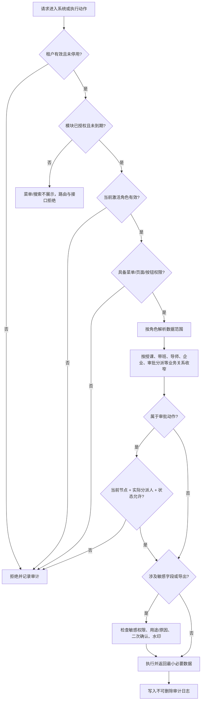
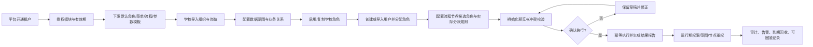
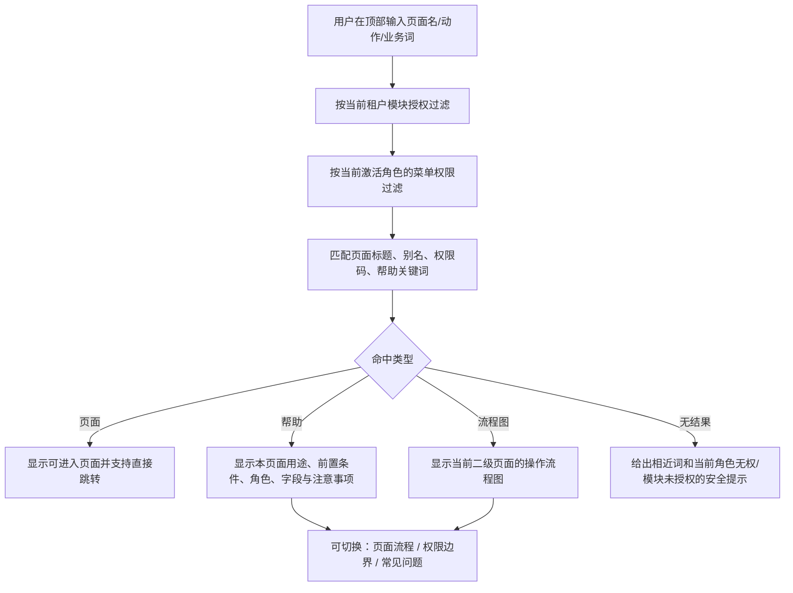

# 系统管理中心权限与流程现场审计报告

> 审计日期：2026-07-10；补充现场复核：2026-07-11  
> 审计环境：`http://localhost:5173`，体验沙箱学校，当前账号 `admin2`，当前角色“学校管理员”  
> 审计方式：只读浏览页面、查看可见状态与帮助内容；未点击保存、启用、停用、作废、审批、导入、导出等会改变数据的操作  
> 规则依据：项目根目录 `CLAUDE.md`、`docs/modules/00-系统管理中心-权限角色模块授权与权责边界设计.md`  
> 结论边界：本报告能确认前端可见事实与页面间一致性，不能替代后端接口鉴权、跨租户隔离和数据库真实性测试。

## 1. 修订结论

根据 13 张截图和 5173 实际页面复核，系统管理中心并不是“缺少大量基础功能”。账号、角色、菜单、数据范围、组织、品牌、安全策略、导出控制、日志、流程模板和审批任务等主要页面已经形成较完整的展示闭环。

本轮未发现可仅凭只读页面直接定性的 P0 权限漏洞。此前依据截图推测的部分缺项，实际已经存在，应从缺陷清单删除。

当前真正需要关注的是：

1. “权限与流程”中的角色管理明确标注为 mock，尚未接入真实权限中心；
2. 顶部搜索无法按现有二级页面名称稳定命中，且没有覆盖每个二级模块的页面流程帮助图；
3. 系统管理与流程模块存在两套角色编码、权限编码和统计口径；
4. 审批按钮、菜单结构按钮、权限点停用按钮的可见状态与当前角色/当前节点边界存在待验证项；
5. 平台运维驻校账号已有最小范围描述，但页面尚未展示运维授权单、有效期和到期回收状态。

综合评级：**功能覆盖较好，前端演示完整度较高；权限主链路仍为“部分接入”，不宜将流程角色与权限点页面作为生产鉴权完成的证明。**

## 2. 已核实存在的能力

| 领域 | 5173 实际核实结果 |
|---|---|
| 用户账号 | 有关键词、组织、角色、状态筛选；手机号和工号脱敏；有启用、停用、锁定、待激活状态；有新增、批量导入、批量导出、查看、编辑、重置密码入口；页面声明操作写审计日志。 |
| 角色权限 | 区分内置/自定义角色；内置角色不可作废；支持复制、导出配置、数据范围配置；权限配置中已有数据范围、菜单、按钮和保存后留痕提示。 |
| 菜单权限 | 当前学校管理员的“新增菜单”已置灰；支持按角色预览；页面明确声明前端隐藏不是安全边界，后端接口仍需按权限码校验。 |
| 数据范围 | 已有全校、学院、班级、实习指导、毕设指导、企业授权、临时授权；显示引用角色和影响用户；临时授权有有效期与到期作废示例；作废前要求解除引用。 |
| 组织结构 | 已有学院、专业、班级、职能部门、组织树、岗位管理、批量导入和导出；有成员转移后才能作废的约束说明。 |
| 品牌配置 | 学校名称和平台名由平台核定且学校侧不可改；学校简称、主色、口号、水印可配置；有实时预览和配置快照导出。 |
| 系统参数 | 已有密码策略、失败锁定、会话超时、异地登录二次验证、导出水印、敏感字段脱敏、明文导出双确认、消息渠道；声明敏感变更二次确认与前后值审计。 |
| 日志审计 | 操作日志和登录日志分开；支持成功、失败、越权拦截筛选；IP/账号脱敏；审计日志不可删改；日志导出自身也留痕。 |
| 模块授权状态 | “权限与流程”顶部已有正常、到期只读、未授权三种演示状态，说明授权到期状态模型已进入页面设计。 |
| 流程模板 | 已有模块、状态、版本、维护人、更新时间、节点顺序、启停和详情；存在启用、停用、草稿三种状态。 |
| 审批任务 | 已有全部、待我处理、已通过、已退回、已撤回、已完成；支持模块和关键字筛选；有申请人、业务编号、当前节点、当前处理人和审批记录。 |
| 帮助中心 | 已有功能帮助和业务流程图入口；已有数字迎新、请假、成绩、毕业设计、岗位实习等业务流程帮助。 |

## 3. 对原截图判断的修正

| 截图 | 原先容易误判的点 | 实际核验后的结论 |
|---|---|---|
| 1 权限点管理 | 学校管理员可直接修改全局权限注册表 | 页面确实显示“停用”按钮，但未执行写操作，尚不能证明后端允许；应列为待验证边界，不直接定性为漏洞。 |
| 2 流程角色管理 | 平台运营角色已进入真实学校权限体系 | 该页明确写有“编辑为 mock 操作，P8 接真实权限中心”；问题是 mock 与真实 RBAC 混在正式导航，而不是已经发生跨租户授权。 |
| 3 审批任务 | 缺少完整审批历史 | 页面已有审批记录和状态分类；真实问题是当前处理人显示为指导教师时，学校管理员仍看到通过/退回/撤回按钮，需验证节点级后端鉴权。 |
| 4 流程模板 | 没有版本和状态 | 已有版本、启用、停用、草稿、维护人和节点；可视化设计器明确标注本期不含，不能当作未披露缺失。 |
| 5 流程看板 | 角色数 7 与系统角色数冲突 | 7 表示流程模块基础角色，系统看板为全系统口径；问题是页面未清楚标注统计范围，容易被理解为同一指标。 |
| 6 系统与品牌 | 缺少安全策略和敏感导出策略 | 实际位于同页“系统参数”标签，已有密码、会话、二次验证、脱敏、水印和明文导出双确认。 |
| 7 组织结构 | 缺少岗位与作废约束 | 已有岗位管理；已有在册成员需先转移、历史关系保留的说明。 |
| 8 数据范围 | 缺少临时授权、有效期和影响范围 | 已有临时授权、有效期、到期作废、引用角色、影响用户及解除引用要求。 |
| 9 菜单权限 | 学校管理员可新增任意菜单 | 当前角色下“新增菜单”已置灰；但“编辑/停用”仍显示可用，需要核实按钮级限制和后端 403。 |
| 10/11 角色配置 | 没有数据范围和审计提示 | 抽屉中已有数据范围，且明确提示影响全部成员、写审计并通知复核；剩余问题主要是长权限树的可用性与权限上限未可视化。 |
| 12 用户账号 | 缺少脱敏、状态和审计 | 这些能力均已存在；仍需在详情或分配页确认默认角色、有效期、授权来源和业务关系绑定状态。 |
| 13 管理看板 | 缺少安全提醒和越权记录 | 已有失败锁定、异地登录、异常导出和越权拦截日志；需确认统计数据来自真实后端而非演示常量。 |

## 4. 现场发现项

### F-01（P1）流程角色页仍是 mock，与真实权限中心并存

证据：`/admin/workflow/roles` 页面直接显示“编辑为 mock 操作，P8 接真实权限中心”。同一正式导航下又存在 `/admin/system/roles` 的另一套真实样式角色管理。

影响：

- 用户可能在错误入口配置并误以为已经生效；
- 角色数量、编码和权限数量出现两套口径；
- 无法把该页面作为生产权限已落地的验收依据。

建议：在接入真实权限中心前将该页明确标记为 `partial/planned`，禁止产生“保存成功即真实授权”的反馈；最终让流程节点选择复用系统角色中心，只保留流程节点绑定视图。

### F-02（P1）顶部搜索不能按二级页面名称稳定命中

现场复现：

- 输入“角色权限”，结果为“未找到相关功能或帮助”，但左侧真实存在“角色权限”页面；
- 输入“流程图”，结果为“未找到相关功能或帮助”；
- 输入“系统管理”才能出现聚合帮助“系统管理：用户、角色、菜单、数据范围”和“角色与数据范围”。

这不满足“顶部搜索每个二级模块的页面流程帮助图”的目标。当前帮助中心是按大模块聚合，不是每个二级页面一条可搜索、可直达、可看流程图的帮助记录。

建议将帮助索引与真实路由/菜单元数据绑定，至少以 `route + menuKey + title + aliases + role + moduleGrant + helpTopic + flowId` 为一条记录，不能靠少量静态关键字。

### F-03（P1）两套角色编码和权限编码并存

现场可见：

- 系统角色中心：`PLATFORM_OPS`、`INTERN_ADVISOR`、`SYS_ADMIN`；
- 流程角色页：`PLATFORM_OPERATOR`、`TEACHER`、`SCHOOL_ADMIN`；
- 系统角色配置：`user:create`、`role:config`、`intern:weekly-report:review`；
- 流程权限点：`workflow.task.approve`、`student.profile.view`。

影响：同一个角色或动作可能出现别名、重复授权、审计难以聚合、迁移时无法判断主键语义。

建议：新权限统一采用 `module.resource.action`；旧冒号编码只作为显式兼容别名，并建立一对一映射。角色编码同样冻结唯一主编码，mock 页不得再生成第二套正式编码。

### F-04（P1，待后端验证）审批按钮与当前节点处理人不一致

现场：学校管理员登录后，在“第 4 周实习周报批阅”详情中看到当前节点和当前处理人均为“指导教师”，页面同时显示“通过、退回、撤回”按钮。

按顶层权限文档，按钮权限不等于审批节点权限，学校管理员能配置流程也不代表能替指导教师审批。

需要验证：

1. 当前学校管理员是否只是看到按钮，点击后后端会按 `角色 × 节点 × 实际分派人 × 业务关系` 返回 403；
2. 若学校管理员具有干预权，是否有单独的“管理员干预/代办”权限、强制原因、原处理人通知和审计，而不是复用普通“通过”按钮。

未做写操作，因此本报告不把它直接定性为已发生越权。

### F-05（P1，待后端验证）权限点注册表的租户边界不清楚

学校管理员在 `/admin/workflow/permissions` 能看到每个权限点的“停用”按钮。需要区分：

- 平台权限注册表：由平台/发布过程维护，学校不能停用全局定义；
- 租户角色授权：学校只在本校已授权模块内给角色勾选权限；
- 租户功能开关：如需学校关闭某能力，应是租户开关，而不是修改权限点定义本身。

如果“停用”只是 mock 演示，应明确置灰并标记；如果调用真实接口，必须验证学校管理员只能影响本租户且不能影响权限注册表。

### F-06（P1，待后端验证）菜单结构按钮状态与页面说明不完全一致

菜单权限页声明“菜单结构变更仅系统管理员可操作”。当前账号为“学校管理员”：

- “新增菜单”已置灰，符合边界；
- 各行“编辑/停用”仍显示为可用按钮。

建议统一体验：无权修改结构时编辑、停用也应置灰或仅允许编辑“本校显示名称/排序/可见性”等租户层字段；无论前端状态如何，后端必须再次校验并记录越权拦截。

### F-07（P2）角色与权限统计口径缺少范围标签

现场同时出现“启用角色 12”“角色共 9 个”“流程基础角色 7 个”“权限点 33 个”等数字。它们可能分别代表全系统、当前列表、流程基础角色和当前权限目录，并非必然数据错误，但页面没有把范围说清楚。

建议每个指标显示口径，例如“全系统启用角色”“系统管理角色”“流程候选角色”“当前模块权限点”，并由同一后端统计口径返回。

### F-08（P2）驻校平台运维缺少授权单与有效期的可见证据

真实角色页已把 `PLATFORM_OPS` 限定为“全校（仅运维项）”，并说明默认不可见学生敏感明细，这是正确方向。但用户列表仍把驻校运维账号与学校普通账号放在同一管理表中，未展示：

- 运维协助授权单号；
- 授权原因和关联工单；
- 只读/可操作范围；
- 生效和到期时间；
- 到期回收状态；
- 学校管理员能否重置或停用该平台身份。

建议以“运维协助授权”而不是普通学校角色表达，并在账号行或详情中展示授权状态。

### F-09（P2）角色权限长树放在窄抽屉中，可用性一般

抽屉已经具备数据范围、菜单和按钮配置，并非功能缺失。但权限树跨多个模块且内容很长，窄抽屉需要大量滚动，不利于：

- 查看当前已选总数；
- 对比修改前后差异；
- 定位敏感权限；
- 查看超出模块授权/创建者权限的禁用原因；
- 预览受影响用户。

建议小角色继续用抽屉；权限项超过阈值时跳转全屏配置工作区，提供模块导航、只看已选、只看变更、敏感项过滤、影响预览和保存差异摘要。

## 4A. 2026-07-11 补充现场核验

本节是在同一 `admin2 / 学校管理员` 会话下，通过 5173 内置浏览器继续核验用户账号与角色权限页面所得。除下述一次“复制角色”误触外，未执行保存、启用、停用、审批、导入、导出、重置密码或配置权限等写操作。

### F-10（P1，待后端验证）学校管理员可见并可操作高权限角色分配与配置控件

现场事实：

- 编辑待激活用户“郑立文”时，“系统管理员”“平台运维”等高权限角色复选框均为可操作状态，“保存修改”按钮可用；
- 学校管理员能够打开现有系统管理员、平台运维账号的编辑抽屉；
- 学校管理员能够打开“系统管理员”角色的权限配置抽屉，页面中的顶级菜单复选框与“保存权限配置”按钮可用；
- 本轮没有点击保存，不能仅凭前端状态断定后端已经允许越权写入。

风险：若后端未再次校验，学校管理员可能给本校账号分配系统管理员或平台运维角色，或改变受保护角色权限，形成纵向提权。

要求：

1. 后端必须计算 `可分配角色集合 = 当前操作者可管理角色 ∩ 学校模块授权 ∩ 租户角色上限`；
2. 学校管理员不得分配、复制或修改平台角色及系统根角色；
3. 受保护角色的成员调整与权限变更应要求更高权限、理由、影响预览和审计；
4. 前端应隐藏或禁用不可操作项，并明确显示禁用原因，但前端禁用不能替代后端鉴权。

### F-11（P1，已复现）平台运维角色可被学校管理员一键复制，且复制操作没有确认

现场点击 `PLATFORM_OPS` 行的“复制”后，系统未展示预览或确认，立即创建：

- 角色名称：`平台运维（副本）`；
- 角色编码：`PLATFORM_OPS_COPY`；
- 类型：自定义角色；
- 数据范围：`全校（仅运维项）`；
- 成员数：0；
- 页面提示：“已复制为『平台运维（副本）』（成员不复制），已留痕”。

随后只读打开其权限配置，29 个权限复选框中已选数量为 0。因此该次复制**没有继承平台运维权限，也没有直接形成权限提升**，但仍存在两项确定问题：

1. 学校管理员能够复制平台角色的名称、语义和特殊数据范围，违反平台角色不得由学校复制的边界；
2. “复制”是立即写入动作，却没有二次确认、差异预览或取消机会。

建议：学校侧移除或禁用平台角色的复制入口；普通学校角色复制应先展示名称、编码、权限、数据范围和敏感项差异，确认后再创建。若业务允许从平台模板派生，应走“模板下发/实例化”流程，并受学校模块授权和操作者权限上限约束。

> 现场保留说明：本报告没有擅自作废、删除或回退该副本，避免产生第二次未经授权的写操作。该角色当前为 0 成员、0 权限，可作为本次审计现场证据；是否清理由项目负责人确认。

### F-12（P2）新增角色表单缺少“角色类型”和授权上限的可见说明

“新增角色”当前包含角色名称、角色编码、默认数据范围和角色说明，并提示新角色默认不授予菜单权限；可选数据范围也已覆盖全校、学院、专业、班级、本人、毕设指导、实习指导、企业授权和临时授权。

但表单未显示顶层权限设计要求的“角色类型”，也未说明：来源模板、平台/学校属性、创建者权限上限、学校模块授权上限、是否允许再复制。建议将角色类型设为必填，并在创建前给出可授权边界摘要。

### F-13（P2）账号管理已有安全闭环，但角色分配生命周期字段仍不完整

本次确认已有的控制：

- 账号编码创建后不可修改；
- 新账号初始为待激活，首次登录强制修改密码；
- 重置密码有二次确认，临时密码发送到绑定手机而不在页面明文展示；
- 停用账号必须填写至少 5 个字的原因，并明确“停用并留痕”；
- 账号详情展示账号来源、脱敏联系方式、角色、默认数据范围和操作轨迹；
- 多角色账号能够同时展示学院管理员、辅导员等角色。

仍建议补齐：默认/当前激活角色、每个角色的授权来源、授权人、生效时间、到期时间、业务关系绑定状态，以及到期回收结果。当前“按角色默认范围”不足以回答临时授权和多角色叠加时的最终有效范围。

## 5. 未确认项，不作为缺陷定论

以下内容不能从学校管理员只读页面得出结论，需要使用平台账号或接口测试：

1. 学校初始化、套餐与模块授权、默认角色模板库是否已在平台运营端完整实现；
2. 页面中的统计和日志是否全部来自真实后端，而非演示数据；
3. 未授权模块的直达路由和接口是否真实返回 403；
4. 角色授权是否同时受“学校模块授权上限”和“创建者自身权限上限”约束；
5. 敏感权限是否禁止批量勾选、查看明文是否强制原因；
6. 审批通过/退回是否真正校验节点、分派人和业务关系；
7. 权限点“停用”、菜单“编辑/停用”是否会被后端按当前角色拦截；
8. 多角色用户切换后，菜单、待办、数据范围、统计口径和业务关系是否全部重载。
9. 学校管理员提交用户编辑时，后端是否拒绝分配 `SYS_ADMIN`、`PLATFORM_OPS` 等受保护角色；
10. 学校管理员提交“系统管理员”权限配置时，后端是否拒绝修改受保护角色及超出自身上限的权限。

## 6. 权限判定流程图

## 7. 系统管理配置闭环图

## 8. 顶部搜索与二级模块流程帮助图

### 8.1 推荐交互流程

### 8.2 系统管理二级页面帮助覆盖清单

| 二级页面 | 当前页面 | 当前帮助覆盖 | 应补流程图主题 |
|---|---:|---:|---|
| 管理看板 | 已有 | 仅大模块聚合 | 告警发现 → 下钻 → 处理 → 审计闭环 |
| 用户账号 | 已有 | 仅大模块聚合 | 新增/Excel 导入 → 校验 → 角色与范围 → 激活 → 停用/交接 |
| 角色权限 | 已有 | 有“角色与数据范围”文字帮助 | 模板复制/空白创建 → 权限上限 → 范围/节点/敏感项 → 差异确认 → 审计 |
| 菜单权限 | 已有 | 仅大模块聚合 | 模块授权 → 菜单可见 → 按钮权限 → 路由/API 二次校验 |
| 数据范围 | 已有 | 有文字帮助 | 规则来源 → 绑定角色 → 影响预览 → 生效 → 到期/作废 |
| 组织结构 | 已有 | 未单列 | Excel 导入 → 校验 → 组织/岗位 → 成员绑定 → 转移 → 作废 |
| 系统与品牌 | 已有 | 未单列 | 可改项 → 实时预览 → 敏感确认 → 保存 → 快照/审计 |
| 流程中心 | 已有 | 未单列 | 模块启用情况 → 待办 → 模板 → 审批记录 |
| 流程模板 | 已有 | 未单列 | 草稿 → 节点/条件/角色 → 校验 → 发布/启用 → 停用/版本 |
| 审批任务 | 已有 | 未单列 | 待我处理 → 节点鉴权 → 通过/退回/撤回 → 状态与审计 |
| 流程角色管理 | 已有但 mock | 未单列 | 复用真实角色 → 绑定节点 → 数据范围 → 实际处理人解析 |
| 权限点管理 | 已有 | 未单列 | 权限注册 → 模块归属 → 角色分配 → 影响分析 → 停用/兼容 |
| 日志中心 | 已有 | 未单列 | 查询 → 查看前后值 → 越权分析 → 受控导出 → 导出留痕 |

帮助索引的验收标准：以上每个二级页面均能用页面原名搜索命中；结果必须同时受模块授权与当前角色权限过滤；点击“流程图”可看到与页面真实操作一致的图，而不是只有大模块介绍。

## 9. 建议的验收顺序

1. 先封闭高权限角色边界：学校管理员不得分配/修改系统管理员和平台角色，不得复制平台角色；
2. 把流程角色 mock 与真实系统角色中心合并，避免两套权限来源；
3. 对审批按钮、权限点停用、菜单编辑/停用做后端 403 与审计测试；
4. 统一角色和权限主编码，建立旧编码兼容映射；
5. 修复顶部搜索索引，并按第 8.2 节补齐 13 个二级页面帮助条目和流程图；
6. 最后使用平台运营账号核验学校初始化、默认模板、模块授权、有效期和回滚闭环。

## 10. 本轮唯一建议的下一步

**只做“受保护角色的后端负向鉴权验收”**：在专用测试数据中验证学校管理员分配 `SYS_ADMIN` / `PLATFORM_OPS`、修改 `SYS_ADMIN` 权限、复制平台角色时均被后端拒绝并写入越权审计。先获得这组证据，再决定页面禁用、角色模板收口和流程 mock 合并的实施顺序。

---

本报告仅修改 Markdown 文档，未修改前端、后端、migration 或数据库模型，未执行数据库控制台操作、Alembic、`create_all`、commit、push 或 tag。浏览器现场审计中曾误触一次“复制平台运维角色”，形成 0 成员、0 权限的 `PLATFORM_OPS_COPY` 演示角色；已停止操作并保留现场，未擅自删除、作废或回退。
